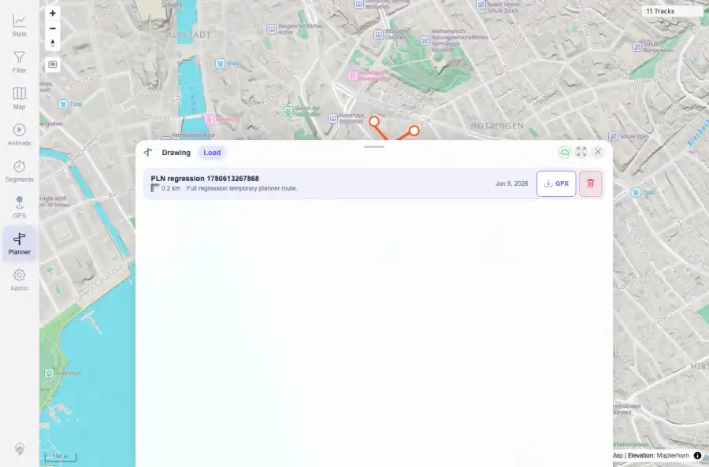
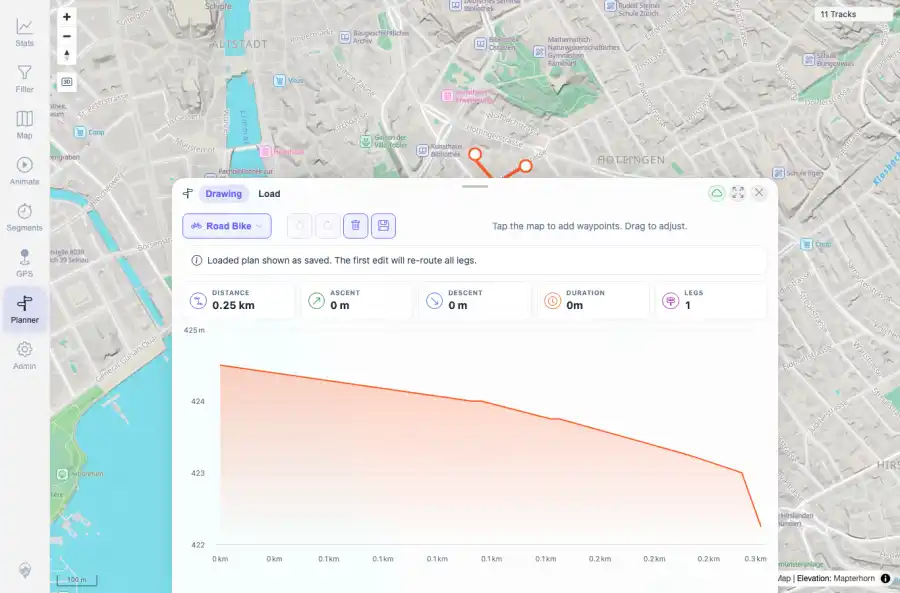
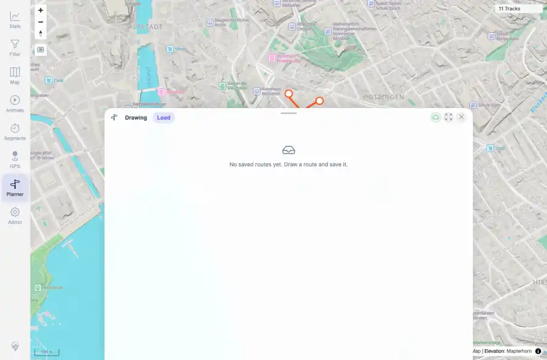

# Packet: PLN_07

## Scope

- Coverage source: `documentation/testing/frontend-regression-test-plan.md`
- Coverage ID or run packet: PLN_07
- In scope: Planner saved route list, load, and delete workflow.
- Out of scope: Other coverage IDs except where noted as shared state/evidence.

## Prerequisites

- Required previous coverage IDs or run packets: PLN_06 PASS.
- Required app/data state: Current run-state and packet set for this run.
- Required browser context: As specified by the coverage action.

## Allowed Mutations

- Allowed: Create and delete a temporary saved Planner route.
- Not allowed: Collapse this ID into a parent row or skip required direct evidence.

## Actions And Results

| Coverage ID | Action | Expected result | Actual result | Status | Evidence |
|---|---|---|---|---|---|
| PLN_07 | Saved a temporary Planner route, verified it appeared in the saved list, loaded it, deleted it, and verified it was absent. | Saved routes can be created, listed, loaded, and deleted without leaving test data behind. | Temporary route named with PLN regression prefix was saved, listed, loaded into the planner, deleted, and confirmed absent after cleanup. | PASS | [assets/PLN_07-saved-plan-listed.webp](../assets/PLN_07-saved-plan-listed.webp); [assets/PLN_07-loaded-saved-plan.webp](../assets/PLN_07-loaded-saved-plan.webp); [assets/PLN_07-saved-plan-deleted.webp](../assets/PLN_07-saved-plan-deleted.webp); [assets/PLN_07-save-list-load-delete.txt](../assets/PLN_07-save-list-load-delete.txt) |

## Issues

| ID | Severity | Summary | Reproduction | Expected | Actual | Evidence | Release impact |
|---|---|---|---|---|---|---|---|

## Evidence Files

| File | Purpose |
|---|---|
| [assets/PLN_07-saved-plan-listed.webp](../assets/PLN_07-saved-plan-listed.webp) | Screenshot evidence |
| [assets/PLN_07-loaded-saved-plan.webp](../assets/PLN_07-loaded-saved-plan.webp) | Screenshot evidence |
| [assets/PLN_07-saved-plan-deleted.webp](../assets/PLN_07-saved-plan-deleted.webp) | Screenshot evidence |
| [assets/PLN_07-save-list-load-delete.txt](../assets/PLN_07-save-list-load-delete.txt) | Text/log evidence |

## Screenshot Evidence

## Timings

| Step | Timing |
|---|---:|
| Packet execution | <1 minute |

## Handoff Notes

- Completed: This coverage ID is terminal.
- Remaining unfinished coverage: Continue with the next queue row.
- Blocked or not applicable: none.
- State left for the next packet: unchanged.
