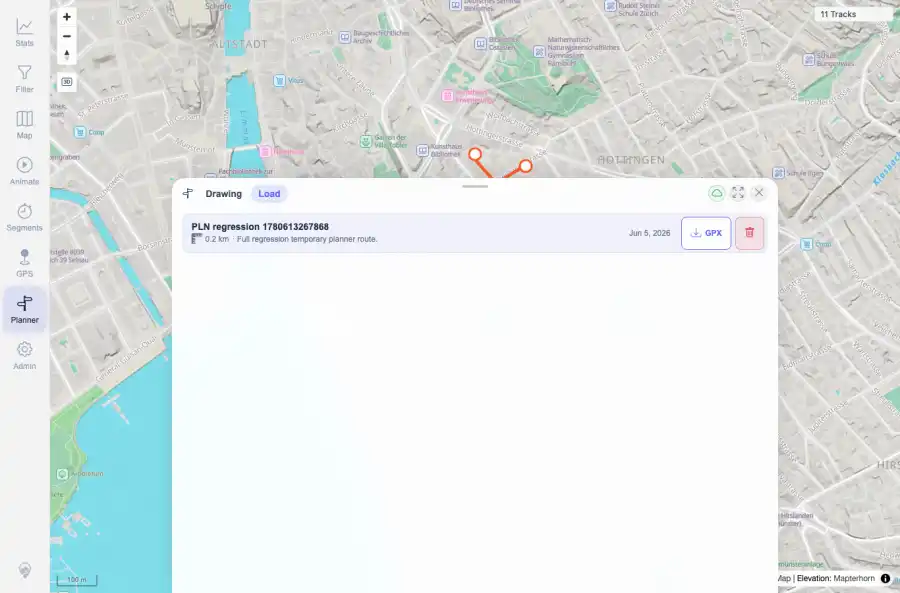

# Packet: PLN_08

## Scope

- Coverage source: `documentation/testing/frontend-regression-test-plan.md`
- Coverage ID or run packet: PLN_08
- In scope: Planner GPX export for a saved/planned route.
- Out of scope: Other coverage IDs except where noted as shared state/evidence.

## Prerequisites

- Required previous coverage IDs or run packets: PLN_07 PASS.
- Required app/data state: Current run-state and packet set for this run.
- Required browser context: As specified by the coverage action.

## Allowed Mutations

- Allowed: Download GPX export evidence for a temporary Planner route.
- Not allowed: Collapse this ID into a parent row or skip required direct evidence.

## Actions And Results

| Coverage ID | Action | Expected result | Actual result | Status | Evidence |
|---|---|---|---|---|---|
| PLN_08 | Triggered Planner GPX export and validated the downloaded GPX metadata and trackpoint count. | Planner exports a valid GPX file for the current route. | GPX download used the expected PLN regression filename, was 784 bytes, had a valid GPX root, contained the route name, and included 8 trkpt elements matching the route response coordinate count. | PASS | [assets/PLN_08-export-button-visible.webp](../assets/PLN_08-export-button-visible.webp); [assets/PLN_08-export-gpx.txt](../assets/PLN_08-export-gpx.txt) |

## Issues

| ID | Severity | Summary | Reproduction | Expected | Actual | Evidence | Release impact |
|---|---|---|---|---|---|---|---|

## Evidence Files

| File | Purpose |
|---|---|
| [assets/PLN_08-export-button-visible.webp](../assets/PLN_08-export-button-visible.webp) | Screenshot evidence |
| [assets/PLN_08-export-gpx.txt](../assets/PLN_08-export-gpx.txt) | Text/log evidence |

## Screenshot Evidence

## Timings

| Step | Timing |
|---|---:|
| Packet execution | <1 minute |

## Handoff Notes

- Completed: This coverage ID is terminal.
- Remaining unfinished coverage: Continue with the next queue row.
- Blocked or not applicable: none.
- State left for the next packet: unchanged.
