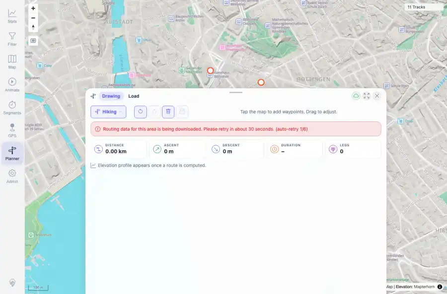

# Packet: PLN_09

## Scope

- Coverage source: `documentation/testing/frontend-regression-test-plan.md`
- Coverage ID or run packet: PLN_09
- In scope: Planner segment-downloading routing error UI.
- Out of scope: Other coverage IDs except where noted as shared state/evidence.

## Prerequisites

- Required previous coverage IDs or run packets: PLN_08 PASS.
- Required app/data state: Current run-state and packet set for this run.
- Required browser context: As specified by the coverage action.

## Allowed Mutations

- Allowed: Use a controlled browser route mock to simulate segment-downloading without changing server state.
- Not allowed: Collapse this ID into a parent row or skip required direct evidence.

## Actions And Results

| Coverage ID | Action | Expected result | Actual result | Status | Evidence |
|---|---|---|---|---|---|
| PLN_09 | Mocked a 503 segment-downloading response in the browser context and attempted route calculation. | Planner displays a clear retry/download message and remains usable. | UI displayed: Routing data for this area is being downloaded. Please retry in about 30 seconds. (auto-retry 1/6). No unhandled error was observed. | PASS | [assets/PLN_09-segment-downloading-ui.webp](../assets/PLN_09-segment-downloading-ui.webp); [assets/PLN_09-segment-downloading-ui.txt](../assets/PLN_09-segment-downloading-ui.txt) |

## Issues

| ID | Severity | Summary | Reproduction | Expected | Actual | Evidence | Release impact |
|---|---|---|---|---|---|---|---|

## Evidence Files

| File | Purpose |
|---|---|
| [assets/PLN_09-segment-downloading-ui.webp](../assets/PLN_09-segment-downloading-ui.webp) | Screenshot evidence |
| [assets/PLN_09-segment-downloading-ui.txt](../assets/PLN_09-segment-downloading-ui.txt) | Text/log evidence |

## Screenshot Evidence

## Timings

| Step | Timing |
|---|---:|
| Packet execution | <1 minute |

## Handoff Notes

- Completed: This coverage ID is terminal.
- Remaining unfinished coverage: Continue with the next queue row.
- Blocked or not applicable: none.
- State left for the next packet: unchanged.
