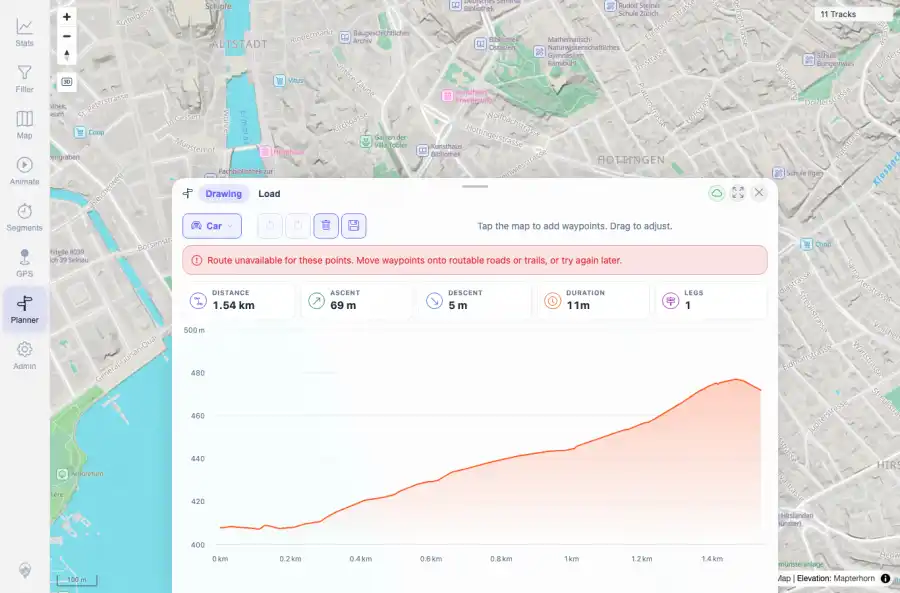

# Packet: PLN_10

## Scope

- Coverage source: `documentation/testing/frontend-regression-test-plan.md`
- Coverage ID or run packet: PLN_10
- In scope: Planner routing error behavior when an existing saved route is visible.
- Out of scope: Other coverage IDs except where noted as shared state/evidence.

## Prerequisites

- Required previous coverage IDs or run packets: PLN_09 PASS.
- Required app/data state: Current run-state and packet set for this run.
- Required browser context: As specified by the coverage action.

## Allowed Mutations

- Allowed: Create/delete a temporary saved route and mock a routing-unavailable response during profile change.
- Not allowed: Collapse this ID into a parent row or skip required direct evidence.

## Actions And Results

| Coverage ID | Action | Expected result | Actual result | Status | Evidence |
|---|---|---|---|---|---|
| PLN_10 | Loaded a temporary saved route, mocked a routing-unavailable response on profile change to Car, and observed whether existing route UI survived. | Planner shows a clear routing error while preserving the existing saved route display. | Planner showed a routing-unavailable notice while preserving the loaded saved route at 1.54 km, 11m, one leg, and chart/map display; temporary saved route was cleaned up. | PASS | [assets/PLN_10-existing-plan-route-error.webp](../assets/PLN_10-existing-plan-route-error.webp); [assets/PLN_10-existing-plan-route-error.txt](../assets/PLN_10-existing-plan-route-error.txt) |

## Issues

| ID | Severity | Summary | Reproduction | Expected | Actual | Evidence | Release impact |
|---|---|---|---|---|---|---|---|

## Evidence Files

| File | Purpose |
|---|---|
| [assets/PLN_10-existing-plan-route-error.webp](../assets/PLN_10-existing-plan-route-error.webp) | Screenshot evidence |
| [assets/PLN_10-existing-plan-route-error.txt](../assets/PLN_10-existing-plan-route-error.txt) | Text/log evidence |

## Screenshot Evidence

## Timings

| Step | Timing |
|---|---:|
| Packet execution | <1 minute |

## Handoff Notes

- Completed: This coverage ID is terminal.
- Remaining unfinished coverage: Continue with the next queue row.
- Blocked or not applicable: none.
- State left for the next packet: unchanged.
