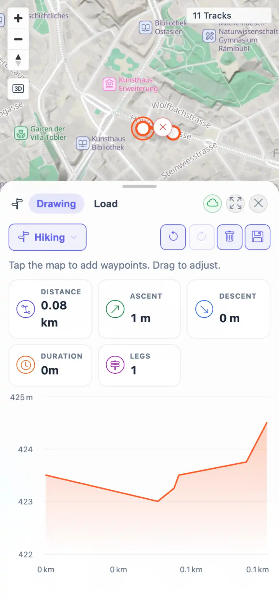

# Packet: PLN_11

## Scope

- Coverage source: `documentation/testing/frontend-regression-test-plan.md`
- Coverage ID or run packet: PLN_11
- In scope: Planner mobile touch waypoint creation and dragging.
- Out of scope: Other coverage IDs except where noted as shared state/evidence.

## Prerequisites

- Required previous coverage IDs or run packets: PLN_10 PASS.
- Required app/data state: Current run-state and packet set for this run.
- Required browser context: As specified by the coverage action.

## Allowed Mutations

- Allowed: Use a narrow touch browser context and temporary Planner route edits.
- Not allowed: Collapse this ID into a parent row or skip required direct evidence.

## Actions And Results

| Coverage ID | Action | Expected result | Actual result | Status | Evidence |
|---|---|---|---|---|---|
| PLN_11 | Opened Planner at 390x844 with touch enabled, placed waypoints with touch input, and dragged a waypoint with touch events. | Planner supports mobile/touch waypoint placement and dragging with route recomputation. | Touch taps created a 0.20 km route; CDP touch drag moved a waypoint and recomputed route stats to 0.08 km with HTTP 200 route responses. | PASS | [assets/PLN_11-mobile-touch-route-drag.webp](../assets/PLN_11-mobile-touch-route-drag.webp); [assets/PLN_11-mobile-touch-route-drag.txt](../assets/PLN_11-mobile-touch-route-drag.txt) |

## Issues

| ID | Severity | Summary | Reproduction | Expected | Actual | Evidence | Release impact |
|---|---|---|---|---|---|---|---|

## Evidence Files

| File | Purpose |
|---|---|
| [assets/PLN_11-mobile-touch-route-drag.webp](../assets/PLN_11-mobile-touch-route-drag.webp) | Screenshot evidence |
| [assets/PLN_11-mobile-touch-route-drag.txt](../assets/PLN_11-mobile-touch-route-drag.txt) | Text/log evidence |

## Screenshot Evidence

## Timings

| Step | Timing |
|---|---:|
| Packet execution | <1 minute |

## Handoff Notes

- Completed: This coverage ID is terminal.
- Remaining unfinished coverage: Continue with the next queue row.
- Blocked or not applicable: none.
- State left for the next packet: unchanged.
