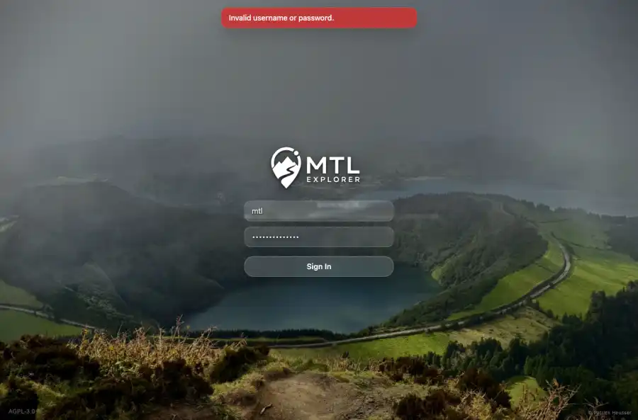

# Packet: SGN_04

## Scope

- Coverage source: `documentation/testing/frontend-regression-test-plan.md`
- Coverage ID or run packet: SGN_04
- In scope: Conditional demo-mode credentials banner on login screen.
- Out of scope: Other coverage IDs except where noted as shared state/evidence.

## Prerequisites

- Required previous coverage IDs or run packets: Login screen evidence captured in clean context.
- Required app/data state: Current run-state and packet set for this run.
- Required browser context: As specified by the coverage action.

## Allowed Mutations

- Allowed: Applicability review and packet/run-state updates only.
- Not allowed: Collapse this ID into a parent row or skip required direct evidence.

## Actions And Results

| Coverage ID | Action | Expected result | Actual result | Status | Evidence |
|---|---|---|---|---|---|
| SGN_04 | Reviewed the login screen text and screenshot for a demo credentials banner. | If demo mode is active, the login screen shows the demo credentials banner. | Demo mode is not active on this quick-install target; the login screen shows the normal Sign In form and no demo credentials banner. | NOT APPLICABLE | [assets/SGN_04-login-no-demo-banner.webp](../assets/SGN_04-login-no-demo-banner.webp); [assets/SGN_04-login-no-demo-banner.txt](../assets/SGN_04-login-no-demo-banner.txt); [assets/SGN-summary.txt](../assets/SGN-summary.txt) |

## Issues

| ID | Severity | Summary | Reproduction | Expected | Actual | Evidence | Release impact |
|---|---|---|---|---|---|---|---|

## Evidence Files

| File | Purpose |
|---|---|
| [assets/SGN_04-login-no-demo-banner.webp](../assets/SGN_04-login-no-demo-banner.webp) | Screenshot evidence |
| [assets/SGN_04-login-no-demo-banner.txt](../assets/SGN_04-login-no-demo-banner.txt) | Text/log evidence |
| [assets/SGN-summary.txt](../assets/SGN-summary.txt) | Text/log evidence |

## Screenshot Evidence

## Timings

| Step | Timing |
|---|---:|
| Demo-banner applicability review | <1 minute |

## Handoff Notes

- Completed: This coverage ID is terminal.
- Remaining unfinished coverage: Continue with the next queue row.
- Blocked or not applicable: none.
- State left for the next packet: unchanged.
