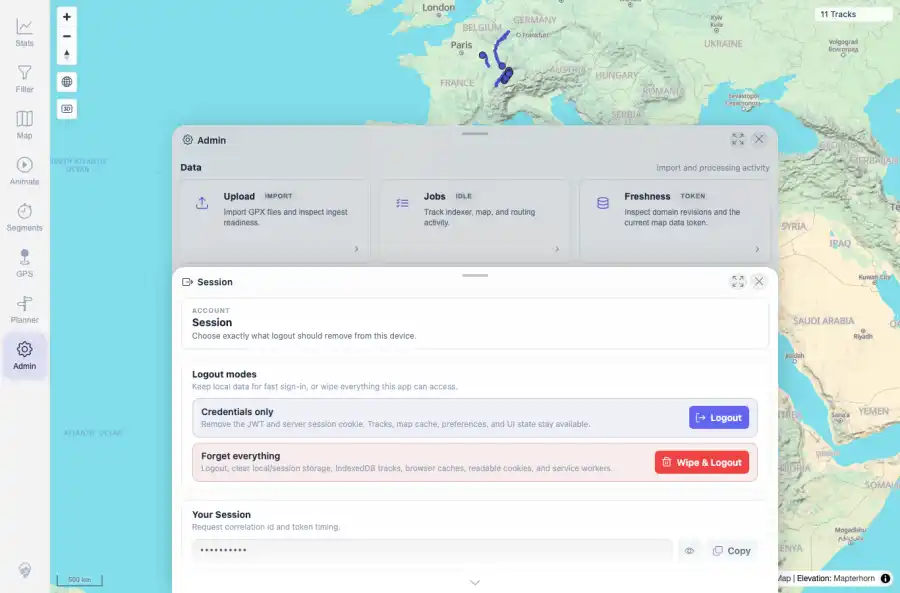
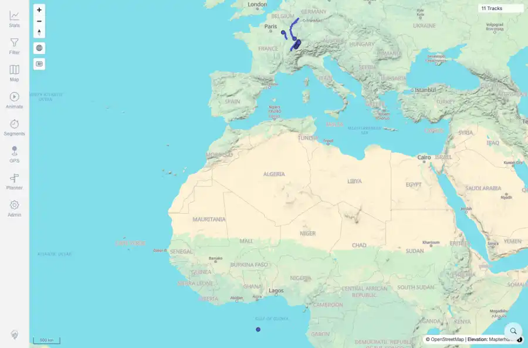

# Packet: SGN_05

## Scope

- Coverage source: `documentation/testing/frontend-regression-test-plan.md`
- Coverage ID or run packet: SGN_05
- In scope: Sign out returns to login; signing in again works.
- Out of scope: Other coverage IDs except where noted as shared state/evidence.

## Prerequisites

- Required previous coverage IDs or run packets: Authenticated app session available.
- Required app/data state: Current run-state and packet set for this run.
- Required browser context: As specified by the coverage action.

## Allowed Mutations

- Allowed: Use visible Admin > Session > Logout flow and re-authenticate with README credentials.
- Not allowed: Collapse this ID into a parent row or skip required direct evidence.

## Actions And Results

| Coverage ID | Action | Expected result | Actual result | Status | Evidence |
|---|---|---|---|---|---|
| SGN_05 | Opened Admin, selected Session, clicked Logout, verified /mtl/login, then signed in again with mtl/change-me. | Logout returns to login and a subsequent valid sign-in returns to the app. | Admin Session exposed a Logout control. Clicking it navigated to /mtl/login; signing in again loaded the map with 11 Tracks. | PASS | [assets/SGN_05-session-logout-control.webp](../assets/SGN_05-session-logout-control.webp); [assets/SGN_05-session-logout-control.txt](../assets/SGN_05-session-logout-control.txt); [assets/SGN_05-after-logout-login.webp](../assets/SGN_05-after-logout-login.webp); [assets/SGN_05-after-logout-login.txt](../assets/SGN_05-after-logout-login.txt); [assets/SGN_05-login-again-map.webp](../assets/SGN_05-login-again-map.webp); [assets/SGN_05-login-again-map.txt](../assets/SGN_05-login-again-map.txt); [assets/SGN-login-control-summary.txt](../assets/SGN-login-control-summary.txt); [assets/SGN-summary.txt](../assets/SGN-summary.txt) |

## Issues

| ID | Severity | Summary | Reproduction | Expected | Actual | Evidence | Release impact |
|---|---|---|---|---|---|---|---|

## Evidence Files

| File | Purpose |
|---|---|
| [assets/SGN_05-session-logout-control.webp](../assets/SGN_05-session-logout-control.webp) | Screenshot evidence |
| [assets/SGN_05-session-logout-control.txt](../assets/SGN_05-session-logout-control.txt) | Text/log evidence |
| [assets/SGN_05-after-logout-login.webp](../assets/SGN_05-after-logout-login.webp) | Screenshot evidence |
| [assets/SGN_05-after-logout-login.txt](../assets/SGN_05-after-logout-login.txt) | Text/log evidence |
| [assets/SGN_05-login-again-map.webp](../assets/SGN_05-login-again-map.webp) | Screenshot evidence |
| [assets/SGN_05-login-again-map.txt](../assets/SGN_05-login-again-map.txt) | Text/log evidence |
| [assets/SGN-login-control-summary.txt](../assets/SGN-login-control-summary.txt) | Text/log evidence |
| [assets/SGN-summary.txt](../assets/SGN-summary.txt) | Text/log evidence |

## Screenshot Evidence

## Timings

| Step | Timing |
|---|---:|
| Browser logout/re-login check | 11 seconds |

## Handoff Notes

- Completed: This coverage ID is terminal.
- Remaining unfinished coverage: Continue with the next queue row.
- Blocked or not applicable: none.
- State left for the next packet: unchanged.
