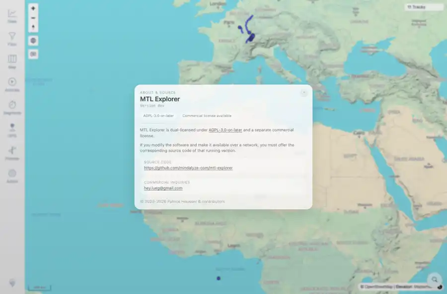

# Packet: SGN_08

## Scope

- Coverage source: `documentation/testing/frontend-regression-test-plan.md`
- Coverage ID or run packet: SGN_08
- In scope: MTL Explorer branding appears in About/public-facing copy.
- Out of scope: Other coverage IDs except where noted as shared state/evidence.

## Prerequisites

- Required previous coverage IDs or run packets: Authenticated app shell available.
- Required app/data state: Current run-state and packet set for this run.
- Required browser context: As specified by the coverage action.

## Allowed Mutations

- Allowed: Open visible About MTL Explorer overlay and update packet/run-state.
- Not allowed: Collapse this ID into a parent row or skip required direct evidence.

## Actions And Results

| Coverage ID | Action | Expected result | Actual result | Status | Evidence |
|---|---|---|---|---|---|
| SGN_08 | Clicked the About MTL Explorer brand button and inspected the About overlay. | The About/public-facing copy uses MTL Explorer branding. | The About overlay showed ABOUT & SOURCE, MTL Explorer, version information, license/source-code copy, and public source URL. | PASS | [assets/SGN_08-about-branding.webp](../assets/SGN_08-about-branding.webp); [assets/SGN_08-about-branding.txt](../assets/SGN_08-about-branding.txt); [assets/SGN-summary.txt](../assets/SGN-summary.txt) |

## Issues

| ID | Severity | Summary | Reproduction | Expected | Actual | Evidence | Release impact |
|---|---|---|---|---|---|---|---|

## Evidence Files

| File | Purpose |
|---|---|
| [assets/SGN_08-about-branding.webp](../assets/SGN_08-about-branding.webp) | Screenshot evidence |
| [assets/SGN_08-about-branding.txt](../assets/SGN_08-about-branding.txt) | Text/log evidence |
| [assets/SGN-summary.txt](../assets/SGN-summary.txt) | Text/log evidence |

## Screenshot Evidence

## Timings

| Step | Timing |
|---|---:|
| Browser About overlay check | 1 second |

## Handoff Notes

- Completed: This coverage ID is terminal.
- Remaining unfinished coverage: Continue with the next queue row.
- Blocked or not applicable: none.
- State left for the next packet: unchanged.
