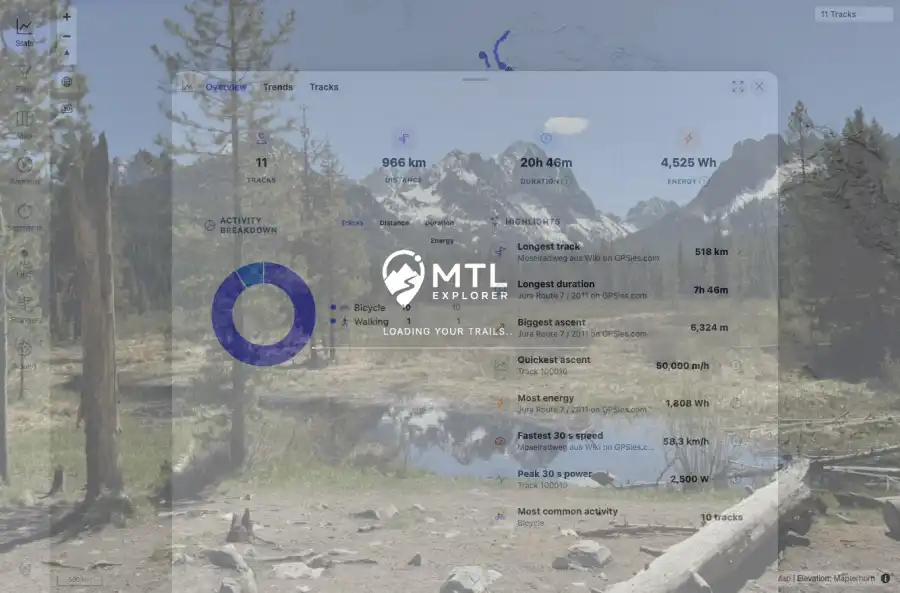

# Packet: SGN_09

## Scope

- Coverage source: `documentation/testing/frontend-regression-test-plan.md`
- Coverage ID or run packet: SGN_09
- In scope: Browser back/forward navigation between views works without errors.
- Out of scope: Other coverage IDs except where noted as shared state/evidence.

## Prerequisites

- Required previous coverage IDs or run packets: Authenticated app shell available with Stats and track detail routes.
- Required app/data state: Current run-state and packet set for this run.
- Required browser context: As specified by the coverage action.

## Allowed Mutations

- Allowed: Navigate between Stats and track detail, use browser back/forward, and update packet/run-state.
- Not allowed: Collapse this ID into a parent row or skip required direct evidence.

## Actions And Results

| Coverage ID | Action | Expected result | Actual result | Status | Evidence |
|---|---|---|---|---|---|
| SGN_09 | Opened Stats, navigated to FIT track detail /track/100005, used browser Back to return to Stats, then Forward to return to detail. | Back/forward navigation restores the previous views without errors. | Back returned to /mtl/stats with the Stats view and 11-track totals; Forward returned to /mtl/track/100005 with Track Details #100005. No blocking UI error was observed. | PASS | [assets/SGN_09-back-to-stats.webp](../assets/SGN_09-back-to-stats.webp); [assets/SGN_09-back-to-stats.txt](../assets/SGN_09-back-to-stats.txt); [assets/SGN_09-forward-to-detail.webp](../assets/SGN_09-forward-to-detail.webp); [assets/SGN_09-forward-to-detail.txt](../assets/SGN_09-forward-to-detail.txt); [assets/SGN_05-08-09-console.txt](../assets/SGN_05-08-09-console.txt); [assets/SGN-summary.txt](../assets/SGN-summary.txt) |

## Issues

| ID | Severity | Summary | Reproduction | Expected | Actual | Evidence | Release impact |
|---|---|---|---|---|---|---|---|

## Evidence Files

| File | Purpose |
|---|---|
| [assets/SGN_09-back-to-stats.webp](../assets/SGN_09-back-to-stats.webp) | Screenshot evidence |
| [assets/SGN_09-back-to-stats.txt](../assets/SGN_09-back-to-stats.txt) | Text/log evidence |
| [assets/SGN_09-forward-to-detail.webp](../assets/SGN_09-forward-to-detail.webp) | Screenshot evidence |
| [assets/SGN_09-forward-to-detail.txt](../assets/SGN_09-forward-to-detail.txt) | Text/log evidence |
| [assets/SGN_05-08-09-console.txt](../assets/SGN_05-08-09-console.txt) | Text/log evidence |
| [assets/SGN-summary.txt](../assets/SGN-summary.txt) | Text/log evidence |

## Screenshot Evidence

## Timings

| Step | Timing |
|---|---:|
| Browser history navigation check | 8 seconds |

## Handoff Notes

- Completed: This coverage ID is terminal.
- Remaining unfinished coverage: Continue with the next queue row.
- Blocked or not applicable: none.
- State left for the next packet: unchanged.
