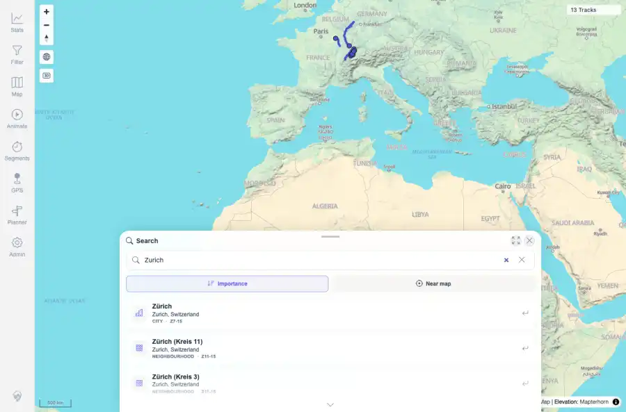

# Packet: SRC_01

## Scope

- Coverage source: `documentation/testing/frontend-regression-test-plan.md`
- Coverage ID or run packet: SRC_01
- In scope: Location search result listing for a typed place name.
- Out of scope: Other coverage IDs except where noted as shared state/evidence.

## Prerequisites

- Required previous coverage IDs or run packets: Map screen available with prior queue rows terminal.
- Required app/data state: Current run-state and packet set for this run.
- Required browser context: As specified by the coverage action.

## Allowed Mutations

- Allowed: Open search, type a place name, capture evidence, and update SRC_01 packet/run-state.
- Not allowed: Collapse this ID into a parent row or skip required direct evidence.

## Actions And Results

| Coverage ID | Action | Expected result | Actual result | Status | Evidence |
|---|---|---|---|---|---|
| SRC_01 | Opened location search and typed 'Zurich'. | Search results appear for the typed place name. | PASS: the query returned 20 visible results, with Zürich, Zurich, Switzerland as the first result. | PASS | [assets/SRC_01-search-results.webp](../assets/SRC_01-search-results.webp); [assets/SRC_01-search-results.txt](../assets/SRC_01-search-results.txt) |

## Issues

| ID | Severity | Summary | Reproduction | Expected | Actual | Evidence | Release impact |
|---|---|---|---|---|---|---|---|

## Evidence Files

| File | Purpose |
|---|---|
| [assets/SRC_01-search-results.webp](../assets/SRC_01-search-results.webp) | Screenshot evidence |
| [assets/SRC_01-search-results.txt](../assets/SRC_01-search-results.txt) | Text/log evidence |

## Screenshot Evidence

## Timings

| Step | Timing |
|---|---:|
| Location result query | ~5 seconds |

## Handoff Notes

- Completed: This coverage ID is terminal.
- Remaining unfinished coverage: Continue with the next queue row.
- Blocked or not applicable: none.
- State left for the next packet: unchanged.
