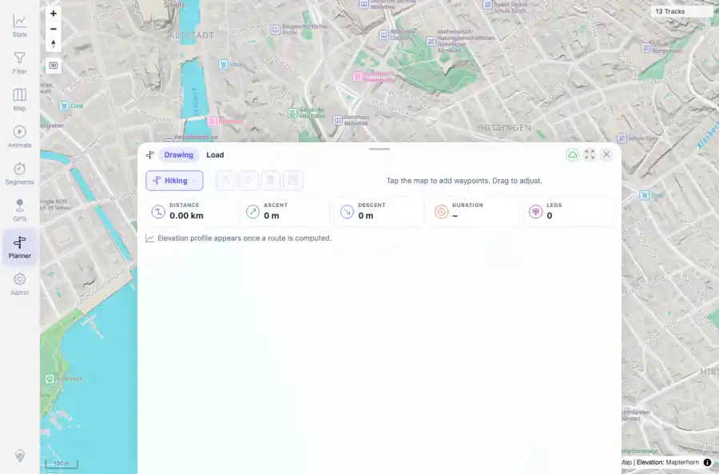

# Packet: SRC_03

## Scope

- Coverage source: `documentation/testing/frontend-regression-test-plan.md`
- Coverage ID or run packet: SRC_03
- In scope: Location marker cleanup when leaving the search tool.
- Out of scope: Other coverage IDs except where noted as shared state/evidence.

## Prerequisites

- Required previous coverage IDs or run packets: SRC_02 terminal; a location search marker was present.
- Required app/data state: Current run-state and packet set for this run.
- Required browser context: As specified by the coverage action.

## Allowed Mutations

- Allowed: Switch tools, inspect marker count, capture evidence, and update SRC_03 packet/run-state.
- Not allowed: Collapse this ID into a parent row or skip required direct evidence.

## Actions And Results

| Coverage ID | Action | Expected result | Actual result | Status | Evidence |
|---|---|---|---|---|---|
| SRC_03 | Clicked the Planner navigation tool after a Zurich marker was placed. | Clearing search or picking a different tool removes the search marker cleanly. | PASS: the marker count dropped from 1 to 0 after switching to Planner. | PASS | [assets/SRC_03-cleared-marker.webp](../assets/SRC_03-cleared-marker.webp); [assets/SRC_03-cleared-marker.txt](../assets/SRC_03-cleared-marker.txt) |

## Issues

| ID | Severity | Summary | Reproduction | Expected | Actual | Evidence | Release impact |
|---|---|---|---|---|---|---|---|

## Evidence Files

| File | Purpose |
|---|---|
| [assets/SRC_03-cleared-marker.webp](../assets/SRC_03-cleared-marker.webp) | Screenshot evidence |
| [assets/SRC_03-cleared-marker.txt](../assets/SRC_03-cleared-marker.txt) | Text/log evidence |

## Screenshot Evidence

## Timings

| Step | Timing |
|---|---:|
| Tool switch cleanup check | ~2 seconds |

## Handoff Notes

- Completed: This coverage ID is terminal.
- Remaining unfinished coverage: Continue with the next queue row.
- Blocked or not applicable: none.
- State left for the next packet: unchanged.
