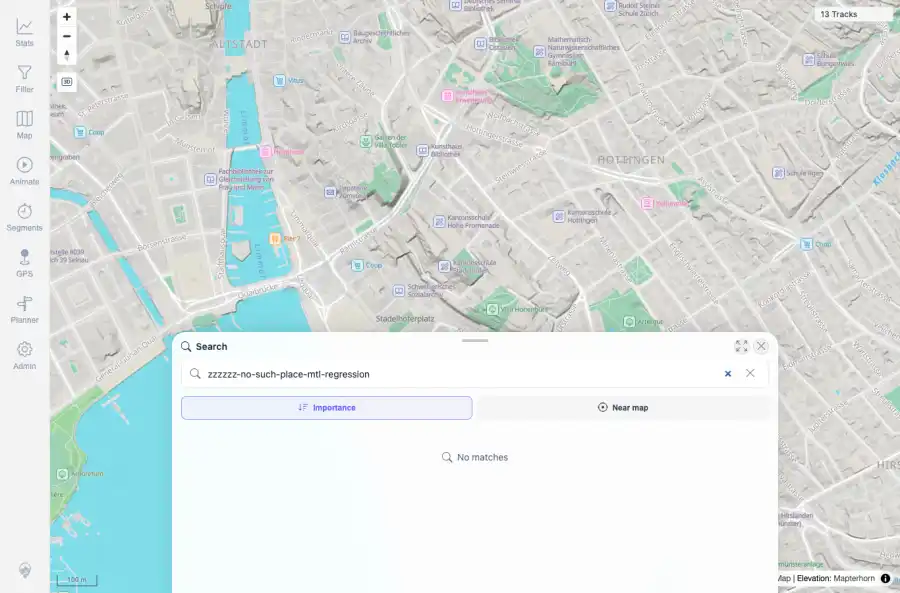

# Packet: SRC_04

## Scope

- Coverage source: `documentation/testing/frontend-regression-test-plan.md`
- Coverage ID or run packet: SRC_04
- In scope: No-result location search state.
- Out of scope: Other coverage IDs except where noted as shared state/evidence.

## Prerequisites

- Required previous coverage IDs or run packets: SRC_03 terminal; location search available.
- Required app/data state: Current run-state and packet set for this run.
- Required browser context: As specified by the coverage action.

## Allowed Mutations

- Allowed: Run an empty/no-result query, capture evidence, and update SRC_04 packet/run-state.
- Not allowed: Collapse this ID into a parent row or skip required direct evidence.

## Actions And Results

| Coverage ID | Action | Expected result | Actual result | Status | Evidence |
|---|---|---|---|---|---|
| SRC_04 | Opened location search and queried 'zzzzzz-no-such-place-mtl-regression'. | Empty or no-result queries show a clear message. | PASS: the query returned 0 result rows and the UI displayed 'No matches'. | PASS | [assets/SRC_04-no-results.webp](../assets/SRC_04-no-results.webp); [assets/SRC_04-no-results.txt](../assets/SRC_04-no-results.txt) |

## Issues

| ID | Severity | Summary | Reproduction | Expected | Actual | Evidence | Release impact |
|---|---|---|---|---|---|---|---|

## Evidence Files

| File | Purpose |
|---|---|
| [assets/SRC_04-no-results.webp](../assets/SRC_04-no-results.webp) | Screenshot evidence |
| [assets/SRC_04-no-results.txt](../assets/SRC_04-no-results.txt) | Text/log evidence |

## Screenshot Evidence

## Timings

| Step | Timing |
|---|---:|
| No-result query check | ~5 seconds |

## Handoff Notes

- Completed: This coverage ID is terminal.
- Remaining unfinished coverage: Continue with the next queue row.
- Blocked or not applicable: none.
- State left for the next packet: unchanged.
