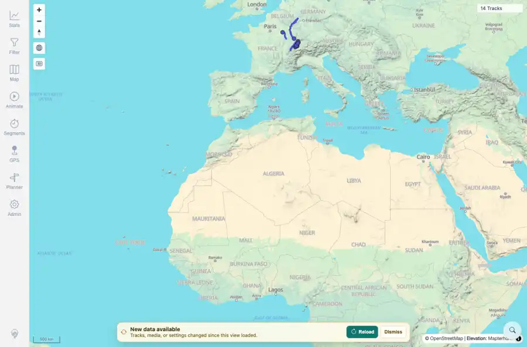

# Packet: SYN_01

## Scope

- Coverage source: `documentation/testing/frontend-regression-test-plan.md`
- Coverage ID or run packet: SYN_01
- In scope: Data freshness banner after a server-side data change.
- Out of scope: Other coverage IDs except where noted as shared state/evidence.

## Prerequisites

- Required previous coverage IDs or run packets: ADM_11 terminal; loaded client initially synchronized to current server freshness token.
- Required app/data state: Current run-state and packet set for this run.
- Required browser context: As specified by the coverage action.

## Allowed Mutations

- Allowed: Upload a fully synthetic GPX through the authenticated API from a loaded client, wait for freshness polling, capture evidence, and update SYN_01 packet/run-state.
- Not allowed: Collapse this ID into a parent row or skip required direct evidence.

## Actions And Results

| Coverage ID | Action | Expected result | Actual result | Status | Evidence |
|---|---|---|---|---|---|
| SYN_01 | With the map already loaded, uploaded syn-banner-upload synthetic GPX and waited for the freshness token to change and the banner to appear. | After server-side data changes, a data-freshness banner appears. | PASS: the server freshness token changed, API track count increased to 15, and the loaded client displayed 'New data available' with Reload and Dismiss actions. | PASS | [assets/SYN_01-freshness-banner.webp](../assets/SYN_01-freshness-banner.webp); [assets/SYN_01-freshness-banner.txt](../assets/SYN_01-freshness-banner.txt) |

## Issues

| ID | Severity | Summary | Reproduction | Expected | Actual | Evidence | Release impact |
|---|---|---|---|---|---|---|---|

## Evidence Files

| File | Purpose |
|---|---|
| [assets/SYN_01-freshness-banner.webp](../assets/SYN_01-freshness-banner.webp) | Screenshot evidence |
| [assets/SYN_01-freshness-banner.txt](../assets/SYN_01-freshness-banner.txt) | Text/log evidence |

## Screenshot Evidence

## Timings

| Step | Timing |
|---|---:|
| Synthetic upload to banner visible | ~30 seconds |

## Handoff Notes

- Completed: This coverage ID is terminal.
- Remaining unfinished coverage: Continue with the next queue row.
- Blocked or not applicable: none.
- State left for the next packet: unchanged.
