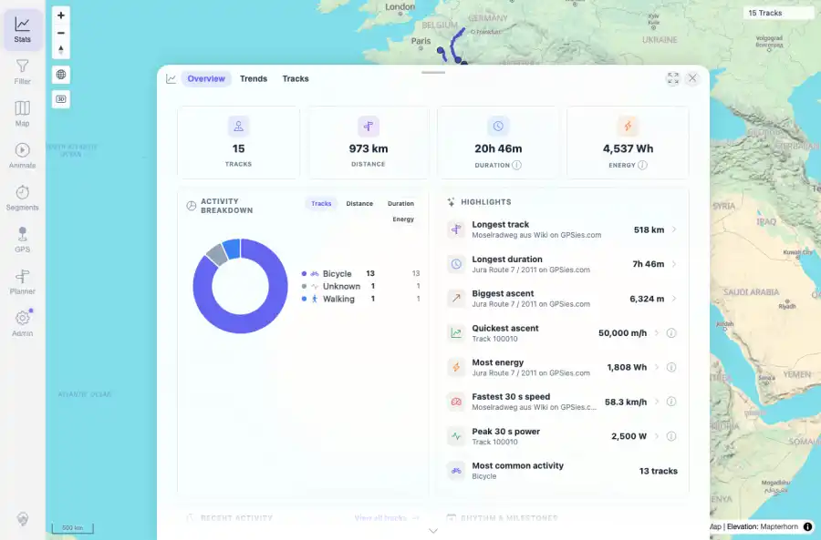

# Packet: SYN_02

## Scope

- Coverage source: `documentation/testing/frontend-regression-test-plan.md`
- Coverage ID or run packet: SYN_02
- In scope: Reload from freshness banner refreshes cached tracks and statistics.
- Out of scope: Other coverage IDs except where noted as shared state/evidence.

## Prerequisites

- Required previous coverage IDs or run packets: SYN_01 terminal; freshness banner visible.
- Required app/data state: Current run-state and packet set for this run.
- Required browser context: As specified by the coverage action.

## Allowed Mutations

- Allowed: Click banner Reload, inspect refreshed map/stats, capture evidence, and update SYN_02 packet/run-state.
- Not allowed: Collapse this ID into a parent row or skip required direct evidence.

## Actions And Results

| Coverage ID | Action | Expected result | Actual result | Status | Evidence |
|---|---|---|---|---|---|
| SYN_02 | Clicked the freshness banner Reload action and waited for the app to reload; then opened Stats. | Reloading from the banner refreshes cached tracks and stats. | PASS: the banner disappeared after reload, the API count was 15, the map showed 15 Tracks, and Stats overview listed the synthetic uploaded track in recent activity. | PASS | [assets/SYN_02-banner-reload-stats.webp](../assets/SYN_02-banner-reload-stats.webp); [assets/SYN_02-banner-reload-stats.txt](../assets/SYN_02-banner-reload-stats.txt) |

## Issues

| ID | Severity | Summary | Reproduction | Expected | Actual | Evidence | Release impact |
|---|---|---|---|---|---|---|---|

## Evidence Files

| File | Purpose |
|---|---|
| [assets/SYN_02-banner-reload-stats.webp](../assets/SYN_02-banner-reload-stats.webp) | Screenshot evidence |
| [assets/SYN_02-banner-reload-stats.txt](../assets/SYN_02-banner-reload-stats.txt) | Text/log evidence |

## Screenshot Evidence

## Timings

| Step | Timing |
|---|---:|
| Banner reload and stats check | ~15 seconds |

## Handoff Notes

- Completed: This coverage ID is terminal.
- Remaining unfinished coverage: Continue with the next queue row.
- Blocked or not applicable: none.
- State left for the next packet: unchanged.
