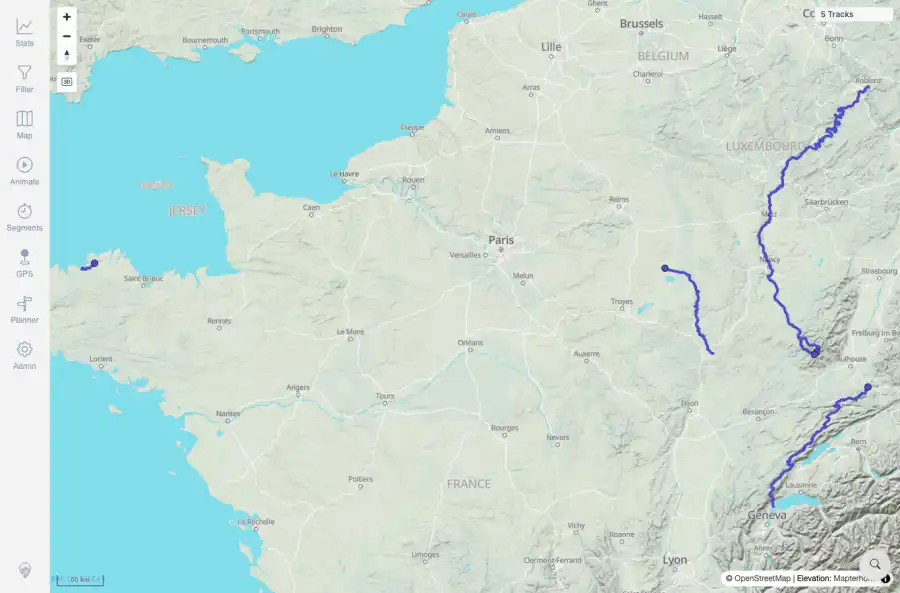
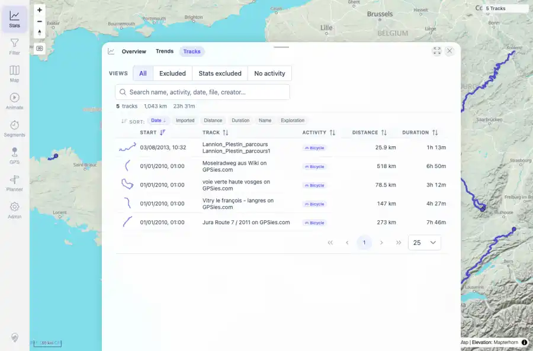
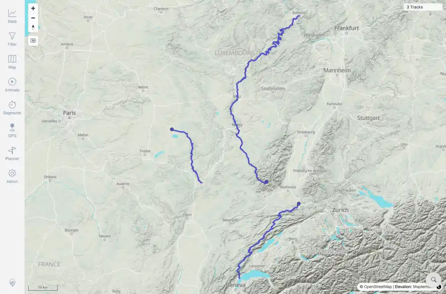
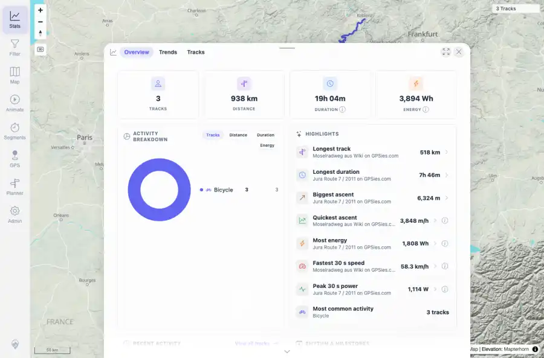
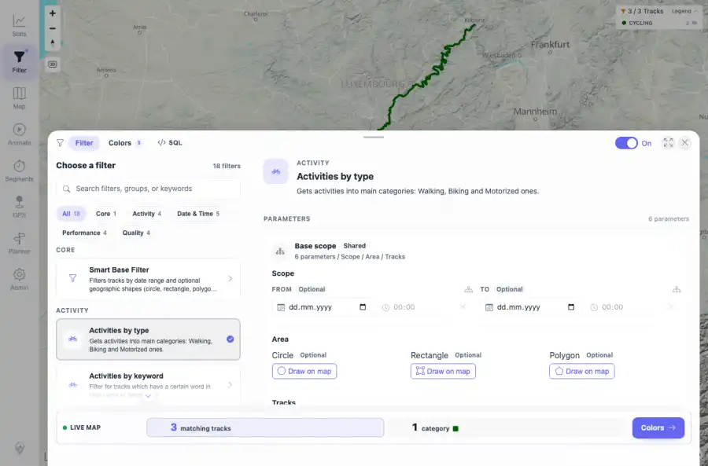
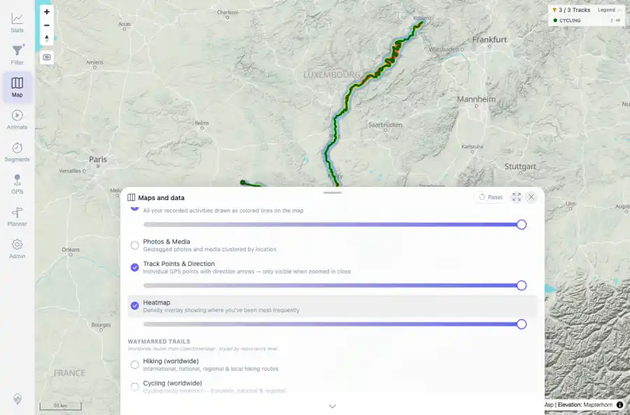
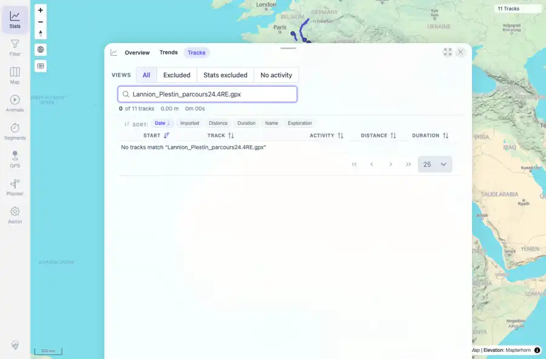

# Packet: SYN_03

## Scope

- Coverage source: `documentation/testing/frontend-regression-test-plan.md`
- Coverage ID or run packet: SYN_03
- In scope: Required five-GPX import and delete-two-track source-of-truth flow across indexer, freshness, map, browser, stats, filters, heatmap, and details.
- Out of scope: Other coverage IDs except where noted as shared state/evidence.

## Prerequisites

- Required previous coverage IDs or run packets: IMP_01 through IMP_09, DEL_01 through DEL_05, TBS_08, FLT, HMO, and TRD detail packets terminal.
- Required app/data state: Current run-state and packet set for this run.
- Required browser context: As specified by the coverage action.

## Allowed Mutations

- Allowed: Review completed packet evidence for the required import/delete flow and update SYN_03 packet/run-state.
- Not allowed: Collapse this ID into a parent row or skip required direct evidence.

## Actions And Results

| Coverage ID | Action | Expected result | Actual result | Status | Evidence |
|---|---|---|---|---|---|
| SYN_03 | Reviewed existing terminal packet evidence for five public GPX imports, deletion of two source files, and post-delete UI/API surfaces. | The required five-GPX import and delete-two-track flow passes and all affected surfaces reflect source-of-truth files. | PASS: five public GPX files imported successfully, two selected public GPX files were removed from the watched folder, indexer state showed removed=2, and map, browser, stats, filters, heatmap, and remaining details reflected the current source-of-truth set without stale deleted tracks. | PASS | [assets/IMP_03-index-final.txt](../assets/IMP_03-index-final.txt); [assets/IMP_05-map-after-reload.webp](../assets/IMP_05-map-after-reload.webp); [assets/IMP_05-tracks-after-reload.webp](../assets/IMP_05-tracks-after-reload.webp); [assets/IMP_09-heatmap-density.webp](../assets/IMP_09-heatmap-density.webp); [assets/DEL_02-delete-processing-wait.txt](../assets/DEL_02-delete-processing-wait.txt); [assets/DEL_03-map-after-deletion.webp](../assets/DEL_03-map-after-deletion.webp); [assets/DEL_03-stats-after-deletion.webp](../assets/DEL_03-stats-after-deletion.webp); [assets/DEL_03-filter-after-deletion.webp](../assets/DEL_03-filter-after-deletion.webp); [assets/DEL_03-heatmap-after-deletion.webp](../assets/DEL_03-heatmap-after-deletion.webp); [assets/TBS_08-deleted-tracks-absent.webp](../assets/TBS_08-deleted-tracks-absent.webp); [assets/DEL_04-remaining-track-open-summary.txt](../assets/DEL_04-remaining-track-open-summary.txt) |

## Issues

| ID | Severity | Summary | Reproduction | Expected | Actual | Evidence | Release impact |
|---|---|---|---|---|---|---|---|

## Evidence Files

| File | Purpose |
|---|---|
| [assets/IMP_03-index-final.txt](../assets/IMP_03-index-final.txt) | Text/log evidence |
| [assets/IMP_05-map-after-reload.webp](../assets/IMP_05-map-after-reload.webp) | Screenshot evidence |
| [assets/IMP_05-tracks-after-reload.webp](../assets/IMP_05-tracks-after-reload.webp) | Screenshot evidence |
| [assets/IMP_09-heatmap-density.webp](../assets/IMP_09-heatmap-density.webp) | Screenshot evidence |
| [assets/DEL_02-delete-processing-wait.txt](../assets/DEL_02-delete-processing-wait.txt) | Text/log evidence |
| [assets/DEL_03-map-after-deletion.webp](../assets/DEL_03-map-after-deletion.webp) | Screenshot evidence |
| [assets/DEL_03-stats-after-deletion.webp](../assets/DEL_03-stats-after-deletion.webp) | Screenshot evidence |
| [assets/DEL_03-filter-after-deletion.webp](../assets/DEL_03-filter-after-deletion.webp) | Screenshot evidence |
| [assets/DEL_03-heatmap-after-deletion.webp](../assets/DEL_03-heatmap-after-deletion.webp) | Screenshot evidence |
| [assets/TBS_08-deleted-tracks-absent.webp](../assets/TBS_08-deleted-tracks-absent.webp) | Screenshot evidence |
| [assets/DEL_04-remaining-track-open-summary.txt](../assets/DEL_04-remaining-track-open-summary.txt) | Text/log evidence |

## Screenshot Evidence

## Timings

| Step | Timing |
|---|---:|
| Evidence synthesis from completed packets | ~5 seconds |

## Handoff Notes

- Completed: This coverage ID is terminal.
- Remaining unfinished coverage: Continue with the next queue row.
- Blocked or not applicable: none.
- State left for the next packet: unchanged.
