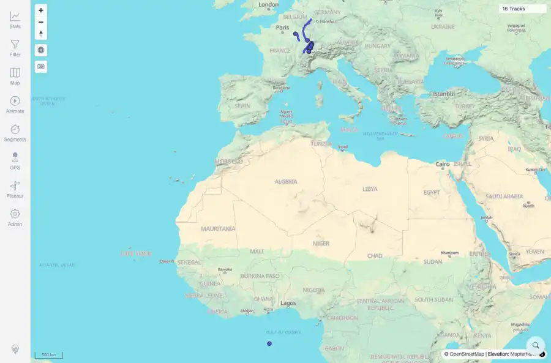
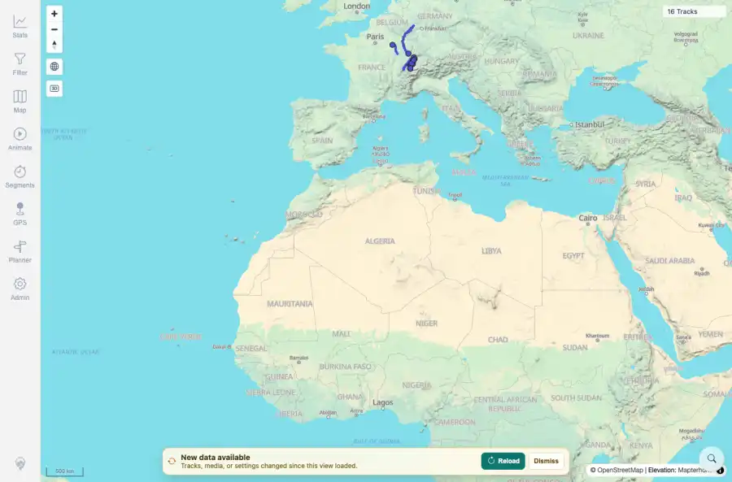

# Packet: SYN_05

## Scope

- Coverage source: `documentation/testing/frontend-regression-test-plan.md`
- Coverage ID or run packet: SYN_05
- In scope: Freshness banner dismiss snooze behavior across subsequent polling and token changes.
- Out of scope: Other coverage IDs except where noted as shared state/evidence.

## Prerequisites

- Required previous coverage IDs or run packets: SYN_01 through SYN_04 terminal; loaded client synchronized before dismiss test.
- Required app/data state: Current run-state and packet set for this run.
- Required browser context: As specified by the coverage action.

## Allowed Mutations

- Allowed: Upload synthetic GPX files, dismiss the banner, wait the real snooze interval, capture evidence, and update SYN_05 packet/run-state.
- Not allowed: Collapse this ID into a parent row or skip required direct evidence.

## Actions And Results

| Coverage ID | Action | Expected result | Actual result | Status | Evidence |
|---|---|---|---|---|---|
| SYN_05 | Uploaded one synthetic GPX to show the banner, clicked Dismiss, uploaded a second synthetic GPX during the snooze, waited through the next poll cycle, then waited for the five-minute snooze to expire. | Dismissing the banner snoozes it for five minutes, keeps it hidden through the next freshness poll even if the token changes again, and may reappear after the snooze if still out of sync. | PASS: the first banner appeared and was dismissed, no banner appeared during the next poll after a second token change, and the banner reappeared after the five-minute snooze expired while the client remained out of sync. | PASS | [assets/SYN_05-banner-before-dismiss.webp](../assets/SYN_05-banner-before-dismiss.webp); [assets/SYN_05-dismissed-hidden-after-next-change.webp](../assets/SYN_05-dismissed-hidden-after-next-change.webp); [assets/SYN_05-snooze-expired-reappeared.webp](../assets/SYN_05-snooze-expired-reappeared.webp); [assets/SYN_05-dismiss-snooze.txt](../assets/SYN_05-dismiss-snooze.txt) |

## Issues

| ID | Severity | Summary | Reproduction | Expected | Actual | Evidence | Release impact |
|---|---|---|---|---|---|---|---|

## Evidence Files

| File | Purpose |
|---|---|
| [assets/SYN_05-banner-before-dismiss.webp](../assets/SYN_05-banner-before-dismiss.webp) | Screenshot evidence |
| [assets/SYN_05-dismissed-hidden-after-next-change.webp](../assets/SYN_05-dismissed-hidden-after-next-change.webp) | Screenshot evidence |
| [assets/SYN_05-snooze-expired-reappeared.webp](../assets/SYN_05-snooze-expired-reappeared.webp) | Screenshot evidence |
| [assets/SYN_05-dismiss-snooze.txt](../assets/SYN_05-dismiss-snooze.txt) | Text/log evidence |

## Screenshot Evidence

## Timings

| Step | Timing |
|---|---:|
| Dismiss, next poll, and snooze expiry | ~6 minutes |

## Handoff Notes

- Completed: This coverage ID is terminal.
- Remaining unfinished coverage: Continue with the next queue row.
- Blocked or not applicable: none.
- State left for the next packet: unchanged.
