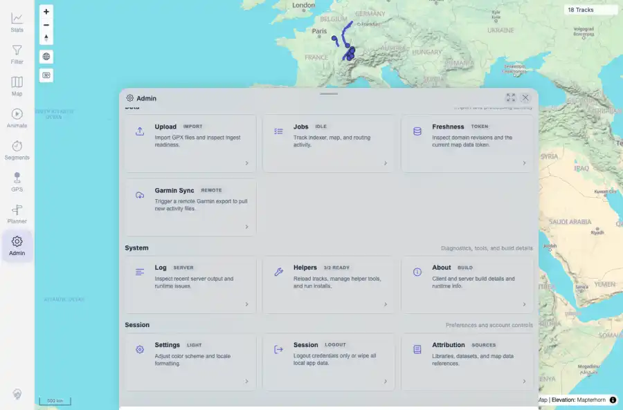
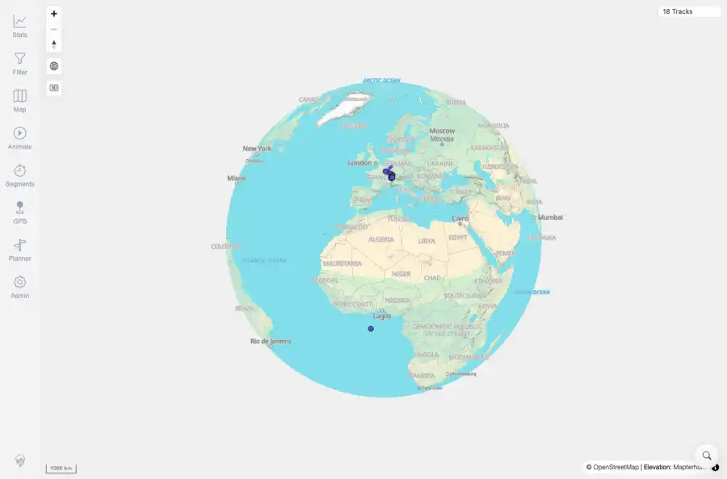

# Packet: SYN_06

## Scope

- Coverage source: `documentation/testing/frontend-regression-test-plan.md`
- Coverage ID or run packet: SYN_06
- In scope: Logout/login freshness behavior: verify returning to the app does not repeatedly trigger automatic data refresh.
- Out of scope: Other coverage IDs except where noted as shared state/evidence.

## Prerequisites

- Required previous coverage IDs or run packets: Previous queue rows terminal or explicitly not required.
- Required app/data state: Current run-state and packet set for this run.
- Required browser context: As specified by the coverage action.

## Allowed Mutations

- Allowed: Read-only verification and packet/run-state updates.
- Not allowed: Collapse this ID into a parent row or skip required direct evidence.

## Actions And Results

| Coverage ID | Action | Expected result | Actual result | Status | Evidence |
|---|---|---|---|---|---|
| SYN_06 | Opened Admin Session, captured freshness token state, logged out, logged back in with dev credentials, then observed navigation count, freshness banner state, and cache/freshness state for roughly one minute. | After login the app returns to the map without repeated automatic refresh navigations or a recurring freshness reload banner. | Returned to the main app; navigation count stayed stable after login polling; freshness banner stayed hidden; local applied/server tokens remained readable and matched while normal one-time track-cache sync completed for 18 tracks. | PASS | [assets/SYN_06-before-logout.webp](../assets/SYN_06-before-logout.webp); [assets/SYN_06-after-login-polling.webp](../assets/SYN_06-after-login-polling.webp); [assets/SYN_06-logout-login-refresh.txt](../assets/SYN_06-logout-login-refresh.txt) |

## Issues

| ID | Severity | Summary | Reproduction | Expected | Actual | Evidence | Release impact |
|---|---|---|---|---|---|---|---|

## Evidence Files

| File | Purpose |
|---|---|
| [assets/SYN_06-before-logout.webp](../assets/SYN_06-before-logout.webp) | Screenshot evidence |
| [assets/SYN_06-after-login-polling.webp](../assets/SYN_06-after-login-polling.webp) | Screenshot evidence |
| [assets/SYN_06-logout-login-refresh.txt](../assets/SYN_06-logout-login-refresh.txt) | Text/log evidence |

## Screenshot Evidence

## Timings

| Step | Timing |
|---|---:|
| Logout/login and polling | ~90 seconds |

## Handoff Notes

- Completed: This coverage ID is terminal.
- Remaining unfinished coverage: Continue with the next queue row.
- Blocked or not applicable: none.
- State left for the next packet: unchanged.
