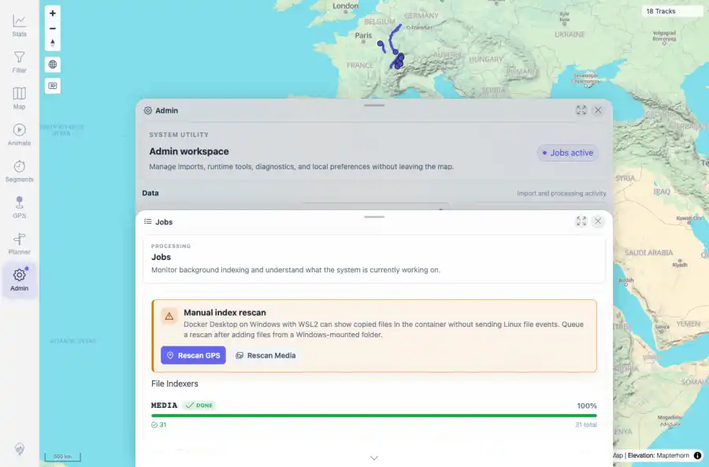
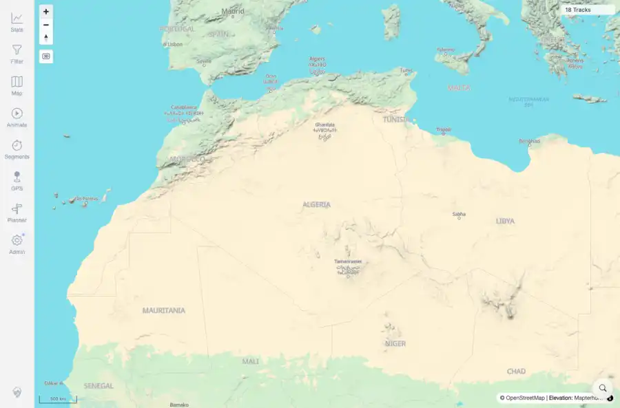

# Packet: SYN_07

## Scope

- Coverage source: `documentation/testing/frontend-regression-test-plan.md`
- Coverage ID or run packet: SYN_07
- In scope: Indexer-running state: visible running badge/status while GPS indexing is pending, and map interaction during that activity.
- Out of scope: Other coverage IDs except where noted as shared state/evidence.

## Prerequisites

- Required previous coverage IDs or run packets: Previous queue rows terminal or explicitly not required.
- Required app/data state: Current run-state and packet set for this run.
- Required browser context: As specified by the coverage action.

## Allowed Mutations

- Allowed: Read-only verification and packet/run-state updates.
- Not allowed: Collapse this ID into a parent row or skip required direct evidence.

## Actions And Results

| Coverage ID | Action | Expected result | Actual result | Status | Evidence |
|---|---|---|---|---|---|
| SYN_07 | Opened authenticated app and Admin home, uploaded a 12.2 MB fully synthetic GPX through the authenticated upload API, polled indexer status until GPS pending=1, captured Admin running/scanning state, closed Admin, clicked map Zoom in, then waited for indexer settlement. | Indexer-running state surfaces as a visible badge/status, and normal map controls remain usable while indexing is active. | Upload was accepted; GPS status reached total=21 pending=1 completed=18 removed=2; Admin showed Jobs active, live Jobs tile, and scanning badge; map Zoom in remained visible/clickable; final GPS status settled to pending=0 completed=19 failed=0. | PASS | [assets/SYN_07-indexer-running-badge.webp](../assets/SYN_07-indexer-running-badge.webp); [assets/SYN_07-map-interactive-during-index.webp](../assets/SYN_07-map-interactive-during-index.webp); [assets/SYN_07-indexer-running.txt](../assets/SYN_07-indexer-running.txt) |

## Issues

| ID | Severity | Summary | Reproduction | Expected | Actual | Evidence | Release impact |
|---|---|---|---|---|---|---|---|

## Evidence Files

| File | Purpose |
|---|---|
| [assets/SYN_07-indexer-running-badge.webp](../assets/SYN_07-indexer-running-badge.webp) | Screenshot evidence |
| [assets/SYN_07-map-interactive-during-index.webp](../assets/SYN_07-map-interactive-during-index.webp) | Screenshot evidence |
| [assets/SYN_07-indexer-running.txt](../assets/SYN_07-indexer-running.txt) | Text/log evidence |

## Screenshot Evidence

## Timings

| Step | Timing |
|---|---:|
| Upload and pending observation | ~45 seconds |\n| Settlement wait | ~15 seconds |

## Handoff Notes

- Completed: This coverage ID is terminal.
- Remaining unfinished coverage: Continue with the next queue row.
- Blocked or not applicable: none.
- State left for the next packet: unchanged.
