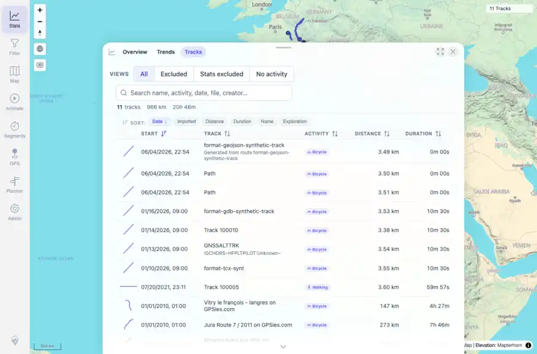

# Packet: TBS_01

## Scope

- Coverage source: `documentation/testing/frontend-regression-test-plan.md`
- Coverage ID or run packet: TBS_01
- In scope: Track browser default listing with names, dates, distance, duration, activity, energy, exploration, and imported columns.
- Out of scope: Other coverage IDs except where noted as shared state/evidence.

## Prerequisites

- Required previous coverage IDs or run packets: Previous queue rows through FLT_08 terminal; current dataset has 11 tracks.
- Required app/data state: Current run-state and packet set for this run.
- Required browser context: As specified by the coverage action.

## Allowed Mutations

- Allowed: Read-only browser verification, screenshot/text evidence, packet/run-state updates.
- Not allowed: Collapse this ID into a parent row or skip required direct evidence.

## Actions And Results

| Coverage ID | Action | Expected result | Actual result | Status | Evidence |
|---|---|---|---|---|---|
| TBS_01 | Opened Stats > Tracks with filters reset; compared API count to browser summary, headers, and visible rows. | Track browser lists all visible tracks with core metadata columns. | Browser summary showed 11 tracks, 966 km, 20h 46m; table headers included Start, Track, Activity, Distance, Duration, Avg km/h, Energy, Exploration, and Imported; visible rows included names/descriptions and metric values. | PASS | [assets/TBS_01-track-browser-all-tracks.webp](../assets/TBS_01-track-browser-all-tracks.webp); [assets/TBS_01-track-browser-all-tracks.txt](../assets/TBS_01-track-browser-all-tracks.txt) |

## Issues

| ID | Severity | Summary | Reproduction | Expected | Actual | Evidence | Release impact |
|---|---|---|---|---|---|---|---|

## Evidence Files

| File | Purpose |
|---|---|
| [assets/TBS_01-track-browser-all-tracks.webp](../assets/TBS_01-track-browser-all-tracks.webp) | Screenshot evidence |
| [assets/TBS_01-track-browser-all-tracks.txt](../assets/TBS_01-track-browser-all-tracks.txt) | Text/log evidence |

## Screenshot Evidence

## Timings

| Step | Timing |
|---|---:|
| Browser automation and evidence capture | ~1 minute |

## Handoff Notes

- Completed: This coverage ID is terminal.
- Remaining unfinished coverage: Continue with the next queue row.
- Blocked or not applicable: none.
- State left for the next packet: unchanged.
