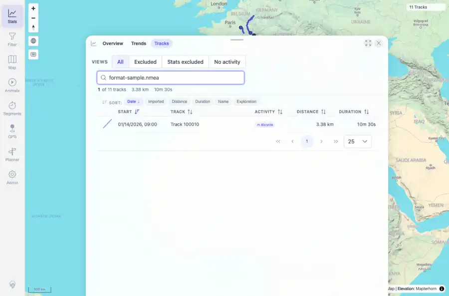

# Packet: TBS_02

## Scope

- Coverage source: `documentation/testing/frontend-regression-test-plan.md`
- Coverage ID or run packet: TBS_02
- In scope: Track browser search across supported indexed fields.
- Out of scope: Other coverage IDs except where noted as shared state/evidence.

## Prerequisites

- Required previous coverage IDs or run packets: TBS_01 terminal; current dataset has 11 tracks.
- Required app/data state: Current run-state and packet set for this run.
- Required browser context: As specified by the coverage action.

## Allowed Mutations

- Allowed: Read-only search interactions, screenshot/text evidence, packet/run-state updates.
- Not allowed: Collapse this ID into a parent row or skip required direct evidence.

## Actions And Results

| Coverage ID | Action | Expected result | Actual result | Status | Evidence |
|---|---|---|---|---|---|
| TBS_02 | Searched the track browser for name, description, ISO date, raw distance, duration text, activity type, and source file path/name values. | Search matches names, descriptions, dates, distances, durations, activity, and file paths. | Queries matched the expected rows: Moselradweg by name, Generated from route by description, 2026-01-13 by date, 3537.06 by raw distance, 10 min by duration, WALKING by activity, and format-sample.nmea by file path/name. | PASS | [assets/TBS_02-search-file-path.webp](../assets/TBS_02-search-file-path.webp); [assets/TBS_02-search-fields.txt](../assets/TBS_02-search-fields.txt) |

## Issues

| ID | Severity | Summary | Reproduction | Expected | Actual | Evidence | Release impact |
|---|---|---|---|---|---|---|---|

## Evidence Files

| File | Purpose |
|---|---|
| [assets/TBS_02-search-file-path.webp](../assets/TBS_02-search-file-path.webp) | Screenshot evidence |
| [assets/TBS_02-search-fields.txt](../assets/TBS_02-search-fields.txt) | Text/log evidence |

## Screenshot Evidence

## Timings

| Step | Timing |
|---|---:|
| Browser automation and evidence capture | ~1 minute |

## Handoff Notes

- Completed: This coverage ID is terminal.
- Remaining unfinished coverage: Continue with the next queue row.
- Blocked or not applicable: none.
- State left for the next packet: unchanged.
