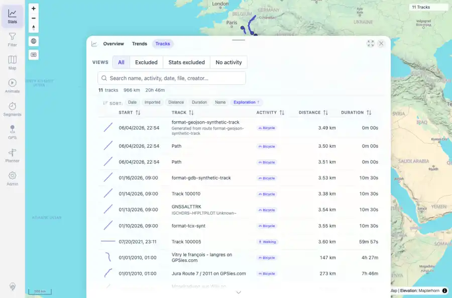
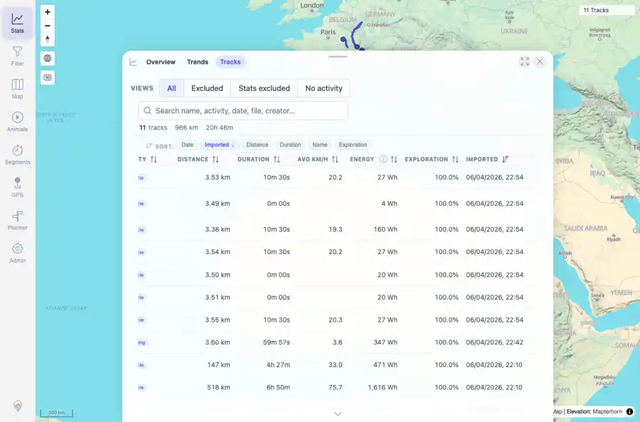

# Packet: TBS_03

## Scope

- Coverage source: `documentation/testing/frontend-regression-test-plan.md`
- Coverage ID or run packet: TBS_03
- In scope: Track browser sorting and summary row behavior.
- Out of scope: Other coverage IDs except where noted as shared state/evidence.

## Prerequisites

- Required previous coverage IDs or run packets: TBS_02 terminal; current dataset has 11 tracks.
- Required app/data state: Current run-state and packet set for this run.
- Required browser context: As specified by the coverage action.

## Allowed Mutations

- Allowed: Read-only sorting interactions, screenshot/text evidence, packet/run-state updates.
- Not allowed: Collapse this ID into a parent row or skip required direct evidence.

## Actions And Results

| Coverage ID | Action | Expected result | Actual result | Status | Evidence |
|---|---|---|---|---|---|
| TBS_03 | Exercised desktop sort chips and toggled each visible sortable table header; recorded first-row changes and summary before/after. | Sorting works by each sortable browser column, and the summary row reflects the currently visible set. | Sort chips changed row order for Date, Imported, Distance, Duration, and Name; direct header sorting changed row order for Start, Track, Activity, Distance, Duration, Avg km/h, Energy, and Imported. Exploration accepted sort toggles but order stayed stable because all current rows show 100.0%. Summary stayed 11 tracks / 966 km / 20h 46m for the unchanged visible set. | PASS | [assets/TBS_03-sort-distance-name.webp](../assets/TBS_03-sort-distance-name.webp); [assets/TBS_03-sort-summary.txt](../assets/TBS_03-sort-summary.txt); [assets/TBS_03-column-sort-headers.webp](../assets/TBS_03-column-sort-headers.webp); [assets/TBS_03-column-sort-summary.txt](../assets/TBS_03-column-sort-summary.txt) |

## Issues

| ID | Severity | Summary | Reproduction | Expected | Actual | Evidence | Release impact |
|---|---|---|---|---|---|---|---|

## Evidence Files

| File | Purpose |
|---|---|
| [assets/TBS_03-sort-distance-name.webp](../assets/TBS_03-sort-distance-name.webp) | Screenshot evidence |
| [assets/TBS_03-sort-summary.txt](../assets/TBS_03-sort-summary.txt) | Text/log evidence |
| [assets/TBS_03-column-sort-headers.webp](../assets/TBS_03-column-sort-headers.webp) | Screenshot evidence |
| [assets/TBS_03-column-sort-summary.txt](../assets/TBS_03-column-sort-summary.txt) | Text/log evidence |

## Screenshot Evidence

## Timings

| Step | Timing |
|---|---:|
| Browser automation and evidence capture | ~2 minutes |

## Handoff Notes

- Completed: This coverage ID is terminal.
- Remaining unfinished coverage: Continue with the next queue row.
- Blocked or not applicable: none.
- State left for the next packet: unchanged.
