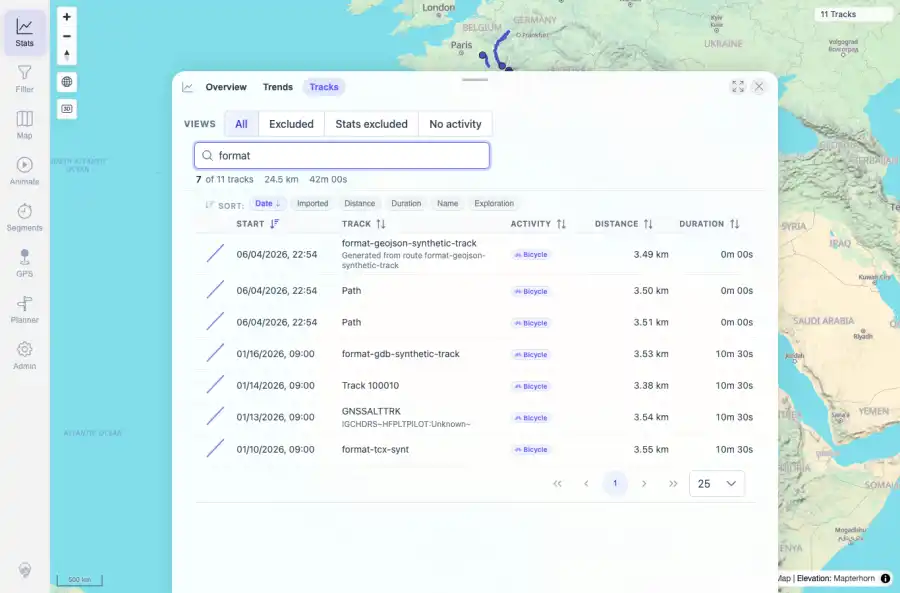

# Packet: TBS_04

## Scope

- Coverage source: `documentation/testing/frontend-regression-test-plan.md`
- Coverage ID or run packet: TBS_04
- In scope: Track browser quick views/presets and continued sort/search usability.
- Out of scope: Other coverage IDs except where noted as shared state/evidence.

## Prerequisites

- Required previous coverage IDs or run packets: TBS_03 terminal; current dataset has 11 tracks.
- Required app/data state: Current run-state and packet set for this run.
- Required browser context: As specified by the coverage action.

## Allowed Mutations

- Allowed: Read-only preset/search interactions, screenshot/text evidence, packet/run-state updates.
- Not allowed: Collapse this ID into a parent row or skip required direct evidence.

## Actions And Results

| Coverage ID | Action | Expected result | Actual result | Status | Evidence |
|---|---|---|---|---|---|
| TBS_04 | Clicked All, Excluded, Stats excluded, and No activity quick views, then returned to All and searched for format. | Quick-view buttons switch subsets correctly and preserve usable search/sort behavior. | All showed 11 tracks; Excluded, Stats excluded, and No activity correctly showed 0 tracks for the current clean dataset; after returning to All, searching format showed 7 of 11 tracks. | PASS | [assets/TBS_04-quick-views-search.webp](../assets/TBS_04-quick-views-search.webp); [assets/TBS_04-quick-views.txt](../assets/TBS_04-quick-views.txt) |

## Issues

| ID | Severity | Summary | Reproduction | Expected | Actual | Evidence | Release impact |
|---|---|---|---|---|---|---|---|

## Evidence Files

| File | Purpose |
|---|---|
| [assets/TBS_04-quick-views-search.webp](../assets/TBS_04-quick-views-search.webp) | Screenshot evidence |
| [assets/TBS_04-quick-views.txt](../assets/TBS_04-quick-views.txt) | Text/log evidence |

## Screenshot Evidence

## Timings

| Step | Timing |
|---|---:|
| Browser automation and evidence capture | ~1 minute |

## Handoff Notes

- Completed: This coverage ID is terminal.
- Remaining unfinished coverage: Continue with the next queue row.
- Blocked or not applicable: none.
- State left for the next packet: unchanged.
