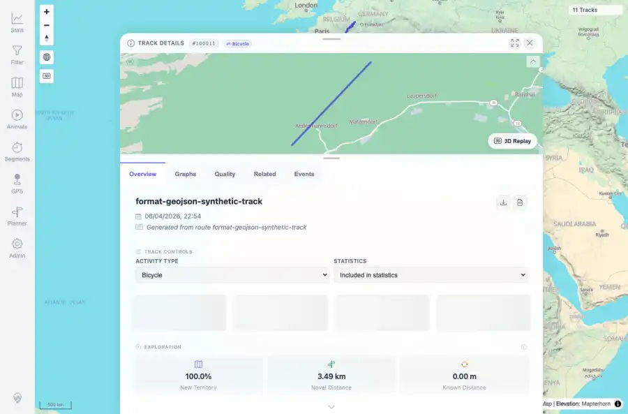

# Packet: TBS_05

## Scope

- Coverage source: `documentation/testing/frontend-regression-test-plan.md`
- Coverage ID or run packet: TBS_05
- In scope: Track browser row-to-detail navigation.
- Out of scope: Other coverage IDs except where noted as shared state/evidence.

## Prerequisites

- Required previous coverage IDs or run packets: TBS_04 terminal; current dataset has 11 tracks.
- Required app/data state: Current run-state and packet set for this run.
- Required browser context: As specified by the coverage action.

## Allowed Mutations

- Allowed: Read-only row click/navigation, screenshot/text evidence, packet/run-state updates.
- Not allowed: Collapse this ID into a parent row or skip required direct evidence.

## Actions And Results

| Coverage ID | Action | Expected result | Actual result | Status | Evidence |
|---|---|---|---|---|---|
| TBS_05 | Clicked the first visible track-browser row after clearing search and checked that the track detail sheet opened. | Clicking a row opens the selected track's details. | Clicking the GeoJSON track row opened Track Details #100011 with activity controls, statistics controls, and overview metrics visible. | PASS | [assets/TBS_05-row-opens-details.webp](../assets/TBS_05-row-opens-details.webp); [assets/TBS_05-row-opens-details.txt](../assets/TBS_05-row-opens-details.txt) |

## Issues

| ID | Severity | Summary | Reproduction | Expected | Actual | Evidence | Release impact |
|---|---|---|---|---|---|---|---|

## Evidence Files

| File | Purpose |
|---|---|
| [assets/TBS_05-row-opens-details.webp](../assets/TBS_05-row-opens-details.webp) | Screenshot evidence |
| [assets/TBS_05-row-opens-details.txt](../assets/TBS_05-row-opens-details.txt) | Text/log evidence |

## Screenshot Evidence

## Timings

| Step | Timing |
|---|---:|
| Browser automation and evidence capture | ~1 minute |

## Handoff Notes

- Completed: This coverage ID is terminal.
- Remaining unfinished coverage: Continue with the next queue row.
- Blocked or not applicable: none.
- State left for the next packet: unchanged.
