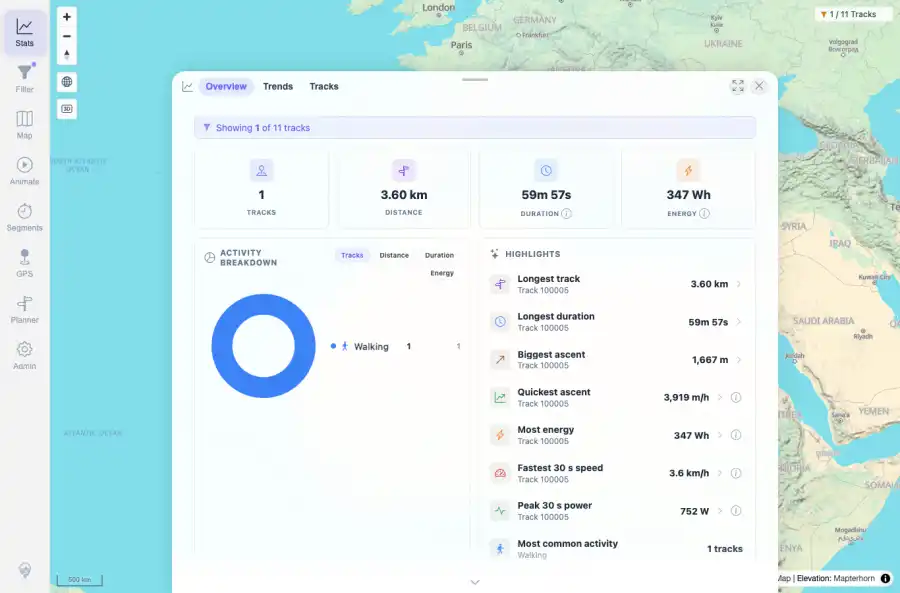
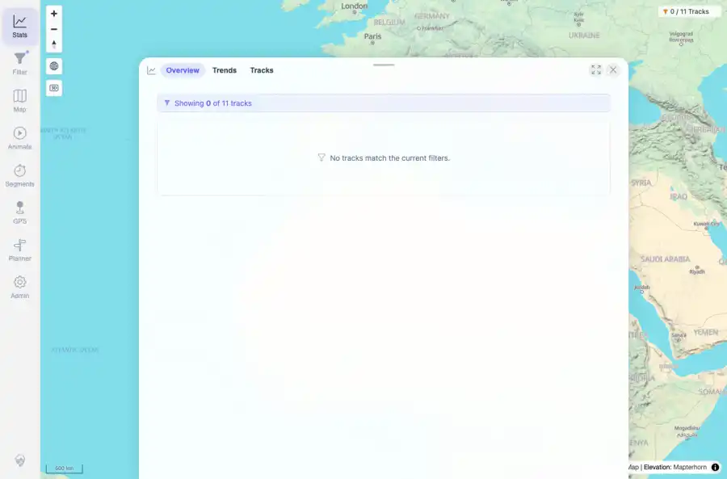

# Packet: TBS_07

## Scope

- Coverage source: `documentation/testing/frontend-regression-test-plan.md`
- Coverage ID or run packet: TBS_07
- In scope: Statistics behavior for many-track, single-track, and empty filtered datasets.
- Out of scope: Other coverage IDs except where noted as shared state/evidence.

## Prerequisites

- Required previous coverage IDs or run packets: TBS_06 terminal; current dataset has 11 tracks and filter UI/local-storage behavior from FLT packets.
- Required app/data state: Current run-state and packet set for this run.
- Required browser context: As specified by the coverage action.

## Allowed Mutations

- Allowed: Temporary browser-local saved filter state changes, screenshot/text evidence, packet/run-state updates.
- Not allowed: Collapse this ID into a parent row or skip required direct evidence.

## Actions And Results

| Coverage ID | Action | Expected result | Actual result | Status | Evidence |
|---|---|---|---|---|---|
| TBS_07 | Captured default many-track overview, applied a Smart Base TRACK_IDS filter for track 100005, then applied a keyword filter that matched no tracks. | Stats are correct for empty dataset, a single track, and many tracks. | Many-track state showed 11 tracks / 966 km / 20h 46m; single-track state showed 1 track / 3.60 km / 59m 57s with a Showing 1 of 11 banner; empty state showed Showing 0 of 11 tracks and the no-match empty message. | PASS | [assets/TBS_07-single-track-stats.webp](../assets/TBS_07-single-track-stats.webp); [assets/TBS_07-empty-stats.webp](../assets/TBS_07-empty-stats.webp); [assets/TBS_07-empty-single-many.txt](../assets/TBS_07-empty-single-many.txt) |

## Issues

| ID | Severity | Summary | Reproduction | Expected | Actual | Evidence | Release impact |
|---|---|---|---|---|---|---|---|

## Evidence Files

| File | Purpose |
|---|---|
| [assets/TBS_07-single-track-stats.webp](../assets/TBS_07-single-track-stats.webp) | Screenshot evidence |
| [assets/TBS_07-empty-stats.webp](../assets/TBS_07-empty-stats.webp) | Screenshot evidence |
| [assets/TBS_07-empty-single-many.txt](../assets/TBS_07-empty-single-many.txt) | Text/log evidence |

## Screenshot Evidence

## Timings

| Step | Timing |
|---|---:|
| Browser automation and evidence capture | ~2 minutes |

## Handoff Notes

- Completed: This coverage ID is terminal.
- Remaining unfinished coverage: Continue with the next queue row.
- Blocked or not applicable: none.
- State left for the next packet: unchanged.
