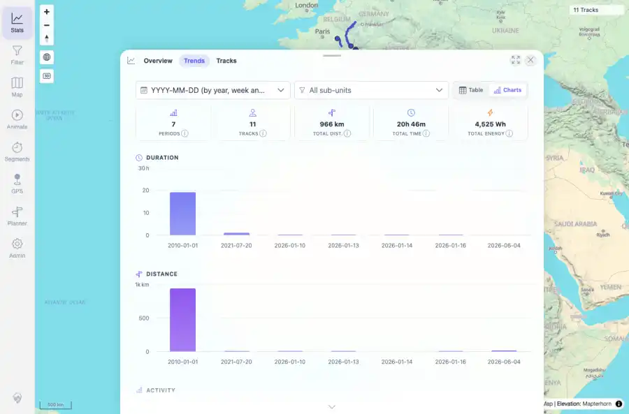

# Packet: TBS_09

## Scope

- Coverage source: `documentation/testing/frontend-regression-test-plan.md`
- Coverage ID or run packet: TBS_09
- In scope: Statistics time-period chart rendering and grouping changes.
- Out of scope: Other coverage IDs except where noted as shared state/evidence.

## Prerequisites

- Required previous coverage IDs or run packets: TBS_08 terminal; current dataset has 11 tracks.
- Required app/data state: Current run-state and packet set for this run.
- Required browser context: As specified by the coverage action.

## Allowed Mutations

- Allowed: Read-only statistics chart interactions, screenshot/text evidence, packet/run-state updates.
- Not allowed: Collapse this ID into a parent row or skip required direct evidence.

## Actions And Results

| Coverage ID | Action | Expected result | Actual result | Status | Evidence |
|---|---|---|---|---|---|
| TBS_09 | Opened Stats > Trends charts and switched grouping from quarterly to monthly, weekly, and daily. | Daily, weekly, and monthly period charts render and switch correctly. | Quarterly default rendered 8 Highcharts SVGs; monthly rendered 4 periods, weekly rendered 5 periods, and daily rendered 7 periods while preserving totals of 11 tracks, 966 km, 20h 46m, and 4,525 Wh. | PASS | [assets/TBS_09-trends-charts-daily.webp](../assets/TBS_09-trends-charts-daily.webp); [assets/TBS_09-period-charts.txt](../assets/TBS_09-period-charts.txt) |

## Issues

| ID | Severity | Summary | Reproduction | Expected | Actual | Evidence | Release impact |
|---|---|---|---|---|---|---|---|

## Evidence Files

| File | Purpose |
|---|---|
| [assets/TBS_09-trends-charts-daily.webp](../assets/TBS_09-trends-charts-daily.webp) | Screenshot evidence |
| [assets/TBS_09-period-charts.txt](../assets/TBS_09-period-charts.txt) | Text/log evidence |

## Screenshot Evidence

## Timings

| Step | Timing |
|---|---:|
| Browser automation and evidence capture | ~1 minute |

## Handoff Notes

- Completed: This coverage ID is terminal.
- Remaining unfinished coverage: Continue with the next queue row.
- Blocked or not applicable: none.
- State left for the next packet: unchanged.
