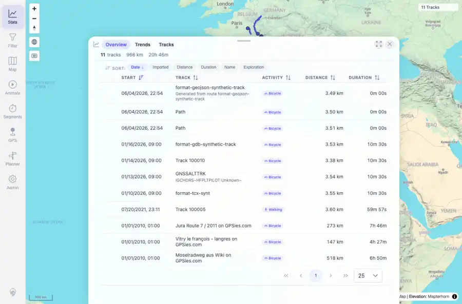

# Packet: TBS_10

## Scope

- Coverage source: `documentation/testing/frontend-regression-test-plan.md`
- Coverage ID or run packet: TBS_10
- In scope: Statistics entry navigation, filtering, and drilldown interactions.
- Out of scope: Other coverage IDs except where noted as shared state/evidence.

## Prerequisites

- Required previous coverage IDs or run packets: TBS_09 terminal; current dataset has 11 tracks.
- Required app/data state: Current run-state and packet set for this run.
- Required browser context: As specified by the coverage action.

## Allowed Mutations

- Allowed: Read-only stats entry clicks/navigation, screenshot/text evidence, packet/run-state updates.
- Not allowed: Collapse this ID into a parent row or skip required direct evidence.

## Actions And Results

| Coverage ID | Action | Expected result | Actual result | Status | Evidence |
|---|---|---|---|---|---|
| TBS_10 | Clicked the first active-period stats entry to open its drilldown, then used View all recent tracks to navigate to the browser list. | Clicking a stats entry navigates, filters, or highlights as expected. | The Most active day drilldown opened with ranked periods and track counts; View all recent tracks switched to the Tracks tab with the 11-track browser summary and rows visible. | PASS | [assets/TBS_10-stats-entry-drilldown-view-all.webp](../assets/TBS_10-stats-entry-drilldown-view-all.webp); [assets/TBS_10-stats-entry-navigation.txt](../assets/TBS_10-stats-entry-navigation.txt) |

## Issues

| ID | Severity | Summary | Reproduction | Expected | Actual | Evidence | Release impact |
|---|---|---|---|---|---|---|---|

## Evidence Files

| File | Purpose |
|---|---|
| [assets/TBS_10-stats-entry-drilldown-view-all.webp](../assets/TBS_10-stats-entry-drilldown-view-all.webp) | Screenshot evidence |
| [assets/TBS_10-stats-entry-navigation.txt](../assets/TBS_10-stats-entry-navigation.txt) | Text/log evidence |

## Screenshot Evidence

## Timings

| Step | Timing |
|---|---:|
| Browser automation and evidence capture | ~1 minute |

## Handoff Notes

- Completed: This coverage ID is terminal.
- Remaining unfinished coverage: Continue with the next queue row.
- Blocked or not applicable: none.
- State left for the next packet: unchanged.
