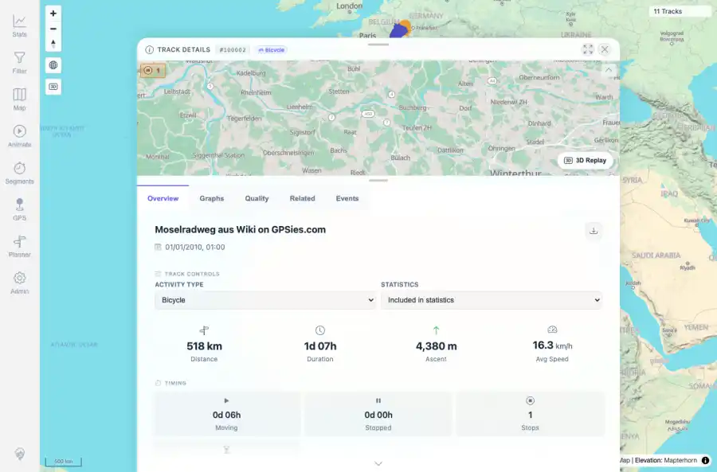

# Packet: TBS_11

## Scope

- Coverage source: `documentation/testing/frontend-regression-test-plan.md`
- Coverage ID or run packet: TBS_11
- In scope: Statistics highlight drilldowns and track-opening behavior.
- Out of scope: Other coverage IDs except where noted as shared state/evidence.

## Prerequisites

- Required previous coverage IDs or run packets: TBS_10 terminal; current dataset has 11 tracks and no currently excluded tracks.
- Required app/data state: Current run-state and packet set for this run.
- Required browser context: As specified by the coverage action.

## Allowed Mutations

- Allowed: Read-only highlight drilldown/open interactions, screenshot/text evidence, packet/run-state updates.
- Not allowed: Collapse this ID into a parent row or skip required direct evidence.

## Actions And Results

| Coverage ID | Action | Expected result | Actual result | Status | Evidence |
|---|---|---|---|---|---|
| TBS_11 | Opened the Longest track highlight drilldown, clicked the first drilldown row open action, and checked whether excluded-highlight counts were applicable. | Highlight drilldowns open expected track lists, selected tracks open, and excluded-highlight counts are exposed where applicable. | Longest track drilldown listed 11 ranked tracks with Moselradweg first; opening the first row opened Track Details #100002. No excluded-highlight count was present because the current dataset has no excluded tracks. | PASS | [assets/TBS_11-highlight-drilldown-open-details.webp](../assets/TBS_11-highlight-drilldown-open-details.webp); [assets/TBS_11-highlight-drilldowns.txt](../assets/TBS_11-highlight-drilldowns.txt) |

## Issues

| ID | Severity | Summary | Reproduction | Expected | Actual | Evidence | Release impact |
|---|---|---|---|---|---|---|---|

## Evidence Files

| File | Purpose |
|---|---|
| [assets/TBS_11-highlight-drilldown-open-details.webp](../assets/TBS_11-highlight-drilldown-open-details.webp) | Screenshot evidence |
| [assets/TBS_11-highlight-drilldowns.txt](../assets/TBS_11-highlight-drilldowns.txt) | Text/log evidence |

## Screenshot Evidence

## Timings

| Step | Timing |
|---|---:|
| Browser automation and evidence capture | ~1 minute |

## Handoff Notes

- Completed: This coverage ID is terminal.
- Remaining unfinished coverage: Continue with the next queue row.
- Blocked or not applicable: none.
- State left for the next packet: unchanged.
