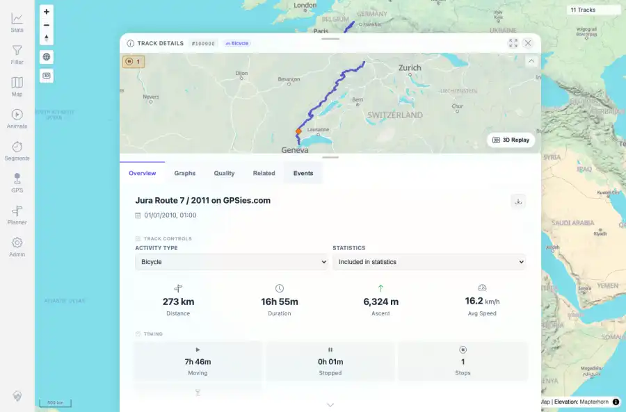
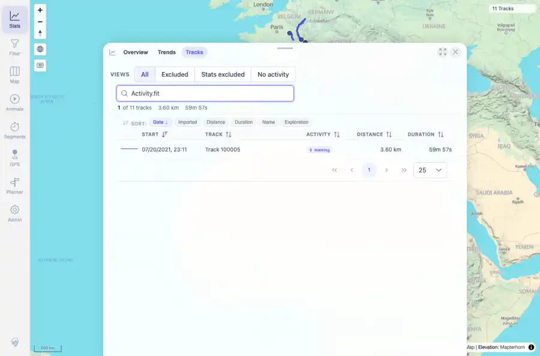
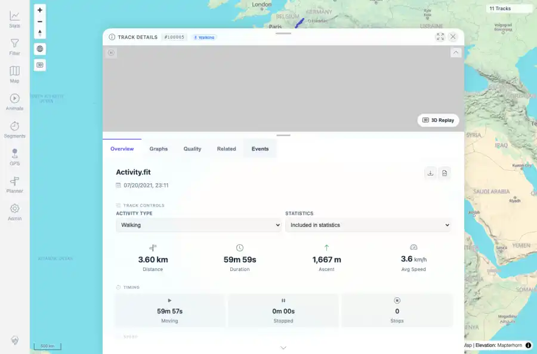

# Packet: TRD_01

## Scope

- Coverage source: `documentation/testing/frontend-regression-test-plan.md`
- Coverage ID or run packet: TRD_01
- In scope: Open one GPX-backed track and one FIT-backed track from user-facing navigation and record their ids/source filenames.
- Out of scope: Other coverage IDs except where noted as shared state/evidence.

## Prerequisites

- Required previous coverage IDs or run packets: Previous queue rows terminal or explicitly not required.
- Required app/data state: Current run-state and packet set for this run.
- Required browser context: As specified by the coverage action.

## Allowed Mutations

- Allowed: Read-only verification and packet/run-state updates.
- Not allowed: Collapse this ID into a parent row or skip required direct evidence.

## Actions And Results

| Coverage ID | Action | Expected result | Actual result | Status | Evidence |
|---|---|---|---|---|---|
| TRD_01 | Opened Stats, switched to Tracks, searched for Jura and Activity.fit, clicked the visible result rows, and recorded the resulting detail URLs plus API source filenames. | A GPX-backed and a FIT-backed track open from user-facing navigation, with IDs and source filenames recorded. | Stats -> Tracks opened GPX track id 100000 from JuraRoute72011.gpx and FIT track id 100005 from Activity.fit; both detail pages showed the expected ID and title. | PASS | [assets/TRD_01-gpx-browser-open-track-list.webp](../assets/TRD_01-gpx-browser-open-track-list.webp); [assets/TRD_01-gpx-browser-open-detail-open.webp](../assets/TRD_01-gpx-browser-open-detail-open.webp); [assets/TRD_01-fit-browser-open-track-list.webp](../assets/TRD_01-fit-browser-open-track-list.webp); [assets/TRD_01-fit-browser-open-detail-open.webp](../assets/TRD_01-fit-browser-open-detail-open.webp); [assets/TRD_01_03-navigation-tabs-summary.txt](../assets/TRD_01_03-navigation-tabs-summary.txt) |

## Issues

| ID | Severity | Summary | Reproduction | Expected | Actual | Evidence | Release impact |
|---|---|---|---|---|---|---|---|

## Evidence Files

| File | Purpose |
|---|---|
| [assets/TRD_01-gpx-browser-open-track-list.webp](../assets/TRD_01-gpx-browser-open-track-list.webp) | Screenshot evidence |
| [assets/TRD_01-gpx-browser-open-detail-open.webp](../assets/TRD_01-gpx-browser-open-detail-open.webp) | Screenshot evidence |
| [assets/TRD_01-fit-browser-open-track-list.webp](../assets/TRD_01-fit-browser-open-track-list.webp) | Screenshot evidence |
| [assets/TRD_01-fit-browser-open-detail-open.webp](../assets/TRD_01-fit-browser-open-detail-open.webp) | Screenshot evidence |
| [assets/TRD_01_03-navigation-tabs-summary.txt](../assets/TRD_01_03-navigation-tabs-summary.txt) | Text/log evidence |

## Screenshot Evidence

## Timings

| Step | Timing |
|---|---:|
| Packet execution | <1 minute |

## Handoff Notes

- Completed: This coverage ID is terminal.
- Remaining unfinished coverage: Continue with the next queue row.
- Blocked or not applicable: none.
- State left for the next packet: unchanged.
