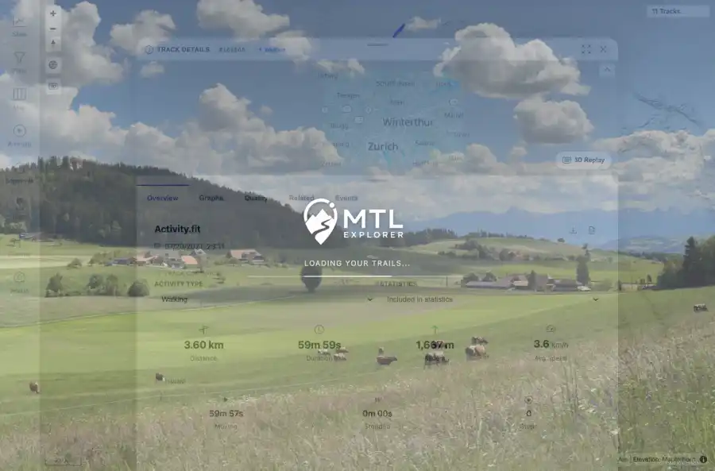
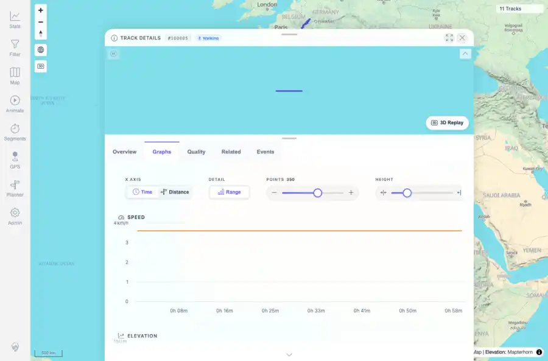
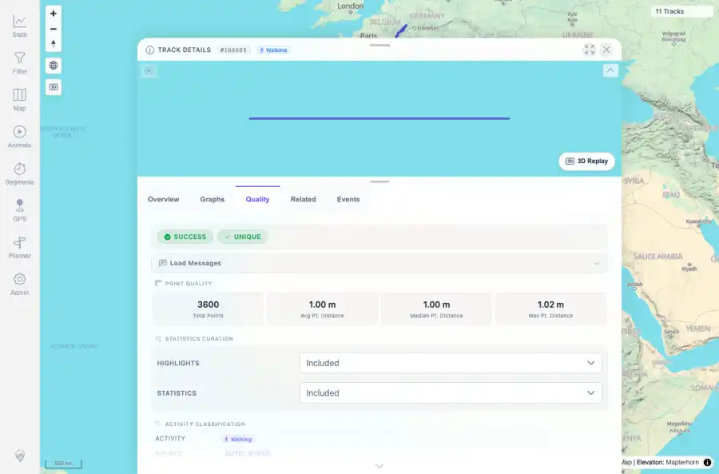
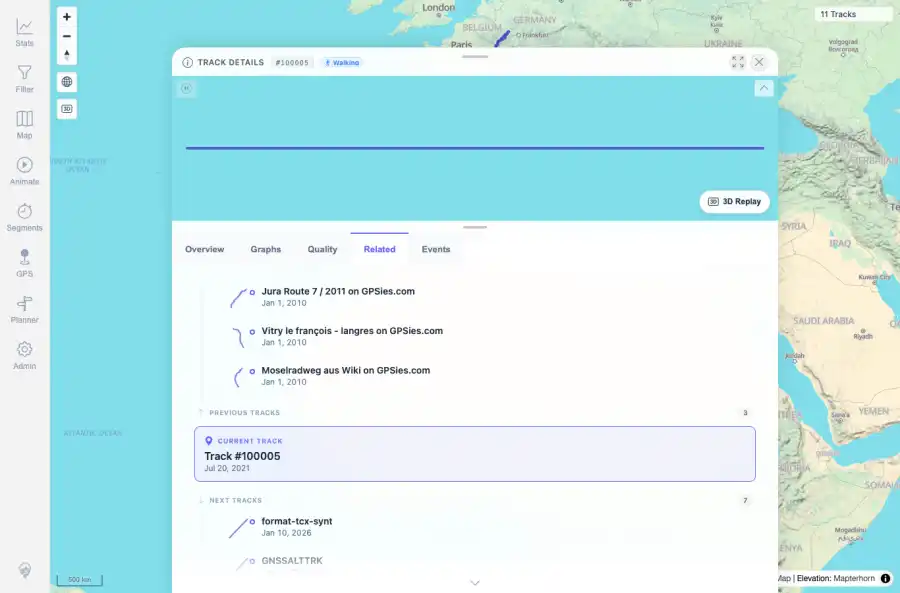
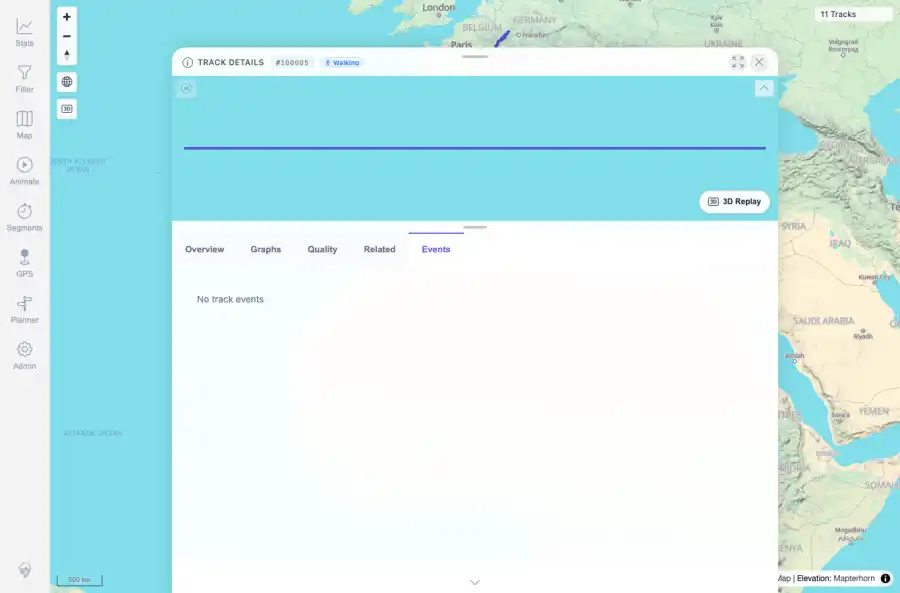

# Packet: TRD_02

## Scope

- Coverage source: `documentation/testing/frontend-regression-test-plan.md`
- Coverage ID or run packet: TRD_02
- In scope: Verify opening a track loads overview, charts, related list, event list, mini-map, and quality info.
- Out of scope: Other coverage IDs except where noted as shared state/evidence.

## Prerequisites

- Required previous coverage IDs or run packets: Previous queue rows terminal or explicitly not required.
- Required app/data state: Current run-state and packet set for this run.
- Required browser context: As specified by the coverage action.

## Allowed Mutations

- Allowed: Read-only verification and packet/run-state updates.
- Not allowed: Collapse this ID into a parent row or skip required direct evidence.

## Actions And Results

| Coverage ID | Action | Expected result | Actual result | Status | Evidence |
|---|---|---|---|---|---|
| TRD_02 | Opened FIT track 100005 detail, captured the overview, switched through Graphs, Quality, Related, and Events, and checked text/canvas evidence. | Track detail loads all required sections without blank panels. | Overview, chart tab, quality tab, related list, event tab, and the embedded mini-map canvas all loaded for track 100005. | PASS | [assets/TRD_02-overview-loaded.webp](../assets/TRD_02-overview-loaded.webp); [assets/TRD_03-tab-graphs.webp](../assets/TRD_03-tab-graphs.webp); [assets/TRD_03-tab-quality.webp](../assets/TRD_03-tab-quality.webp); [assets/TRD_03-tab-related.webp](../assets/TRD_03-tab-related.webp); [assets/TRD_03-tab-events.webp](../assets/TRD_03-tab-events.webp); [assets/TRD_01_03-navigation-tabs-summary.txt](../assets/TRD_01_03-navigation-tabs-summary.txt) |

## Issues

| ID | Severity | Summary | Reproduction | Expected | Actual | Evidence | Release impact |
|---|---|---|---|---|---|---|---|

## Evidence Files

| File | Purpose |
|---|---|
| [assets/TRD_02-overview-loaded.webp](../assets/TRD_02-overview-loaded.webp) | Screenshot evidence |
| [assets/TRD_03-tab-graphs.webp](../assets/TRD_03-tab-graphs.webp) | Screenshot evidence |
| [assets/TRD_03-tab-quality.webp](../assets/TRD_03-tab-quality.webp) | Screenshot evidence |
| [assets/TRD_03-tab-related.webp](../assets/TRD_03-tab-related.webp) | Screenshot evidence |
| [assets/TRD_03-tab-events.webp](../assets/TRD_03-tab-events.webp) | Screenshot evidence |
| [assets/TRD_01_03-navigation-tabs-summary.txt](../assets/TRD_01_03-navigation-tabs-summary.txt) | Text/log evidence |

## Screenshot Evidence

## Timings

| Step | Timing |
|---|---:|
| Packet execution | <1 minute |

## Handoff Notes

- Completed: This coverage ID is terminal.
- Remaining unfinished coverage: Continue with the next queue row.
- Blocked or not applicable: none.
- State left for the next packet: unchanged.
