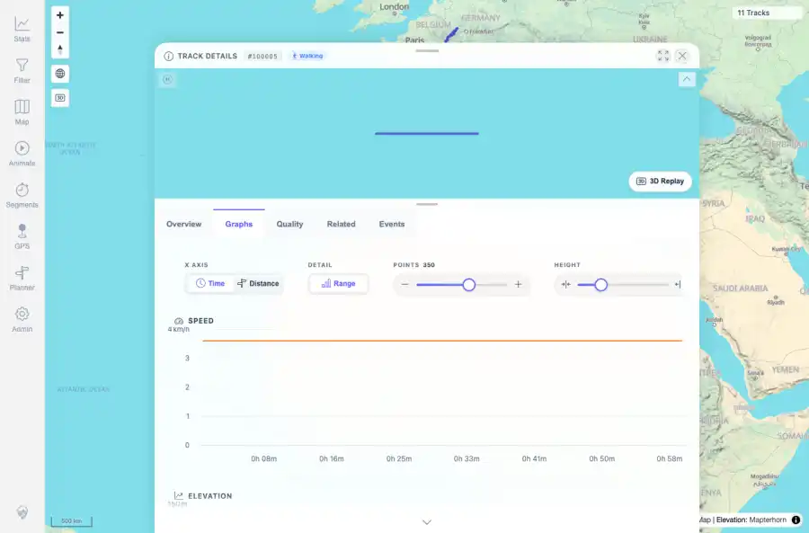

# Packet: TRD_04

## Scope

- Coverage source: `documentation/testing/frontend-regression-test-plan.md`
- Coverage ID or run packet: TRD_04
- In scope: Verify elevation, speed, distance, and gain charts render with readable values.
- Out of scope: Other coverage IDs except where noted as shared state/evidence.

## Prerequisites

- Required previous coverage IDs or run packets: Previous queue rows terminal or explicitly not required.
- Required app/data state: Current run-state and packet set for this run.
- Required browser context: As specified by the coverage action.

## Allowed Mutations

- Allowed: Read-only verification and packet/run-state updates.
- Not allowed: Collapse this ID into a parent row or skip required direct evidence.

## Actions And Results

| Coverage ID | Action | Expected result | Actual result | Status | Evidence |
|---|---|---|---|---|---|
| TRD_04 | Opened FIT track 100005 Graphs tab and recorded chart names, chart count, Highcharts accessibility text, and screenshot evidence. | Elevation, speed, distance, and gain charts render with readable values. | Six Highcharts charts rendered, including Speed, Elevation, Elevation Gain Rate, and Distance Over Time, with readable axes/data-range text. | PASS | [assets/TRD_04-graphs-render.webp](../assets/TRD_04-graphs-render.webp); [assets/TRD_04_06-graphs-controls-hover-summary.txt](../assets/TRD_04_06-graphs-controls-hover-summary.txt) |

## Issues

| ID | Severity | Summary | Reproduction | Expected | Actual | Evidence | Release impact |
|---|---|---|---|---|---|---|---|

## Evidence Files

| File | Purpose |
|---|---|
| [assets/TRD_04-graphs-render.webp](../assets/TRD_04-graphs-render.webp) | Screenshot evidence |
| [assets/TRD_04_06-graphs-controls-hover-summary.txt](../assets/TRD_04_06-graphs-controls-hover-summary.txt) | Text/log evidence |

## Screenshot Evidence

## Timings

| Step | Timing |
|---|---:|
| Packet execution | <1 minute |

## Handoff Notes

- Completed: This coverage ID is terminal.
- Remaining unfinished coverage: Continue with the next queue row.
- Blocked or not applicable: none.
- State left for the next packet: unchanged.
