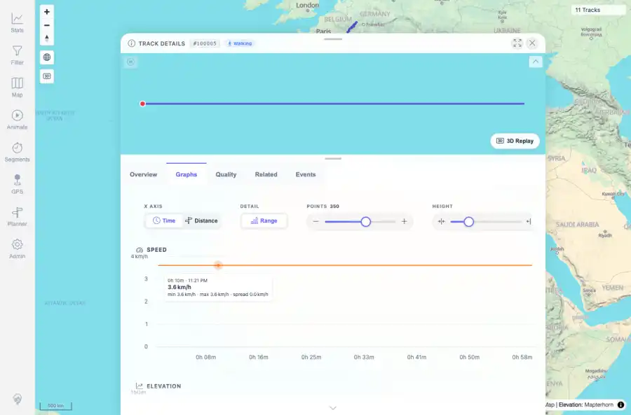
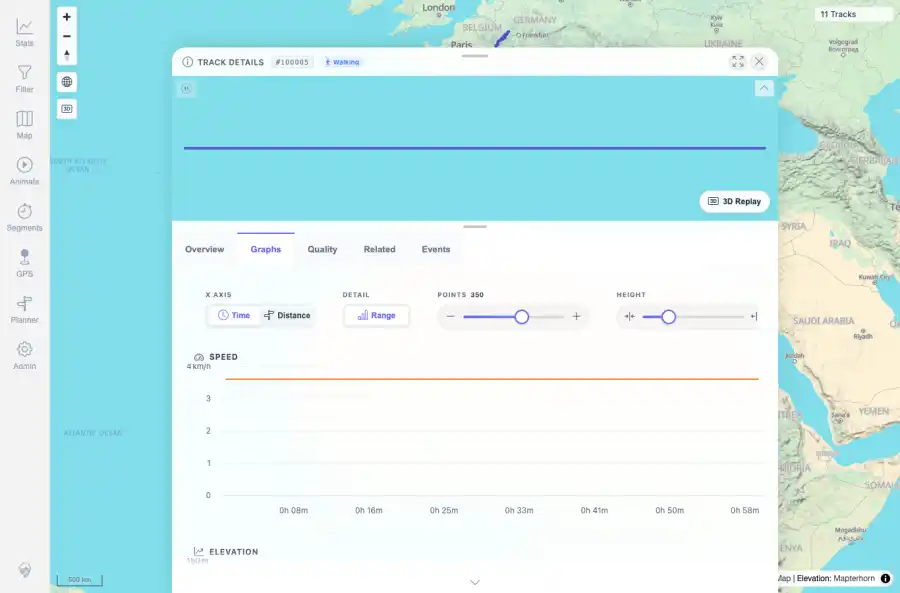
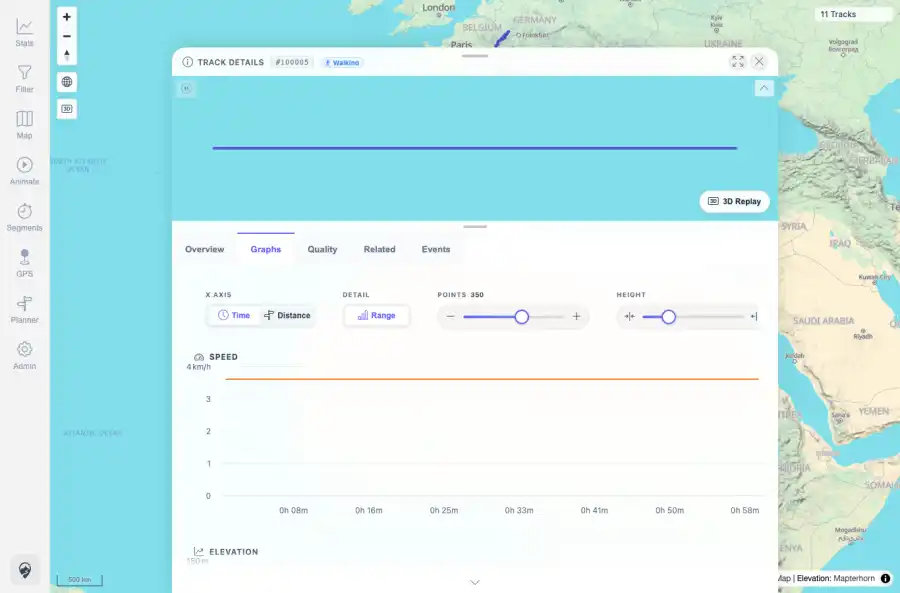

# Packet: TRD_06

## Scope

- Coverage source: `documentation/testing/frontend-regression-test-plan.md`
- Coverage ID or run packet: TRD_06
- In scope: Verify chart hover and mini-map hover synchronization and stale cursor cleanup.
- Out of scope: Other coverage IDs except where noted as shared state/evidence.

## Prerequisites

- Required previous coverage IDs or run packets: Previous queue rows terminal or explicitly not required.
- Required app/data state: Current run-state and packet set for this run.
- Required browser context: As specified by the coverage action.

## Allowed Mutations

- Allowed: Read-only verification and packet/run-state updates.
- Not allowed: Collapse this ID into a parent row or skip required direct evidence.

## Actions And Results

| Coverage ID | Action | Expected result | Actual result | Status | Evidence |
|---|---|---|---|---|---|
| TRD_06 | Hovered a chart point on the speed chart, verified synchronized chart tooltip/crosshair and mini-map red marker, hovered the mini-map line area, then moved fully outside the sheet and checked cleanup. | Hovering either surface highlights the matching counterpart and no stale cursors remain after leaving. | Chart hover produced Highcharts tooltip/crosshair and a red mini-map marker; mini-map hover retained synchronized chart highlight; after leaving the sheet there were no tooltip, crosshair, hover-point, or map popup nodes. | PASS | [assets/TRD_06-hover-line-left.webp](../assets/TRD_06-hover-line-left.webp); [assets/TRD_06-hover-mini-line-mid.webp](../assets/TRD_06-hover-mini-line-mid.webp); [assets/TRD_06-targeted-leave-clean.webp](../assets/TRD_06-targeted-leave-clean.webp); [assets/TRD_06-hover-targeted-summary.txt](../assets/TRD_06-hover-targeted-summary.txt); [assets/TRD_06-targeted-leave-summary.txt](../assets/TRD_06-targeted-leave-summary.txt) |

## Issues

| ID | Severity | Summary | Reproduction | Expected | Actual | Evidence | Release impact |
|---|---|---|---|---|---|---|---|

## Evidence Files

| File | Purpose |
|---|---|
| [assets/TRD_06-hover-line-left.webp](../assets/TRD_06-hover-line-left.webp) | Screenshot evidence |
| [assets/TRD_06-hover-mini-line-mid.webp](../assets/TRD_06-hover-mini-line-mid.webp) | Screenshot evidence |
| [assets/TRD_06-targeted-leave-clean.webp](../assets/TRD_06-targeted-leave-clean.webp) | Screenshot evidence |
| [assets/TRD_06-hover-targeted-summary.txt](../assets/TRD_06-hover-targeted-summary.txt) | Text/log evidence |
| [assets/TRD_06-targeted-leave-summary.txt](../assets/TRD_06-targeted-leave-summary.txt) | Text/log evidence |

## Screenshot Evidence

## Timings

| Step | Timing |
|---|---:|
| Packet execution | <1 minute |

## Handoff Notes

- Completed: This coverage ID is terminal.
- Remaining unfinished coverage: Continue with the next queue row.
- Blocked or not applicable: none.
- State left for the next packet: unchanged.
