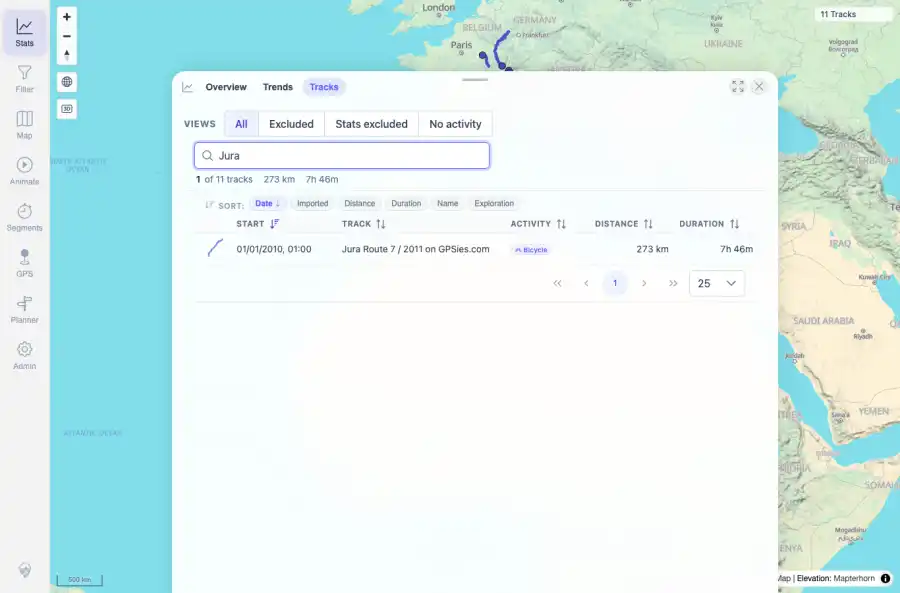
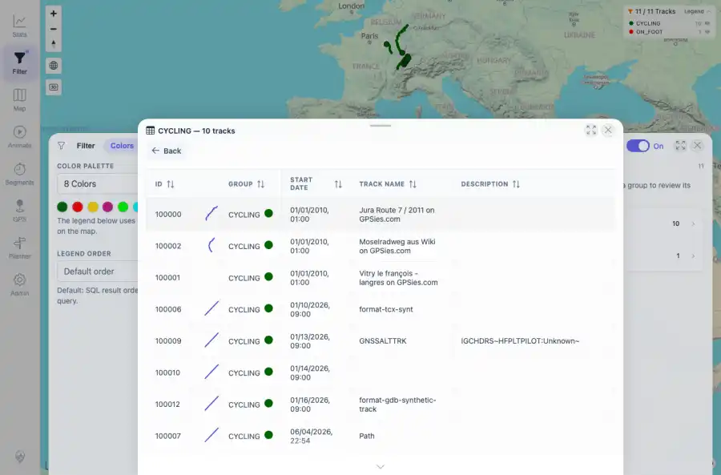
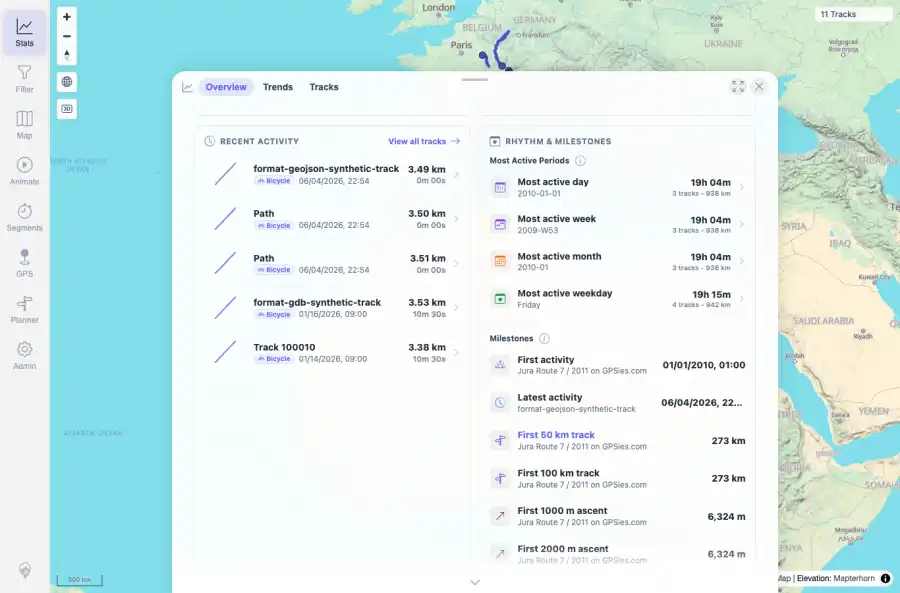
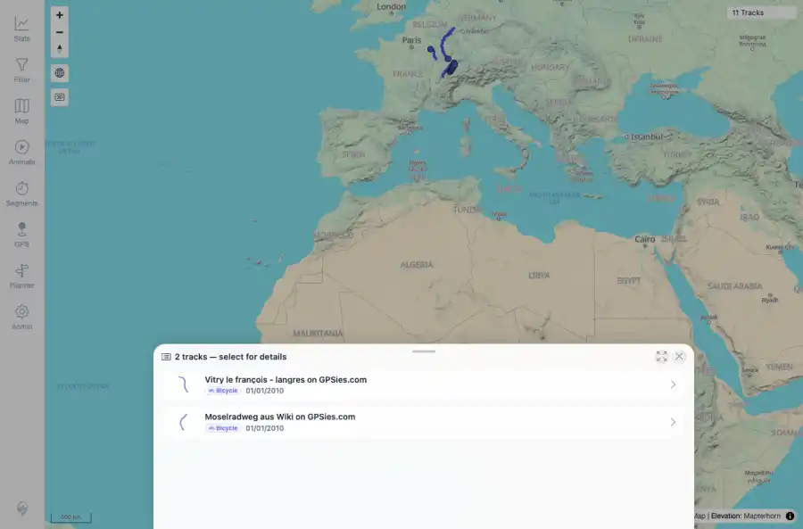

# Packet: TRD_07

## Scope

- Coverage source: `documentation/testing/frontend-regression-test-plan.md`
- Coverage ID or run packet: TRD_07
- In scope: Verify small track-shape previews in browser, filters, stats, related tracks, and selection lists.
- Out of scope: Other coverage IDs except where noted as shared state/evidence.

## Prerequisites

- Required previous coverage IDs or run packets: Previous queue rows terminal or explicitly not required.
- Required app/data state: Current run-state and packet set for this run.
- Required browser context: As specified by the coverage action.

## Allowed Mutations

- Allowed: Read-only verification and packet/run-state updates.
- Not allowed: Collapse this ID into a parent row or skip required direct evidence.

## Actions And Results

| Coverage ID | Action | Expected result | Actual result | Status | Evidence |
|---|---|---|---|---|---|
| TRD_07 | Captured TrackShapePreview rendering in Stats Tracks search, filter Colors drill-down, Statistics overview recent activity, Related tab, and map overlap selection sheet. | The track shape preview is visible in all named surfaces. | Shape previews were visible in the track browser row, filter drill-down table, stats recent activity list, related tracks list, and the two-track map selection sheet. | PASS | [assets/TRD_01-gpx-browser-open-track-list.webp](../assets/TRD_01-gpx-browser-open-track-list.webp); [assets/TRD_07-filter-drilldown.webp](../assets/TRD_07-filter-drilldown.webp); [assets/TRD_07-filter-drilldown-summary.txt](../assets/TRD_07-filter-drilldown-summary.txt); [assets/TRD_07-stats-recent-previews.webp](../assets/TRD_07-stats-recent-previews.webp); [assets/TRD_07-stats-recent-previews.txt](../assets/TRD_07-stats-recent-previews.txt); [assets/TRD_03-tab-related.webp](../assets/TRD_03-tab-related.webp); [assets/TRD_07-selection-list.webp](../assets/TRD_07-selection-list.webp); [assets/TRD_07-selection-list-summary.txt](../assets/TRD_07-selection-list-summary.txt) |

## Issues

| ID | Severity | Summary | Reproduction | Expected | Actual | Evidence | Release impact |
|---|---|---|---|---|---|---|---|

## Evidence Files

| File | Purpose |
|---|---|
| [assets/TRD_01-gpx-browser-open-track-list.webp](../assets/TRD_01-gpx-browser-open-track-list.webp) | Screenshot evidence |
| [assets/TRD_07-filter-drilldown.webp](../assets/TRD_07-filter-drilldown.webp) | Screenshot evidence |
| [assets/TRD_07-filter-drilldown-summary.txt](../assets/TRD_07-filter-drilldown-summary.txt) | Text/log evidence |
| [assets/TRD_07-stats-recent-previews.webp](../assets/TRD_07-stats-recent-previews.webp) | Screenshot evidence |
| [assets/TRD_07-stats-recent-previews.txt](../assets/TRD_07-stats-recent-previews.txt) | Text/log evidence |
| [assets/TRD_03-tab-related.webp](../assets/TRD_03-tab-related.webp) | Screenshot evidence |
| [assets/TRD_07-selection-list.webp](../assets/TRD_07-selection-list.webp) | Screenshot evidence |
| [assets/TRD_07-selection-list-summary.txt](../assets/TRD_07-selection-list-summary.txt) | Text/log evidence |

## Screenshot Evidence

## Timings

| Step | Timing |
|---|---:|
| Packet execution | <1 minute |

## Handoff Notes

- Completed: This coverage ID is terminal.
- Remaining unfinished coverage: Continue with the next queue row.
- Blocked or not applicable: none.
- State left for the next packet: unchanged.
