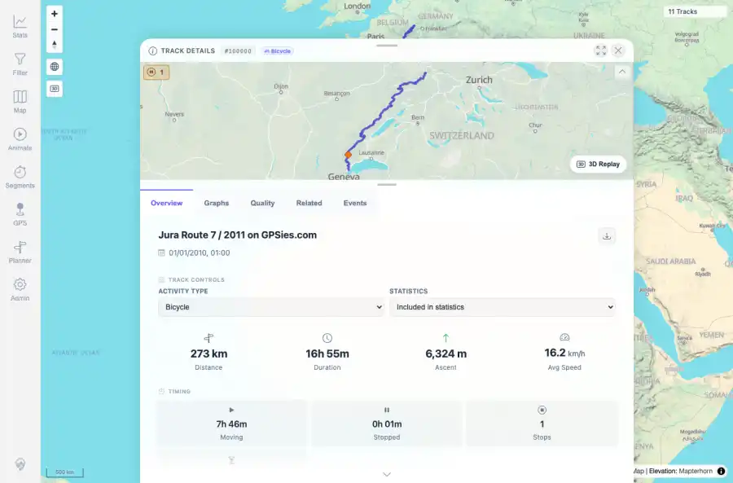
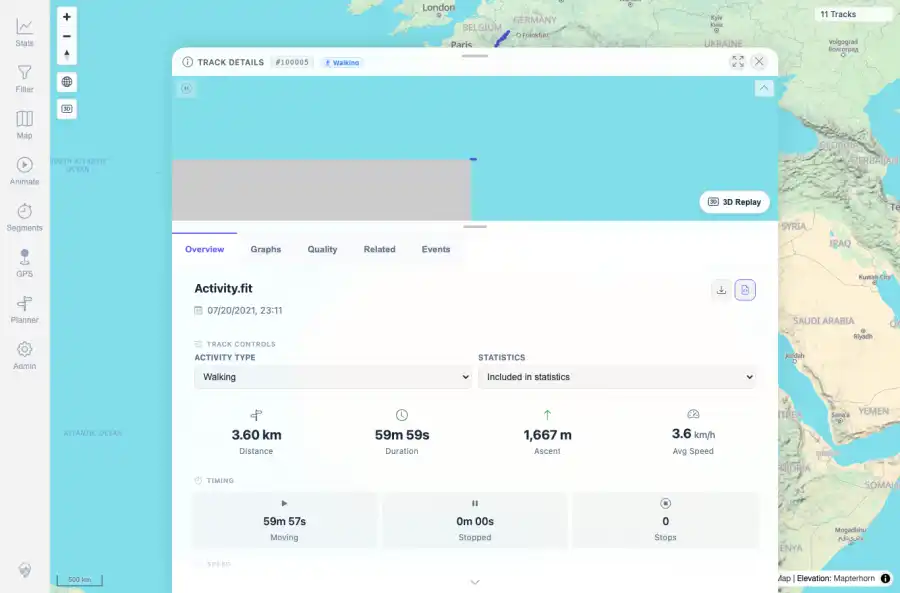

# Packet: TRD_08

## Scope

- Coverage source: `documentation/testing/frontend-regression-test-plan.md`
- Coverage ID or run packet: TRD_08
- In scope: Verify Download original source file returns the uploaded source and matches it.
- Out of scope: Other coverage IDs except where noted as shared state/evidence.

## Prerequisites

- Required previous coverage IDs or run packets: Previous queue rows terminal or explicitly not required.
- Required app/data state: Current run-state and packet set for this run.
- Required browser context: As specified by the coverage action.

## Allowed Mutations

- Allowed: Read-only verification and packet/run-state updates.
- Not allowed: Collapse this ID into a parent row or skip required direct evidence.

## Actions And Results

| Coverage ID | Action | Expected result | Actual result | Status | Evidence |
|---|---|---|---|---|---|
| TRD_08 | Downloaded original files from GPX track 100000 and FIT track 100005 detail pages, then compared byte size and SHA-256 against staged source files. | Original source downloads complete and match the uploaded files. | JuraRoute72011.gpx and Activity.fit downloaded with matching byte sizes and SHA-256 hashes. | PASS | [assets/TRD_08-gpx-original-control.webp](../assets/TRD_08-gpx-original-control.webp); [assets/TRD_08-fit-original-control.webp](../assets/TRD_08-fit-original-control.webp); [assets/TRD_08_09-download-summary.txt](../assets/TRD_08_09-download-summary.txt) |

## Issues

| ID | Severity | Summary | Reproduction | Expected | Actual | Evidence | Release impact |
|---|---|---|---|---|---|---|---|

## Evidence Files

| File | Purpose |
|---|---|
| [assets/TRD_08-gpx-original-control.webp](../assets/TRD_08-gpx-original-control.webp) | Screenshot evidence |
| [assets/TRD_08-fit-original-control.webp](../assets/TRD_08-fit-original-control.webp) | Screenshot evidence |
| [assets/TRD_08_09-download-summary.txt](../assets/TRD_08_09-download-summary.txt) | Text/log evidence |

## Screenshot Evidence

## Timings

| Step | Timing |
|---|---:|
| Packet execution | <1 minute |

## Handoff Notes

- Completed: This coverage ID is terminal.
- Remaining unfinished coverage: Continue with the next queue row.
- Blocked or not applicable: none.
- State left for the next packet: unchanged.
