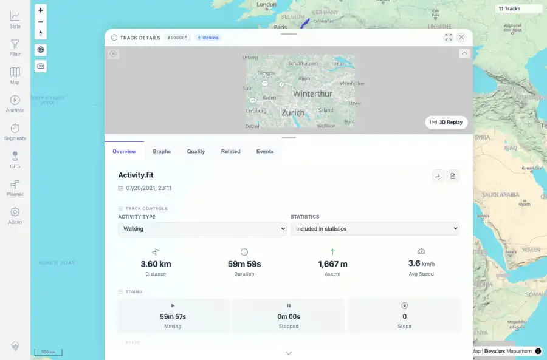
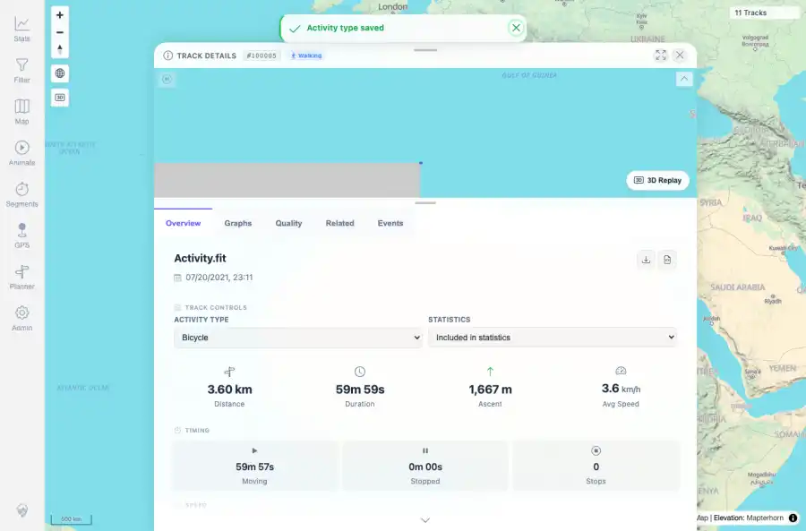
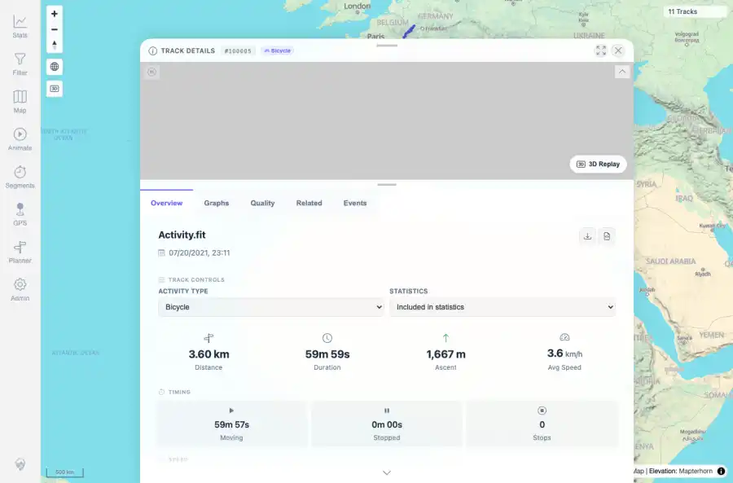
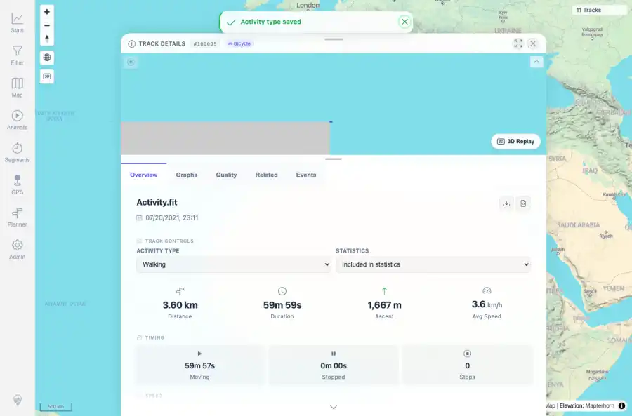
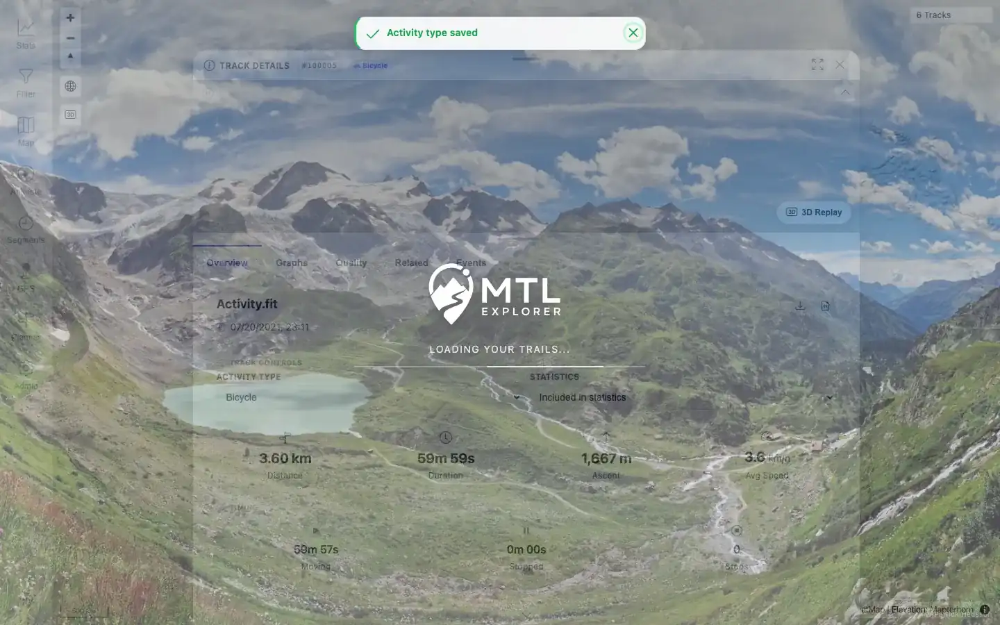

# Packet: TRD_10

## Scope

- Coverage source: `documentation/testing/frontend-regression-test-plan.md`
- Coverage ID or run packet: TRD_10
- In scope: Verify changing activity type saves and recalculates energy values.
- Out of scope: Other coverage IDs except where noted as shared state/evidence.

## Prerequisites

- Required previous coverage IDs or run packets: Previous queue rows terminal or explicitly not required.
- Required app/data state: Current run-state and packet set for this run.
- Required browser context: As specified by the coverage action.

## Allowed Mutations

- Allowed: Read-only verification and packet/run-state updates.
- Not allowed: Collapse this ID into a parent row or skip required direct evidence.

## Actions And Results

| Coverage ID | Action | Expected result | Actual result | Status | Evidence |
|---|---|---|---|---|---|
| TRD_10 | Changed FIT track 100005 from Walking to Bicycle using the detail activity select, checked API/energy values, reloaded, then restored Walking. Retested the stale-header issue on beta image `1.300` built `2026-06-05T07:16:20Z`. | Activity type saves successfully and energy/calorie values update automatically. | PASS: activity select saved Bicycle, API returned `BICYCLE`, and the detail header badge changed from Walking to Bicycle immediately before reload. The track was restored to Walking after the probe. | PASS | [assets/RETEST_TRD_10-header-badge-fixed.webp](../assets/RETEST_TRD_10-header-badge-fixed.webp); [assets/RETEST_open-defects-2026-06-05-beta-1.300.json](../assets/RETEST_open-defects-2026-06-05-beta-1.300.json) |

## Issues

| ID | Severity | Summary | Reproduction | Expected | Actual | Evidence | Release impact |
|---|---|---|---|---|---|---|---|
| TRD_10-I01 | Low | Detail header activity badge remains stale until reload after activity-type save. | Open track 100005, change activity type from Walking to Bicycle, wait after save toast. | All visible activity indicators update after save. | FIXED on beta image `1.300`: the sheet header badge updates to Bicycle immediately after the save; API and select also show `BICYCLE`. | [assets/RETEST_TRD_10-header-badge-fixed.webp](../assets/RETEST_TRD_10-header-badge-fixed.webp); [assets/RETEST_open-defects-2026-06-05-beta-1.300.json](../assets/RETEST_open-defects-2026-06-05-beta-1.300.json) | Fixed in targeted beta retest. |

## Evidence Files

| File | Purpose |
|---|---|
| [assets/TRD_10-before-activity-change.webp](../assets/TRD_10-before-activity-change.webp) | Screenshot evidence |
| [assets/TRD_10-after-bicycle-change.webp](../assets/TRD_10-after-bicycle-change.webp) | Screenshot evidence |
| [assets/TRD_10-bicycle-after-reload.webp](../assets/TRD_10-bicycle-after-reload.webp) | Screenshot evidence |
| [assets/TRD_10-restored-walking.webp](../assets/TRD_10-restored-walking.webp) | Screenshot evidence |
| [assets/TRD_10_11-mutating-controls-summary.txt](../assets/TRD_10_11-mutating-controls-summary.txt) | Text/log evidence |
| [assets/RETEST_TRD_10-header-badge-fixed.webp](../assets/RETEST_TRD_10-header-badge-fixed.webp) | Targeted beta retest screenshot |
| [assets/RETEST_open-defects-2026-06-05-beta-1.300.json](../assets/RETEST_open-defects-2026-06-05-beta-1.300.json) | Targeted beta retest JSON evidence |

## Screenshot Evidence

## Timings

| Step | Timing |
|---|---:|
| Packet execution | <1 minute |
| Targeted beta retest | ~8 seconds |

## Handoff Notes

- Completed: This coverage ID is terminal.
- Remaining unfinished coverage: Continue with the next queue row.
- Blocked or not applicable: none.
- State left for the next packet: unchanged.
