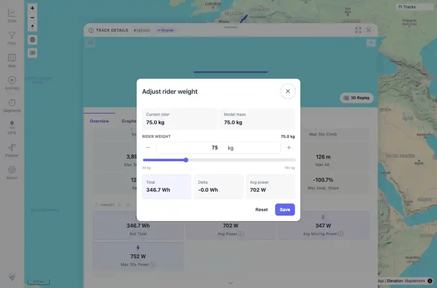
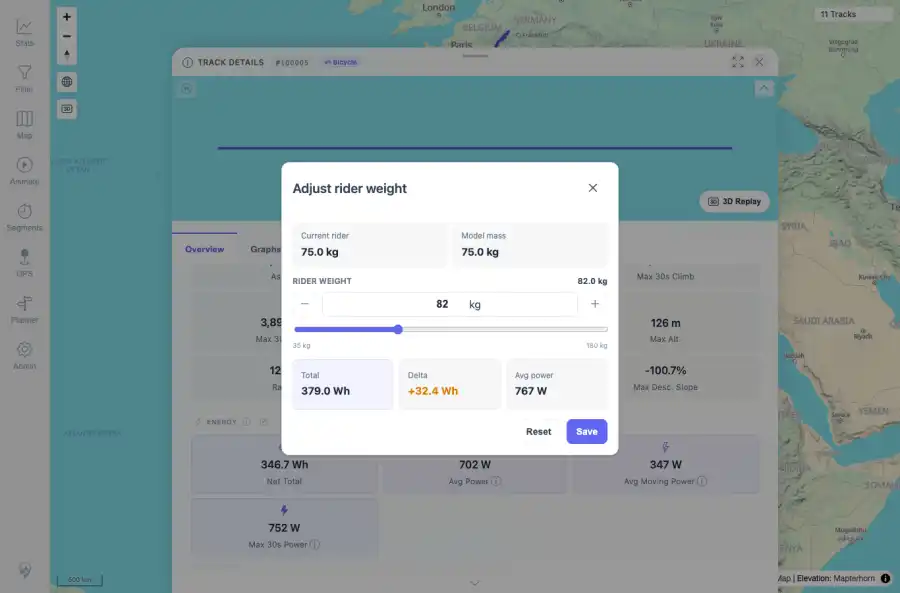
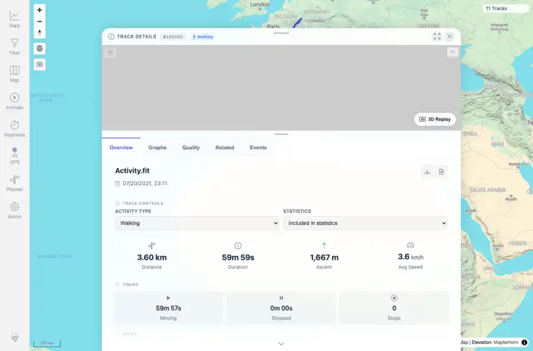

# Packet: TRD_11

## Scope

- Coverage source: `documentation/testing/frontend-regression-test-plan.md`
- Coverage ID or run packet: TRD_11
- In scope: Verify energy what-if recalculation updates displayed values without permanently saving.
- Out of scope: Other coverage IDs except where noted as shared state/evidence.

## Prerequisites

- Required previous coverage IDs or run packets: Previous queue rows terminal or explicitly not required.
- Required app/data state: Current run-state and packet set for this run.
- Required browser context: As specified by the coverage action.

## Allowed Mutations

- Allowed: Read-only verification and packet/run-state updates.
- Not allowed: Collapse this ID into a parent row or skip required direct evidence.

## Actions And Results

| Coverage ID | Action | Expected result | Actual result | Status | Evidence |
|---|---|---|---|---|---|
| TRD_11 | Opened Adjust rider weight, changed the rider weight input to 82 kg, observed recalculated totals/delta/avg power, closed without saving, reloaded, and checked API values. | What-if rider-weight changes update displayed values but do not permanently save unless Save is used. | Dialog preview changed to 379.0 Wh, +32.4 Wh, and 767 W at 82 kg; after closing/reloading without Save, API stayed at 75 kg and 346.67 Wh. | PASS | [assets/TRD_11-weight-dialog-baseline.webp](../assets/TRD_11-weight-dialog-baseline.webp); [assets/TRD_11-weight-dialog-preview-82kg.webp](../assets/TRD_11-weight-dialog-preview-82kg.webp); [assets/TRD_11-after-dialog-closed-reloaded.webp](../assets/TRD_11-after-dialog-closed-reloaded.webp); [assets/TRD_10_11-mutating-controls-summary.txt](../assets/TRD_10_11-mutating-controls-summary.txt) |

## Issues

| ID | Severity | Summary | Reproduction | Expected | Actual | Evidence | Release impact |
|---|---|---|---|---|---|---|---|

## Evidence Files

| File | Purpose |
|---|---|
| [assets/TRD_11-weight-dialog-baseline.webp](../assets/TRD_11-weight-dialog-baseline.webp) | Screenshot evidence |
| [assets/TRD_11-weight-dialog-preview-82kg.webp](../assets/TRD_11-weight-dialog-preview-82kg.webp) | Screenshot evidence |
| [assets/TRD_11-after-dialog-closed-reloaded.webp](../assets/TRD_11-after-dialog-closed-reloaded.webp) | Screenshot evidence |
| [assets/TRD_10_11-mutating-controls-summary.txt](../assets/TRD_10_11-mutating-controls-summary.txt) | Text/log evidence |

## Screenshot Evidence

## Timings

| Step | Timing |
|---|---:|
| Packet execution | <1 minute |

## Handoff Notes

- Completed: This coverage ID is terminal.
- Remaining unfinished coverage: Continue with the next queue row.
- Blocked or not applicable: none.
- State left for the next packet: unchanged.
