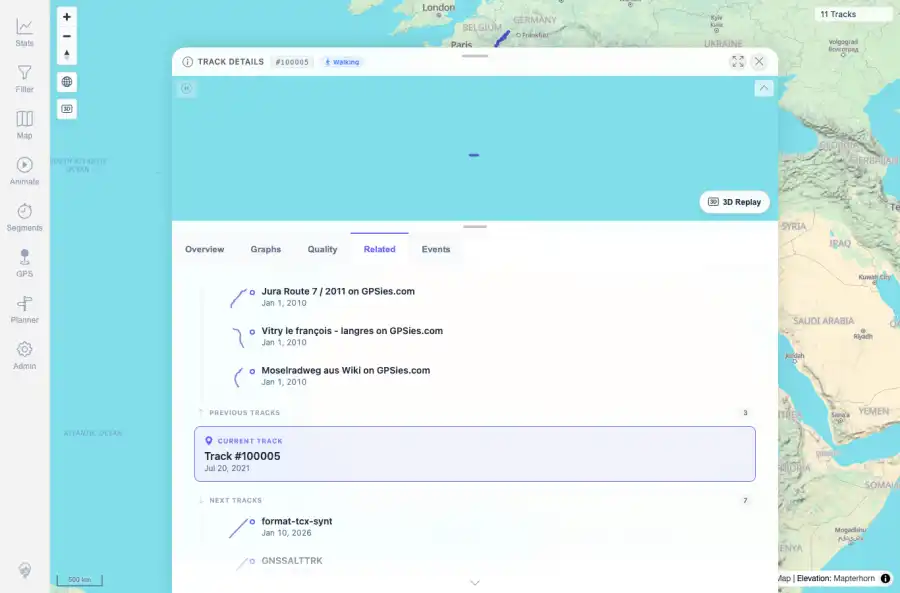
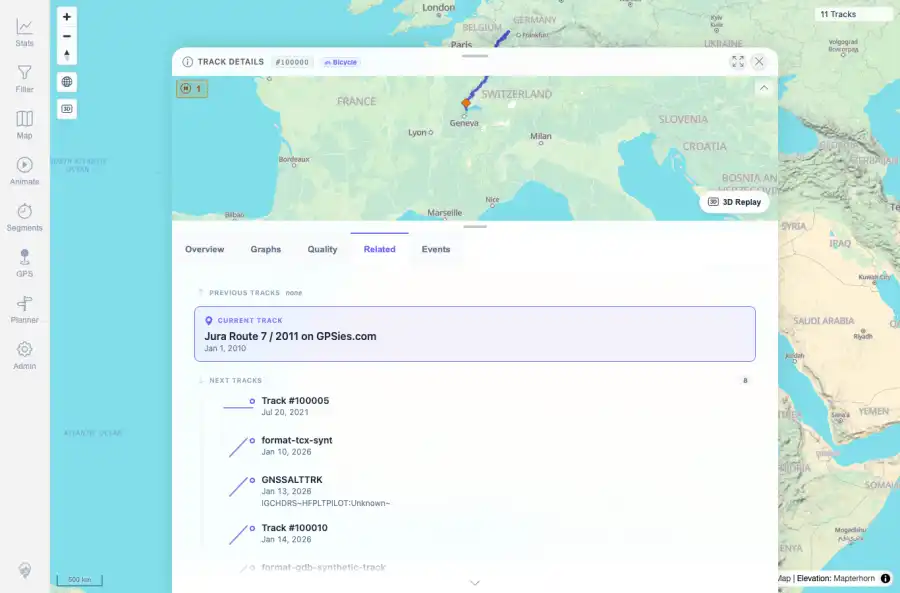

# Packet: TRD_13

## Scope

- Coverage source: `documentation/testing/frontend-regression-test-plan.md`
- Coverage ID or run packet: TRD_13
- In scope: Verify Related tracks show available duplicate/previous/next relationships and clicking a related track navigates.
- Out of scope: Other coverage IDs except where noted as shared state/evidence.

## Prerequisites

- Required previous coverage IDs or run packets: Previous queue rows terminal or explicitly not required.
- Required app/data state: Current run-state and packet set for this run.
- Required browser context: As specified by the coverage action.

## Allowed Mutations

- Allowed: Read-only verification and packet/run-state updates.
- Not allowed: Collapse this ID into a parent row or skip required direct evidence.

## Actions And Results

| Coverage ID | Action | Expected result | Actual result | Status | Evidence |
|---|---|---|---|---|---|
| TRD_13 | Opened FIT track 100005 Related tab, checked previous/current/next groups, verified all duplicate statuses are UNIQUE, and clicked a previous related row. | Related tracks show duplicates and previous/next tracks; clicking one navigates. | Previous, current, and next groups rendered; every current track has duplicateStatus=UNIQUE so duplicate-group display was not applicable; clicking Jura Route navigated to /track/100000. | PASS | [assets/TRD_13-related-before-click.webp](../assets/TRD_13-related-before-click.webp); [assets/TRD_13-related-click-navigated.webp](../assets/TRD_13-related-click-navigated.webp); [assets/TRD_13-related-summary.txt](../assets/TRD_13-related-summary.txt) |

## Issues

| ID | Severity | Summary | Reproduction | Expected | Actual | Evidence | Release impact |
|---|---|---|---|---|---|---|---|

## Evidence Files

| File | Purpose |
|---|---|
| [assets/TRD_13-related-before-click.webp](../assets/TRD_13-related-before-click.webp) | Screenshot evidence |
| [assets/TRD_13-related-click-navigated.webp](../assets/TRD_13-related-click-navigated.webp) | Screenshot evidence |
| [assets/TRD_13-related-summary.txt](../assets/TRD_13-related-summary.txt) | Text/log evidence |

## Screenshot Evidence

## Timings

| Step | Timing |
|---|---:|
| Packet execution | <1 minute |

## Handoff Notes

- Completed: This coverage ID is terminal.
- Remaining unfinished coverage: Continue with the next queue row.
- Blocked or not applicable: none.
- State left for the next packet: unchanged.
