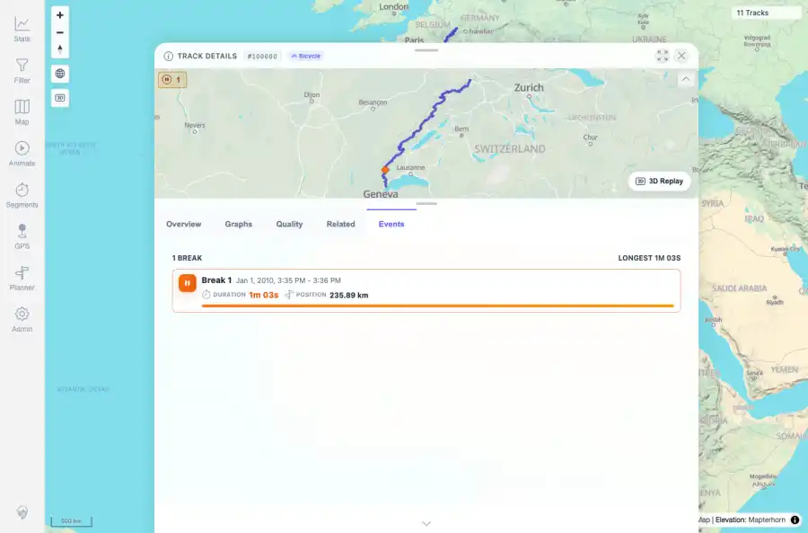
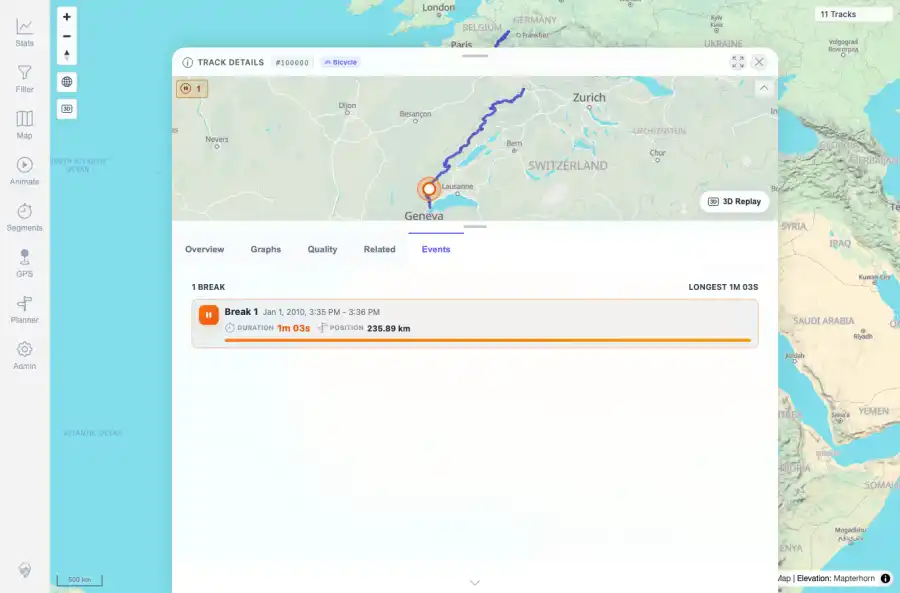
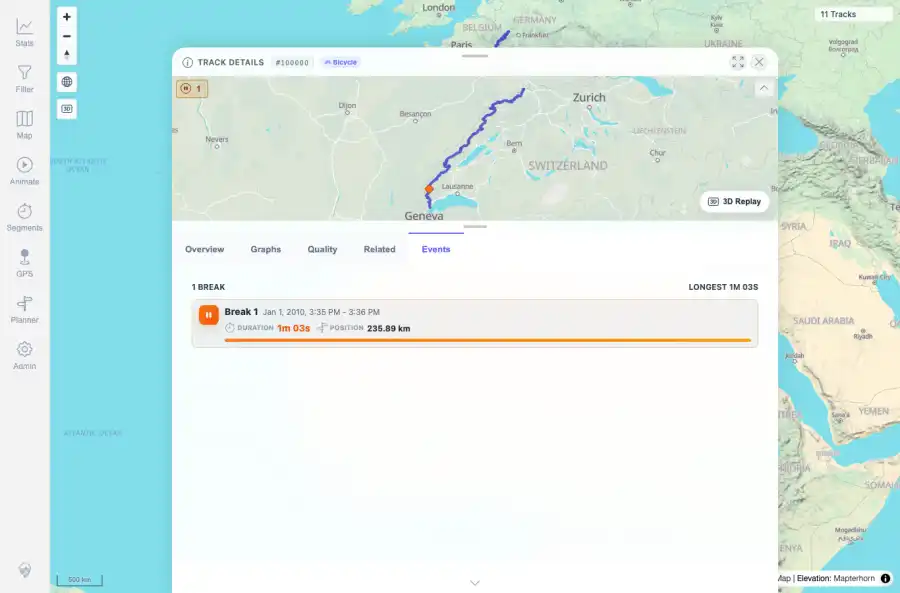

# Packet: TRD_14

## Scope

- Coverage source: `documentation/testing/frontend-regression-test-plan.md`
- Coverage ID or run packet: TRD_14
- In scope: Verify Events tab shows stops/GPS gaps where present and selecting an event highlights the mini-map and deselects cleanly.
- Out of scope: Other coverage IDs except where noted as shared state/evidence.

## Prerequisites

- Required previous coverage IDs or run packets: Previous queue rows terminal or explicitly not required.
- Required app/data state: Current run-state and packet set for this run.
- Required browser context: As specified by the coverage action.

## Allowed Mutations

- Allowed: Read-only verification and packet/run-state updates.
- Not allowed: Collapse this ID into a parent row or skip required direct evidence.

## Actions And Results

| Coverage ID | Action | Expected result | Actual result | Status | Evidence |
|---|---|---|---|---|---|
| TRD_14 | Opened Jura track 100000 Events tab, selected the detected Break event, captured highlighted row/mini-map state, clicked again, and checked deselection. | Events tab shows detected stops/GPS gaps where present; selecting an event highlights the matching mini-map position and deselects cleanly. | Events tab showed Break 1 with duration and position; selecting it added the selected event class and displayed the mini-map highlight; clicking it again restored the unselected class. | PASS | [assets/TRD_14-events-before-selection.webp](../assets/TRD_14-events-before-selection.webp); [assets/TRD_14-events-selected.webp](../assets/TRD_14-events-selected.webp); [assets/TRD_14-events-deselected.webp](../assets/TRD_14-events-deselected.webp); [assets/TRD_14-events-summary.txt](../assets/TRD_14-events-summary.txt) |

## Issues

| ID | Severity | Summary | Reproduction | Expected | Actual | Evidence | Release impact |
|---|---|---|---|---|---|---|---|

## Evidence Files

| File | Purpose |
|---|---|
| [assets/TRD_14-events-before-selection.webp](../assets/TRD_14-events-before-selection.webp) | Screenshot evidence |
| [assets/TRD_14-events-selected.webp](../assets/TRD_14-events-selected.webp) | Screenshot evidence |
| [assets/TRD_14-events-deselected.webp](../assets/TRD_14-events-deselected.webp) | Screenshot evidence |
| [assets/TRD_14-events-summary.txt](../assets/TRD_14-events-summary.txt) | Text/log evidence |

## Screenshot Evidence

## Timings

| Step | Timing |
|---|---:|
| Packet execution | <1 minute |

## Handoff Notes

- Completed: This coverage ID is terminal.
- Remaining unfinished coverage: Continue with the next queue row.
- Blocked or not applicable: none.
- State left for the next packet: unchanged.
