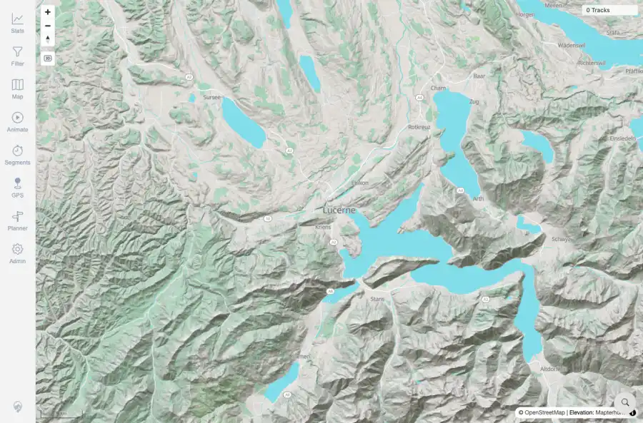
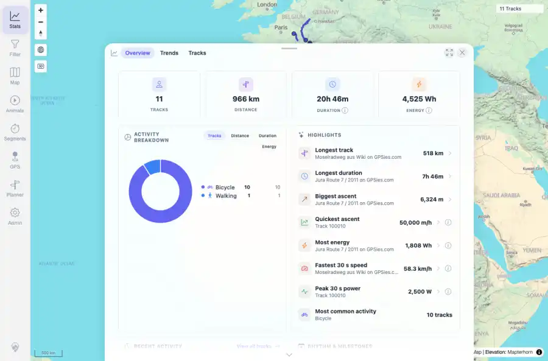
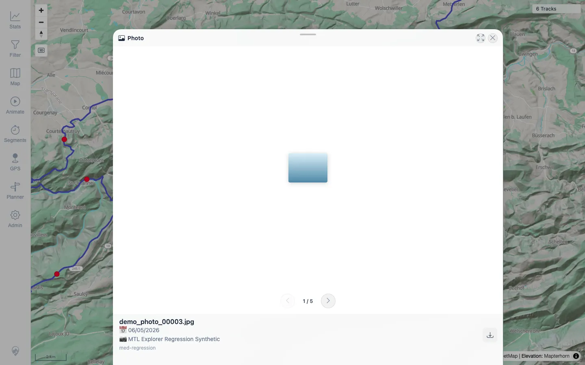
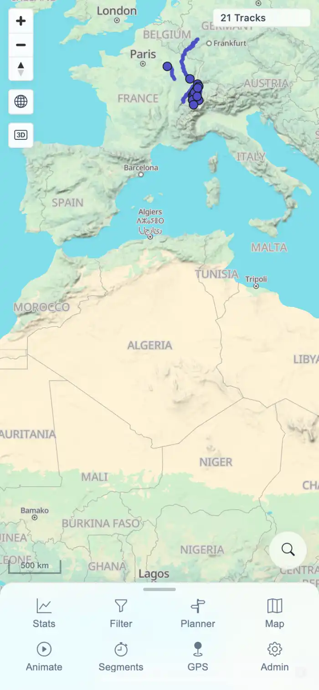

> **RESULT: TARGETED RETEST PASS - all previously open defects fixed on beta image `1.300`**

# MTL Explorer Full Regression Report

## Goal And Scope

Run the README quick-install flow and the full user-facing regression queue from `documentation/testing/frontend-regression-test-plan.md` against the beta Docker image `wauwau0977/mytraillog:beta`. The run used one packet per coverage ID and the resumable workflow gate before cleanup.

## Environment

| Field | Value |
|---|---|
| Run id | 2026-06-04_2154-beta-full-regression |
| Target server | 167.233.16.201 |
| Source | GitHub main quick install with Docker image tag override `wauwau0977/mytraillog:beta` |
| App URL | http://167.233.16.201:18080/mtl/ |
| Started | 2026-06-04T21:54:44+02:00 |
| Coordinator | Codex |
| Docker image override | `wauwau0977/mytraillog:beta` |
| GUI credentials source | README quick start: `mtl` / `change-me` |
| Finalization gate | PASS (174 coverage IDs terminal) |
| Cleanup | PASS: compose stack stopped; disposable server directory removed |
| Targeted retest image | `wauwau0977/mytraillog:beta` image `1.300`, built `2026-06-05T07:16:20Z` |

## README Facts Used

- README facts: Docker Engine plus Compose plugin required; quick start downloads `docker-compose.yml`, starts `docker compose up -d`, app path `http://localhost:18080/mtl/`, login `mtl` / `change-me`, imports via `./data/gpx/`. User requested Docker image tag `wauwau0977/mytraillog:beta` instead of the default/latest tag for this run.
- Login credentials source: root SSH access supplied in user prompt for server access; GUI credentials from README quick start only (`mtl` / `change-me`).
- Import folder: `/root/mtl-regression-2026-06-04_2154-beta-full-regression/mtl-explorer/data/gpx/` on target server, mounted to `/app/gpx`.
- Browser contexts: desktop browser context required; narrow mobile/touch viewport required later; installed-PWA offline context only if available/applicable.
- Known constraints: remote plain-HTTP origin means browser geolocation secure-origin checks are expected NOT APPLICABLE unless tunneled/HTTPS; installed-PWA offline coverage may be NOT APPLICABLE if not installed as a web app.

## Summary

| Area | Result |
|---|---|
| Quick install | PASS: Docker prerequisites installed, compose stack started, beta app image verified, README login reached the app. |
| Coverage completion | PASS: finalization gate reported all 174 plan IDs terminal before cleanup. |
| Cleanup | PASS: `docker compose down` removed this run's containers/network and the disposable directory was deleted. |
| Overall product result | TARGETED RETEST PASS: all previously open defects were fixed on beta image `1.300`; formerly blocked `MED_05` also passed through the Photo sheet path. |

## Status Counts

| Status | Count |
|---|---:|
| BLOCKED | 0 |
| FAIL | 0 |
| NOT APPLICABLE | 8 |
| PASS | 168 |

## Targeted Retest Results

| Coverage ID | Status | Packet | Notes |
|---|---|---|---|
| MED_01 | PASS | [packets/MED_01.md](packets/MED_01.md) | FIXED: overview media toggle sends a clamped bounds request and no Invalid LngLat error occurs. |
| MED_03 | PASS | [packets/MED_03.md](packets/MED_03.md) | FIXED: rendered media marker opens Photo sheet with image, metadata, and navigation. |
| ADM_03 | PASS | [packets/ADM_03.md](packets/ADM_03.md) | FIXED: Jobs GPS card shows `2 removed` while API reports `removed=2`. |
| ERR_01 | PASS | [packets/ERR_01.md](packets/ERR_01.md) | FIXED: media toggle no longer throws Invalid LngLat; broken-photo recovery is actionable through Photo sheet. |
| MED_05 | PASS | [packets/MED_05.md](packets/MED_05.md) | PASS: missing photo shows Preview unavailable with Retry/Download; file restored. |
| TRD_10 | PASS | [packets/TRD_10.md](packets/TRD_10.md) | FIXED: detail header activity badge updates immediately after activity-type save. |

## Fixed Issues

| ID | Severity | Coverage ID | Summary | Status |
|---|---|---|---|---|
| MED_01-I01 | High | MED_01 | Media layer toggle at full-track overview throws `Invalid LngLat latitude value` and remains off before any media bounds request starts. | Fixed on beta image `1.300` |
| MED_03-I01 | High | MED_03 | Bounded media API returns media points, but no visible/clickable media pins render and the Photo sheet cannot be opened. | Fixed on beta image `1.300` |
| ADM_03-I01 | P2 | ADM_03 | Jobs File Indexers UI omits removed GPS files even though the indexer API reports `removed=2`. | Fixed on beta image `1.300` |
| ERR_01-I01 | High | ERR_01 | Media recovery is not actionable because Photos & Media throws `Invalid LngLat latitude value` before a media request or retry/dismiss UI appears. | Fixed on beta image `1.300` |
| TRD_10-I01 | Low | TRD_10 | Detail header activity badge remains stale until reload after activity-type save. | Fixed on beta image `1.300` |

## Not Applicable Coverage

| Coverage ID | Reason |
|---|---|
| FIT_06 | FIT converter was available and successful; unavailable-converter fallback did not apply. |
| SGN_04 | Demo mode not active; no demo credentials banner expected. |
| MAP_12 | Swiss overlays are raster/attribution layers in this deployment; no interactive route-popup target was applicable. |
| GPS_02 | NOT APPLICABLE: live GPS permission/marker flow blocked by remote HTTP secure-origin rule. |
| GPS_03 | NOT APPLICABLE: follow-me behavior requires live GPS on localhost/HTTPS. |
| GPS_05 | NOT APPLICABLE: disable/stop-updates flow requires live GPS on localhost/HTTPS. |
| NET_01 | NOT APPLICABLE: Installed-PWA-only coverage not available in this browser-tab run. |
| NET_04 | NOT APPLICABLE: Remote HTTP target cannot run service workers; no update event available. |

## Representative Evidence

### Quick install post-login map

### Imported tracks evidence

### Track details graphs

### Stats overview

### Planner route error handled in dedicated planner packet

### Media layer retest fixed

### Media photo sheet retest fixed

### Admin jobs removed-count retest fixed

### Mobile map

### Rapid tool-switch cleanup

## Timings

| Step | Timing | Source |
|---|---:|---|
| Docker prerequisite install | 9 seconds | `packets/RUN_SETUP.md` |
| Compose pull/create/start | 33 seconds | `packets/RUN_SETUP.md` |
| App ready after Compose start | 12 seconds | `packets/RUN_SETUP.md` |
| Browser login to map | 9.3 seconds | `packets/RUN_SETUP.md` |
| Finalization gate | <1 second | `packets/RUN_CLEANUP.md` |
| Compose down and disposable directory removal | 12 seconds | `packets/RUN_CLEANUP.md` |
| Full regression wall-clock | Started 2026-06-04T21:54:44+02:00; cleanup completed after all packets on 2026-06-05 local time. | run-state and cleanup packet |

## Coverage Matrix

| Coverage ID | Status | Packet | Notes |
|---|---|---|---|
| RUN_SETUP | PASS | [packets/RUN_SETUP.md](packets/RUN_SETUP.md) | Quick install completed with beta image; app reachable remotely; README login baseline passed. |
| ACC_01 | PASS | [packets/ACC_01.md](packets/ACC_01.md) | 174 current-plan coverage IDs initialized as required rows. |
| ACC_02 | PASS | [packets/ACC_02.md](packets/ACC_02.md) | No collapsed parent-section PASS rows are used. |
| ACC_03 | PASS | [packets/ACC_03.md](packets/ACC_03.md) | Packet-derived coverage matrix is enforced by one packet path per ID. |
| ACC_04 | PASS | [packets/ACC_04.md](packets/ACC_04.md) | Initial working-function screenshots captured under 85 KB. |
| ACC_05 | PASS | [packets/ACC_05.md](packets/ACC_05.md) | Known constraints recorded for later GPS/offline/status decisions. |
| DAT_01 | PASS | [packets/DAT_01.md](packets/DAT_01.md) | Five public GPX files staged with real trkpt sequences. |
| DAT_02 | PASS | [packets/DAT_02.md](packets/DAT_02.md) | All five public GPX files have timestamped trackpoints. |
| DAT_03 | PASS | [packets/DAT_03.md](packets/DAT_03.md) | Source metadata and imported ID/name mappings completed after GPX/FIT/format import evidence was available. |
| DAT_04 | PASS | [packets/DAT_04.md](packets/DAT_04.md) | Suggested gps-touring sample GPX URLs used. |
| DAT_05 | PASS | [packets/DAT_05.md](packets/DAT_05.md) | Garmin Activity.fit staged and GPS-bearing validation passed. |
| DAT_06 | PASS | [packets/DAT_06.md](packets/DAT_06.md) | No waypoint-only GPX or non-GPS FIT counted as positive evidence. |
| DAT_07 | PASS | [packets/DAT_07.md](packets/DAT_07.md) | Two fully synthetic crossing tracks staged for later measure/comparison checks. |
| IMP_01 | PASS | [packets/IMP_01.md](packets/IMP_01.md) | Empty baseline counts/freshness/indexer captured before import. |
| IMP_02 | PASS | [packets/IMP_02.md](packets/IMP_02.md) | Five public GPX files copied into watched import folder. |
| IMP_03 | PASS | [packets/IMP_03.md](packets/IMP_03.md) | Live watcher processed five GPX files; no Rescan GPS needed. |
| IMP_04 | PASS | [packets/IMP_04.md](packets/IMP_04.md) | Five source files completed; freshness changed; background jobs settled. |
| IMP_05 | PASS | [packets/IMP_05.md](packets/IMP_05.md) | Helper reload and map/browser/filter/stats five-track visibility verified. |
| IMP_06 | PASS | [packets/IMP_06.md](packets/IMP_06.md) | Each imported file verified by browser search, API map geometry, stats summary, and activity-type filter result. |
| IMP_07 | PASS | [packets/IMP_07.md](packets/IMP_07.md) | Map clicks opened all five imported tracks; overlap chooser and point popup verified. |
| IMP_08 | PASS | [packets/IMP_08.md](packets/IMP_08.md) | Statistics count increased from 0 to 5; each public GPX mapped to one displayed track. |
| IMP_09 | PASS | [packets/IMP_09.md](packets/IMP_09.md) | Aggregate stats, trends, rankings, track-browser summary, and heatmap density verified after five imports. |
| DEL_01 | PASS | [packets/DEL_01.md](packets/DEL_01.md) | Deleted Lannion and VoieVerte source files from watched folder; three GPX sources remain. |
| DEL_02 | PASS | [packets/DEL_02.md](packets/DEL_02.md) | Deletion processed automatically; indexer reported removed=2 and three remaining tracks. |
| DEL_03 | PASS | [packets/DEL_03.md](packets/DEL_03.md) | Deleted tracks absent from map/browser/filter/selection/heatmap/related/statistics; three-track totals verified. |
| DEL_04 | PASS | [packets/DEL_04.md](packets/DEL_04.md) | Remaining Jura, Vitry, and Mosel tracks opened correctly after deletion. |
| DEL_05 | PASS | [packets/DEL_05.md](packets/DEL_05.md) | Deletion status was based on current folder/indexer/UI/API surfaces, not stale deleted-track probes. |
| FIT_01 | PASS | [packets/FIT_01.md](packets/FIT_01.md) | Activity.fit copied into watched folder with matching checksum. |
| FIT_02 | PASS | [packets/FIT_02.md](packets/FIT_02.md) | FIT Activity.fit accepted, indexed, displayed, searchable, and included in statistics as track 100005. |
| FIT_03 | PASS | [packets/FIT_03.md](packets/FIT_03.md) | FIT-backed detail tabs, mini-map, and point popup render correctly for track 100005. |
| FIT_04 | PASS | [packets/FIT_04.md](packets/FIT_04.md) | Download original returned Activity.fit with matching checksum. |
| FIT_05 | PASS | [packets/FIT_05.md](packets/FIT_05.md) | Download as GPX returned valid GPX with 3,601 trkpt elements. |
| FIT_06 | NOT APPLICABLE | [packets/FIT_06.md](packets/FIT_06.md) | FIT converter was available and successful; unavailable-converter fallback did not apply. |
| FMT_01 | PASS | [packets/FMT_01.md](packets/FMT_01.md) | All required formats accepted: GPX, FIT, TCX, KML, KMZ, IGC, NMEA, GeoJSON, and GDB. |
| FMT_02 | PASS | [packets/FMT_02.md](packets/FMT_02.md) | All seven non-GPX tested formats passed conversion, UI, original download, and GPX export checks. |
| SGN_01 | PASS | [packets/SGN_01.md](packets/SGN_01.md) | Clean signed-out context redirected to /mtl/login. |
| SGN_02 | PASS | [packets/SGN_02.md](packets/SGN_02.md) | Valid README credentials reached the map with 11 tracks. |
| SGN_03 | PASS | [packets/SGN_03.md](packets/SGN_03.md) | Invalid password shows clear login error and does not enter the app. |
| SGN_04 | NOT APPLICABLE | [packets/SGN_04.md](packets/SGN_04.md) | Demo mode not active; no demo credentials banner expected. |
| SGN_05 | PASS | [packets/SGN_05.md](packets/SGN_05.md) | Logout returned to login and valid re-login reached the map. |
| SGN_06 | PASS | [packets/SGN_06.md](packets/SGN_06.md) | Startup splash appeared and then cleared after map/tracks loaded. |
| SGN_07 | PASS | [packets/SGN_07.md](packets/SGN_07.md) | Synthetic startup API failure produced a visible Retry action. |
| SGN_08 | PASS | [packets/SGN_08.md](packets/SGN_08.md) | About overlay uses MTL Explorer branding. |
| SGN_09 | PASS | [packets/SGN_09.md](packets/SGN_09.md) | Back/forward navigation restored Stats and track detail views. |
| MAP_01 | PASS | [packets/MAP_01.md](packets/MAP_01.md) | Base map and track overlays loaded on first/current map open. |
| MAP_02 | PASS | [packets/MAP_02.md](packets/MAP_02.md) | Current map visible/total track count is 11. |
| MAP_03 | PASS | [packets/MAP_03.md](packets/MAP_03.md) | Freshness/helper reload surfaced new GPX tracks without browser restart. |
| MAP_04 | PASS | [packets/MAP_04.md](packets/MAP_04.md) | Deleted Lannion and VoieVerte tracks stayed absent from current map-related surfaces. |
| MAP_05 | PASS | [packets/MAP_05.md](packets/MAP_05.md) | Zoom in maintained a clean rendered map state. |
| MAP_06 | PASS | [packets/MAP_06.md](packets/MAP_06.md) | Fast pan/zoom left the map stable. |
| MAP_07 | PASS | [packets/MAP_07.md](packets/MAP_07.md) | Track Points & Direction enabled and high-zoom FIT track rendered with point popup support. |
| MAP_08 | PASS | [packets/MAP_08.md](packets/MAP_08.md) | Single rendered track clicks opened expected detail pages. |
| MAP_09 | PASS | [packets/MAP_09.md](packets/MAP_09.md) | Overlap chooser appeared and picking a row opened the selected track. |
| MAP_10 | PASS | [packets/MAP_10.md](packets/MAP_10.md) | Overlap selection resolved cleanly and normal map state was restored. |
| MAP_11 | PASS | [packets/MAP_11.md](packets/MAP_11.md) | Track point marker popup displayed expected metrics. |
| MAP_12 | NOT APPLICABLE | [packets/MAP_12.md](packets/MAP_12.md) | Swiss overlays are raster/attribution layers in this deployment; no interactive route-popup target was applicable. |
| MAP_13 | PASS | [packets/MAP_13.md](packets/MAP_13.md) | Remote raster mode passed for light/topo/dark providers with no map-proxy tile requests. |
| MAP_14 | PASS | [packets/MAP_14.md](packets/MAP_14.md) | Local PMTiles failure fell back to remote raster and kept map/tracks usable. |
| MAP_15 | PASS | [packets/MAP_15.md](packets/MAP_15.md) | Manual Remote source override passed and Reset restored Auto/local mode. |
| TRD_01 | PASS | [packets/TRD_01.md](packets/TRD_01.md) | GPX and FIT tracks opened from Stats Tracks search with IDs and source filenames recorded. |
| TRD_02 | PASS | [packets/TRD_02.md](packets/TRD_02.md) | Track detail overview, charts, related list, events, mini-map, and quality surfaces loaded. |
| TRD_03 | PASS | [packets/TRD_03.md](packets/TRD_03.md) | Detail tabs switched cleanly with nonblank panels and no loop symptoms. |
| TRD_04 | PASS | [packets/TRD_04.md](packets/TRD_04.md) | Required charts rendered with readable values. |
| TRD_05 | PASS | [packets/TRD_05.md](packets/TRD_05.md) | All graph controls exercised and restored. |
| TRD_06 | PASS | [packets/TRD_06.md](packets/TRD_06.md) | Chart and mini-map hover synchronization verified with cleanup after leaving. |
| TRD_07 | PASS | [packets/TRD_07.md](packets/TRD_07.md) | Track shape previews verified across all named surfaces. |
| TRD_08 | PASS | [packets/TRD_08.md](packets/TRD_08.md) | Original GPX and FIT downloads matched staged sources. |
| TRD_09 | PASS | [packets/TRD_09.md](packets/TRD_09.md) | FIT-backed GPX export downloaded and validated. |
| TRD_10 | PASS | [packets/TRD_10.md](packets/TRD_10.md) | Activity type save and energy recalculation passed; track restored to Walking. |
| TRD_11 | PASS | [packets/TRD_11.md](packets/TRD_11.md) | Energy what-if recalculation previewed changed values and did not persist without Save. |
| TRD_12 | PASS | [packets/TRD_12.md](packets/TRD_12.md) | Statistics exclusion removed the track from totals and re-include restored totals. |
| TRD_13 | PASS | [packets/TRD_13.md](packets/TRD_13.md) | Related previous/current/next navigation passed; duplicate-specific display not applicable because all tracks are UNIQUE. |
| TRD_14 | PASS | [packets/TRD_14.md](packets/TRD_14.md) | Events selection/highlight/deselection passed on Jura track stop event. |
| FLT_01 | PASS | [packets/FLT_01.md](packets/FLT_01.md) | Saved Activities by type restored after reload. |
| FLT_02 | PASS | [packets/FLT_02.md](packets/FLT_02.md) | Catalog search and Performance grouping verified. |
| FLT_03 | PASS | [packets/FLT_03.md](packets/FLT_03.md) | Keyword parameter narrows to 3 and clears back to 11. |
| FLT_04 | PASS | [packets/FLT_04.md](packets/FLT_04.md) | Date/text/circle persisted and re-applied after reload. |
| FLT_05 | PASS | [packets/FLT_05.md](packets/FLT_05.md) | Geo draw, undo/cancel/finish/reload/clear verified. |
| FLT_06 | PASS | [packets/FLT_06.md](packets/FLT_06.md) | Distance gradient filter updated map, legend, and stats without reload. |
| FLT_07 | PASS | [packets/FLT_07.md](packets/FLT_07.md) | Legend reflects active filter and group hide/collapse updates map. |
| FLT_08 | PASS | [packets/FLT_08.md](packets/FLT_08.md) | Disabling filter restored all 11 tracks. |
| TBS_01 | PASS | [packets/TBS_01.md](packets/TBS_01.md) | Track browser listed 11 tracks with expected metadata columns. |
| TBS_02 | PASS | [packets/TBS_02.md](packets/TBS_02.md) | Track browser search matched all required field categories. |
| TBS_03 | PASS | [packets/TBS_03.md](packets/TBS_03.md) | Sortable columns and summary row verified; Exploration rows are all tied at 100%. |
| TBS_04 | PASS | [packets/TBS_04.md](packets/TBS_04.md) | Quick views switched subsets correctly and search remained usable. |
| TBS_05 | PASS | [packets/TBS_05.md](packets/TBS_05.md) | Track browser row opened the expected track detail sheet. |
| TBS_06 | PASS | [packets/TBS_06.md](packets/TBS_06.md) | Stats overview and period chart surfaces showed the expected totals and sections. |
| TBS_07 | PASS | [packets/TBS_07.md](packets/TBS_07.md) | Stats handled many, single, and empty filtered datasets correctly. |
| TBS_08 | PASS | [packets/TBS_08.md](packets/TBS_08.md) | Stats/browser state reflected post-delete data with no stale deleted GPX totals. |
| TBS_09 | PASS | [packets/TBS_09.md](packets/TBS_09.md) | Trend charts rendered and grouping switches updated period granularity correctly. |
| TBS_10 | PASS | [packets/TBS_10.md](packets/TBS_10.md) | Stats drilldown and view-all navigation worked. |
| TBS_11 | PASS | [packets/TBS_11.md](packets/TBS_11.md) | Highlight drilldown opened the expected list and first track detail; excluded count was not applicable in current clean state. |
| PLN_01 | PASS | [packets/PLN_01.md](packets/PLN_01.md) | Planner opened; Road Bike profile selected; BRouter/profile configuration available. |
| PLN_02 | PASS | [packets/PLN_02.md](packets/PLN_02.md) | Two-waypoint Planner route computed and chart/stats rendered. |
| PLN_03 | PASS | [packets/PLN_03.md](packets/PLN_03.md) | Intermediate waypoint insertion passed; route remained valid with two legs. |
| PLN_04 | PASS | [packets/PLN_04.md](packets/PLN_04.md) | Planner edit history controls passed through drag, delete, clear, undo, and redo. |
| PLN_05 | PASS | [packets/PLN_05.md](packets/PLN_05.md) | Planner live route stats updated correctly during route edits. |
| PLN_06 | PASS | [packets/PLN_06.md](packets/PLN_06.md) | Planner elevation chart hover synchronized with map marker. |
| PLN_07 | PASS | [packets/PLN_07.md](packets/PLN_07.md) | Planner saved-route create/list/load/delete workflow passed and cleaned up. |
| PLN_08 | PASS | [packets/PLN_08.md](packets/PLN_08.md) | Planner GPX export produced valid route GPX. |
| PLN_09 | PASS | [packets/PLN_09.md](packets/PLN_09.md) | Planner segment-downloading error state passed with clear retry UI. |
| PLN_10 | PASS | [packets/PLN_10.md](packets/PLN_10.md) | Planner preserved existing saved route during mocked route error and cleaned up temporary data. |
| PLN_11 | PASS | [packets/PLN_11.md](packets/PLN_11.md) | Planner mobile touch route creation and drag recomputation passed. |
| MCT_01 | PASS | [packets/MCT_01.md](packets/MCT_01.md) | Measure tool returned two synthetic crossing tracks for A-B with speed/time/distance metrics; total indexed tracks now 13. |
| MCT_02 | PASS | [packets/MCT_02.md](packets/MCT_02.md) | Measure result link opened Track Details #100018. |
| MCT_03 | PASS | [packets/MCT_03.md](packets/MCT_03.md) | Measure close cleaned temporary UI/listener state; normal map selection still worked. |
| MCT_04 | PASS | [packets/MCT_04.md](packets/MCT_04.md) | Segment comparison rendered charts and mini-map for two selected synthetic tracks. |
| MCT_05 | PASS | [packets/MCT_05.md](packets/MCT_05.md) | Sub-track extraction returned two-point local A-B slices for both synthetic tracks. |
| MCT_06 | PASS | [packets/MCT_06.md](packets/MCT_06.md) | Segment comparison geometry stayed local to Bern with no zero/global/off-continent line. |
| AVR_01 | PASS | [packets/AVR_01.md](packets/AVR_01.md) | Animation speed/play/pause/stop controls passed with 13-track data set. |
| AVR_02 | PASS | [packets/AVR_02.md](packets/AVR_02.md) | Virtual race loaded two racers, progressed, paused, and reset successfully. |
| AVR_03 | PASS | [packets/AVR_03.md](packets/AVR_03.md) | Cleanup after animation/race left map clicks and Stats usable. |
| AVR_04 | PASS | [packets/AVR_04.md](packets/AVR_04.md) | Virtual race geometry stayed local to the selected Bern A-B segment. |
| MED_01 | PASS | [packets/MED_01.md](packets/MED_01.md) | FIXED retest: overview media toggle sends a clamped bounds request and no Invalid LngLat error occurs. |
| MED_02 | PASS | [packets/MED_02.md](packets/MED_02.md) | Media viewport loading API used bounded requests and updated after zoom. |
| MED_03 | PASS | [packets/MED_03.md](packets/MED_03.md) | FIXED retest: rendered media marker opens Photo sheet with image, metadata, and navigation. |
| MED_04 | PASS | [packets/MED_04.md](packets/MED_04.md) | Indexed HEIC content converted to JPEG and decoded in browser. |
| MED_05 | PASS | [packets/MED_05.md](packets/MED_05.md) | Retest passed: missing photo shows Preview unavailable with Retry/Download; file restored. |
| HMO_01 | PASS | [packets/HMO_01.md](packets/HMO_01.md) | PASS: Heatmap toggle enabled, opacity slider present, tracks remained visible. |
| HMO_02 | PASS | [packets/HMO_02.md](packets/HMO_02.md) | PASS: Independent overlay toggles and opacity control verified. |
| HMO_03 | PASS | [packets/HMO_03.md](packets/HMO_03.md) | PASS: Heatmap/map state updated after keyword filter; filtered count 4 / 13. |
| GPS_01 | PASS | [packets/GPS_01.md](packets/GPS_01.md) | PASS: Remote HTTP secure-origin limitation verified; live GPS rows require localhost/HTTPS. |
| GPS_02 | NOT APPLICABLE | [packets/GPS_02.md](packets/GPS_02.md) | NOT APPLICABLE: live GPS permission/marker flow blocked by remote HTTP secure-origin rule. |
| GPS_03 | NOT APPLICABLE | [packets/GPS_03.md](packets/GPS_03.md) | NOT APPLICABLE: follow-me behavior requires live GPS on localhost/HTTPS. |
| GPS_04 | PASS | [packets/GPS_04.md](packets/GPS_04.md) | PASS: Insecure-origin disabled state shows clear HTTPS/localhost guidance. |
| GPS_05 | NOT APPLICABLE | [packets/GPS_05.md](packets/GPS_05.md) | NOT APPLICABLE: disable/stop-updates flow requires live GPS on localhost/HTTPS. |
| SRC_01 | PASS | [packets/SRC_01.md](packets/SRC_01.md) | PASS: Zurich query returned visible location results. |
| SRC_02 | PASS | [packets/SRC_02.md](packets/SRC_02.md) | PASS: Selecting a result placed a visible map marker. |
| SRC_03 | PASS | [packets/SRC_03.md](packets/SRC_03.md) | PASS: Switching tools removed the search marker. |
| SRC_04 | PASS | [packets/SRC_04.md](packets/SRC_04.md) | PASS: No-result query showed the No matches message. |
| GLB_01 | PASS | [packets/GLB_01.md](packets/GLB_01.md) | PASS: Low zoom automatically engaged globe mode. |
| GLB_02 | PASS | [packets/GLB_02.md](packets/GLB_02.md) | PASS: Zooming in returned the map to mercator/flat mode. |
| GLB_03 | PASS | [packets/GLB_03.md](packets/GLB_03.md) | PASS: Manual globe disable remained respected through the low-zoom cycle. |
| GLB_04 | PASS | [packets/GLB_04.md](packets/GLB_04.md) | PASS: Edge pan and zoom-limit recovery remained responsive. |
| ADM_01 | PASS | [packets/ADM_01.md](packets/ADM_01.md) | PASS: Admin workspace and tile navigation reachable. |
| ADM_02 | PASS | [packets/ADM_02.md](packets/ADM_02.md) | PASS: Upload panel handled unsupported, empty, loading, and successful synthetic GPX upload states. |
| ADM_03 | PASS | [packets/ADM_03.md](packets/ADM_03.md) | FIXED retest: Jobs GPS card shows 2 removed while API reports removed=2. |
| ADM_04 | PASS | [packets/ADM_04.md](packets/ADM_04.md) | PASS: Manual GPS/media rescans queued and map interaction still worked. |
| ADM_05 | PASS | [packets/ADM_05.md](packets/ADM_05.md) | PASS: Background jobs visible and settled at 100%. |
| ADM_06 | PASS | [packets/ADM_06.md](packets/ADM_06.md) | PASS: Operational task rows visible with useful details. |
| ADM_07 | PASS | [packets/ADM_07.md](packets/ADM_07.md) | PASS: Freshness timestamps and refresh control verified. |
| ADM_08 | PASS | [packets/ADM_08.md](packets/ADM_08.md) | PASS: Server log lines loaded and refresh worked. |
| ADM_09 | PASS | [packets/ADM_09.md](packets/ADM_09.md) | PASS: Attribution source list includes expected map/data/tool credits. |
| ADM_10 | PASS | [packets/ADM_10.md](packets/ADM_10.md) | PASS: Garmin/helper tool status and install error reporting verified. |
| ADM_11 | PASS | [packets/ADM_11.md](packets/ADM_11.md) | PASS: Admin remained usable after closing/reopening Log during refresh activity. |
| SYN_01 | PASS | [packets/SYN_01.md](packets/SYN_01.md) | PASS: Freshness banner appeared after synthetic server-side upload. |
| SYN_02 | PASS | [packets/SYN_02.md](packets/SYN_02.md) | PASS: Banner reload refreshed map/cache/stats surfaces. |
| SYN_03 | PASS | [packets/SYN_03.md](packets/SYN_03.md) | PASS: Required five-GPX import/delete-two flow reflected correctly across covered surfaces. |
| SYN_04 | PASS | [packets/SYN_04.md](packets/SYN_04.md) | PASS: FIT import advanced freshness/cache state and rendered like GPX-backed data after reload. |
| SYN_05 | PASS | [packets/SYN_05.md](packets/SYN_05.md) | PASS: Dismiss snoozed for five minutes, hid through another server change, then reappeared after expiry. |
| SYN_06 | PASS | [packets/SYN_06.md](packets/SYN_06.md) | PASS: Logout/login did not re-trigger repeated automatic refresh. |
| SYN_07 | PASS | [packets/SYN_07.md](packets/SYN_07.md) | PASS: Indexer running state surfaced and did not block map zoom interaction. |
| APP_01 | PASS | [packets/APP_01.md](packets/APP_01.md) | PASS: Light/dark Settings control immediately re-themed app surfaces. |
| APP_02 | PASS | [packets/APP_02.md](packets/APP_02.md) | PASS: No unreadable same-color text/background pairs found in either theme. |
| APP_03 | PASS | [packets/APP_03.md](packets/APP_03.md) | PASS: Stats charts re-colored between light and dark without browser reload. |
| APP_04 | PASS | [packets/APP_04.md](packets/APP_04.md) | PASS: Dark theme persisted through reload and credentials-only logout/login. |
| APP_05 | PASS | [packets/APP_05.md](packets/APP_05.md) | PASS: Hard refresh in dark mode did not observe a light-theme transition. |
| APP_06 | PASS | [packets/APP_06.md](packets/APP_06.md) | PASS: All map styles were selectable under both UI themes. |
| APP_07 | PASS | [packets/APP_07.md](packets/APP_07.md) | PASS: OSM Dark map style persisted across reload. |
| APP_08 | PASS | [packets/APP_08.md](packets/APP_08.md) | PASS: Opacity sliders persisted and reset restored defaults. |
| LOC_01 | PASS | [packets/LOC_01.md](packets/LOC_01.md) | PASS: Effective en-US formatting rendered expected number/date/duration surfaces. |
| LOC_02 | PASS | [packets/LOC_02.md](packets/LOC_02.md) | PASS: de-DE locale selection updated formatting without browser reload. |
| LOC_03 | PASS | [packets/LOC_03.md](packets/LOC_03.md) | PASS: de-DE locale persisted across reload. |
| LOC_04 | PASS | [packets/LOC_04.md](packets/LOC_04.md) | PASS: Boundary values rendered as usable numbers/durations with no bad literals. |
| MOB_01 | PASS | [packets/MOB_01.md](packets/MOB_01.md) | PASS: Mobile viewport and touch-enabled navigation loaded. |
| MOB_02 | PASS | [packets/MOB_02.md](packets/MOB_02.md) | PASS: Mobile sheet drag/snap/close verified. |
| MOB_03 | PASS | [packets/MOB_03.md](packets/MOB_03.md) | PASS: Mobile table/chart surfaces usable; table overflow is scrollable table width. |
| MOB_04 | PASS | [packets/MOB_04.md](packets/MOB_04.md) | PASS: Planner touch taps/drag kept the planner usable. |
| MOB_05 | PASS | [packets/MOB_05.md](packets/MOB_05.md) | PASS: Mobile map gestures remained usable after tool usage. |
| NET_01 | NOT APPLICABLE | [packets/NET_01.md](packets/NET_01.md) | NOT APPLICABLE: Installed-PWA-only coverage not available in this browser-tab run. |
| NET_02 | PASS | [packets/NET_02.md](packets/NET_02.md) | PASS: Flaky track load shows Retry and nonblank app shell. |
| NET_03 | PASS | [packets/NET_03.md](packets/NET_03.md) | PASS: 401/403 invalid-token handling redirects to login and clears token. |
| NET_04 | NOT APPLICABLE | [packets/NET_04.md](packets/NET_04.md) | NOT APPLICABLE: Remote HTTP target cannot run service workers; no update event available. |
| ERR_01 | PASS | [packets/ERR_01.md](packets/ERR_01.md) | FIXED retest: media toggle no longer throws Invalid LngLat and broken-photo recovery is actionable through Photo sheet. |
| ERR_02 | PASS | [packets/ERR_02.md](packets/ERR_02.md) | PASS: Rapid tool switching cleaned up visible tool state and preserved map interaction. |
| RUN_CLEANUP | PASS | [packets/RUN_CLEANUP.md](packets/RUN_CLEANUP.md) | PASS: Target stack stopped, containers gone, disposable directory removed. |

## Cleanup

Cleanup ran only after `check-finalization-gate.py` returned `Finalization gate: PASS (174 coverage IDs terminal)`. The target compose stack was stopped from `/root/mtl-regression-2026-06-04_2154-beta-full-regression/mtl-explorer`; app, db, brouter, and location-search containers plus the compose network were removed; no matching MTL Explorer containers remained; and `/root/mtl-regression-2026-06-04_2154-beta-full-regression` was deleted.

Evidence: [assets/RUN_CLEANUP-cleanup-summary.txt](assets/RUN_CLEANUP-cleanup-summary.txt)

## Conclusion

The quick install, regression execution, finalization gate, and cleanup completed. A later targeted retest against beta image `1.300` fixed every previously open issue from this run: media toggle, media pin/photo sheet, broken-photo recovery, admin removed-count display, and the track-detail activity header badge all passed their repro checks. This update is a targeted defect retest, not a full rerun of all coverage IDs.
