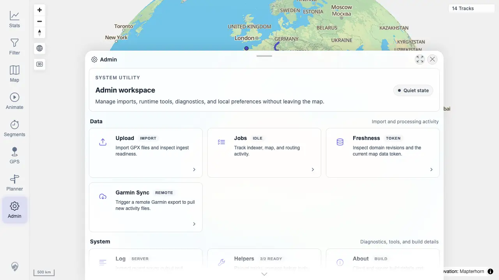

# Packet: ADM_01

## Scope

- Coverage source: `documentation/testing/frontend-regression-test-plan.md`
- Coverage ID or run packet: ADM_01
- In scope: Open Admin and verify the panel list is reachable and usable.
- Out of scope: Individual panel workflows.

## Prerequisites

- Required previous coverage IDs or run packets: GLB_04
- Required app/data state: Authenticated map view.
- Required browser context: Desktop Chrome.

## Allowed Mutations

- Allowed: Open Admin and panels.
- Not allowed: Change server data.

## Actions And Results

| Coverage ID | Action | Expected result | Actual result | Status | Evidence |
|---|---|---|---|---|---|
| ADM_01 | Opened Admin from the map navigation and inspected the Admin workspace tiles. | Admin dialog opens; tab/panel list is reachable and usable. | Admin opened with Data, System, and Session groups and reachable tiles for Upload, Jobs, Freshness, Garmin Sync, Log, Helpers, About, Settings, Session, and Attribution. | PASS | [assets/ADM_01-admin-home.webp](../assets/ADM_01-admin-home.webp); [assets/ADM-admin-results.txt](../assets/ADM-admin-results.txt) |

## Issues

| ID | Severity | Summary | Reproduction | Expected | Actual | Evidence | Release impact |
|---|---|---|---|---|---|---|---|

## Evidence Files

| File | Purpose |
|---|---|
| [assets/ADM_01-admin-home.webp](../assets/ADM_01-admin-home.webp) | Admin workspace tile list. |
| [assets/ADM-admin-results.txt](../assets/ADM-admin-results.txt) | Admin tile/group summary. |

## Screenshot Evidence

## Timings

| Step | Timing |
|---|---:|
| Open Admin and capture home | 2026-06-20T01:13 CEST |

## Handoff Notes

- Completed: ADM_01 passed.
- Remaining unfinished coverage: ADM_02.
- Blocked or not applicable: None.
- State left for the next packet: Admin evidence captured.
