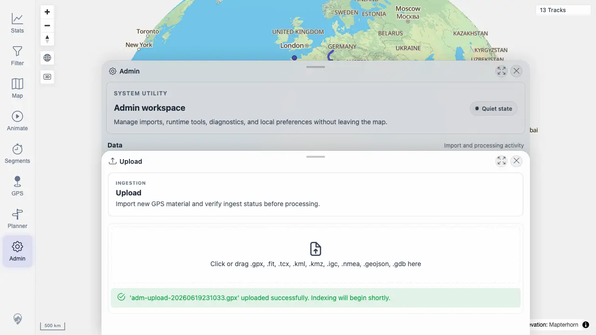

# Packet: ADM_02

## Scope

- Coverage source: `documentation/testing/frontend-regression-test-plan.md`
- Coverage ID or run packet: ADM_02
- In scope: Track file upload availability, accepted formats, progress/success, unsupported format, and empty-file validation.
- Out of scope: Later map cache refresh from the uploaded track.

## Prerequisites

- Required previous coverage IDs or run packets: ADM_01
- Required app/data state: Admin Upload panel available.
- Required browser context: Desktop Chrome with synthetic files supplied through the file input.

## Allowed Mutations

- Allowed: Upload one synthetic GPX file.
- Not allowed: Upload private GPX data.

## Actions And Results

| Coverage ID | Action | Expected result | Actual result | Status | Evidence |
|---|---|---|---|---|---|
| ADM_02 | Opened Upload, validated unsupported `.txt`, validated empty `.gpx`, then uploaded synthetic `adm-upload-20260619231033.gpx`. | Upload availability, accepted formats, progress/success, unsupported-format errors, and empty-file errors are clear. | Upload panel listed accepted formats, unsupported and empty files showed clear validation messages, and the synthetic GPX uploaded successfully with an indexing notice. | PASS | [assets/ADM_02-upload-results.webp](../assets/ADM_02-upload-results.webp); [assets/ADM_02-upload-validation.webp](../assets/ADM_02-upload-validation.webp); [assets/ADM-admin-results.txt](../assets/ADM-admin-results.txt) |

## Issues

| ID | Severity | Summary | Reproduction | Expected | Actual | Evidence | Release impact |
|---|---|---|---|---|---|---|---|

## Evidence Files

| File | Purpose |
|---|---|
| [assets/ADM_02-upload-results.webp](../assets/ADM_02-upload-results.webp) | Synthetic upload success state. |
| [assets/ADM_02-upload-validation.webp](../assets/ADM_02-upload-validation.webp) | Empty-file validation state after unsupported-format validation was exercised. |
| [assets/ADM-admin-results.txt](../assets/ADM-admin-results.txt) | Upload summary including validation coverage. |

## Screenshot Evidence

## Timings

| Step | Timing |
|---|---:|
| Validate and upload | 2026-06-20T01:10-01:13 CEST |

## Handoff Notes

- Completed: ADM_02 passed.
- Remaining unfinished coverage: ADM_03.
- Blocked or not applicable: None.
- State left for the next packet: Synthetic uploaded track is now part of the disposable run state.
