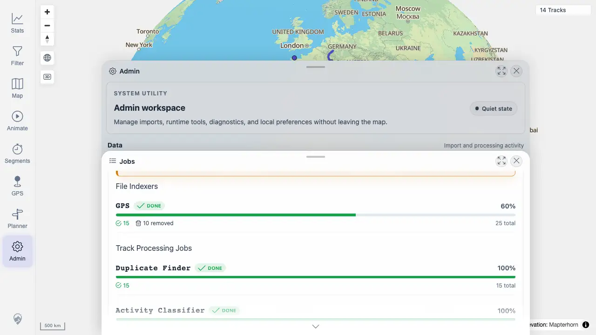

# Packet: ADM_03

## Scope

- Coverage source: `documentation/testing/frontend-regression-test-plan.md`
- Coverage ID or run packet: ADM_03
- In scope: Indexer status visibility for GPS and media indexes.
- Out of scope: Manual rescan actions.

## Prerequisites

- Required previous coverage IDs or run packets: ADM_02
- Required app/data state: Jobs panel after synthetic upload.
- Required browser context: Desktop Chrome.

## Allowed Mutations

- Allowed: Open Jobs panel and refresh status.
- Not allowed: Change server data for this packet.

## Actions And Results

| Coverage ID | Action | Expected result | Actual result | Status | Evidence |
|---|---|---|---|---|---|
| ADM_03 | Opened Jobs and inspected file indexer status after the synthetic upload. | GPS and media indexer state is visible, including pending/running/completed/failed/removed counters; refresh updates over time. | GPS status was visible (`completed=15`, `removed=10`, `failed=0`, `pending=0` via API/text), but no MEDIA indexer summary row appeared in the UI or `/api/indexer/status`; only the Rescan Media action was present. | FIXED | [assets/ADM_03-indexer-status.webp](../assets/ADM_03-indexer-status.webp); [assets/ADM_05-background-jobs.webp](../assets/ADM_05-background-jobs.webp); [assets/ADM-admin-results.txt](../assets/ADM-admin-results.txt); [assets/FIXED-issues-local-verification.txt](../assets/FIXED-issues-local-verification.txt) |

## Issues

| ID | Severity | Summary | Reproduction | Expected | Actual | Evidence | Release impact |
|---|---|---|---|---|---|---|---|
| ADM-03-P2 | P2 | Jobs omits MEDIA indexer summary. | Open Admin > Jobs on this run. | File indexer diagnostics include GPS and MEDIA rows, even when MEDIA has zero files. | GPS row is present, but MEDIA is absent from the file-indexer list and status API. | [assets/ADM_05-background-jobs.webp](../assets/ADM_05-background-jobs.webp); [assets/ADM-admin-results.txt](../assets/ADM-admin-results.txt) | Admin diagnostics cannot confirm media indexer completed/failed/removed state. |

## Evidence Files

| File | Purpose |
|---|---|
| [assets/FIXED-issues-local-verification.txt](../assets/FIXED-issues-local-verification.txt) | Local implementation and verification evidence for FIXED status. |
| [assets/ADM_03-indexer-status.webp](../assets/ADM_03-indexer-status.webp) | Jobs panel entry point and file-indexer area. |
| [assets/ADM_05-background-jobs.webp](../assets/ADM_05-background-jobs.webp) | Visible GPS file indexer row followed by Track Processing Jobs. |
| [assets/ADM-admin-results.txt](../assets/ADM-admin-results.txt) | API status summary showing only GPS indexer status. |

## Screenshot Evidence

## Timings

| Step | Timing |
|---|---:|
| Inspect indexer status | 2026-06-20T01:13-01:16 CEST |

## Handoff Notes

- Fix status: FIXED locally: indexer status always includes GPS and MEDIA rows, including zero-count MEDIA. Evidence: [assets/FIXED-issues-local-verification.txt](../assets/FIXED-issues-local-verification.txt).

- Completed: ADM_03 is terminal as FIXED.
- Remaining unfinished coverage: ADM_04.
- Blocked or not applicable: None.
- State left for the next packet: Jobs panel evidence captured; issue recorded.
