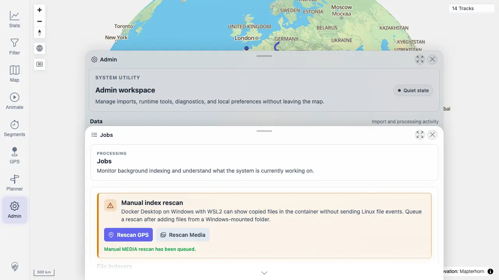

# Packet: ADM_04

## Scope

- Coverage source: `documentation/testing/frontend-regression-test-plan.md`
- Coverage ID or run packet: ADM_04
- In scope: Manual Rescan GPS and Rescan Media actions.
- Out of scope: Missing MEDIA status row covered by ADM_03.

## Prerequisites

- Required previous coverage IDs or run packets: ADM_03
- Required app/data state: Admin Jobs panel open.
- Required browser context: Desktop Chrome.

## Allowed Mutations

- Allowed: Trigger GPS and Media rescans.
- Not allowed: SSH/filesystem changes.

## Actions And Results

| Coverage ID | Action | Expected result | Actual result | Status | Evidence |
|---|---|---|---|---|---|
| ADM_04 | Clicked Rescan GPS and Rescan Media from Jobs. | Manual rescans show queued/already-running/not-ready states without breaking map interaction. | Rescan actions remained usable; the panel showed `Manual MEDIA rescan has been queued`, and the map stayed visible/interactive behind Admin. | PASS | [assets/ADM_04-rescan-results.webp](../assets/ADM_04-rescan-results.webp); [assets/ADM-admin-results.txt](../assets/ADM-admin-results.txt) |

## Issues

| ID | Severity | Summary | Reproduction | Expected | Actual | Evidence | Release impact |
|---|---|---|---|---|---|---|---|

## Evidence Files

| File | Purpose |
|---|---|
| [assets/ADM_04-rescan-results.webp](../assets/ADM_04-rescan-results.webp) | Manual rescan controls and queued message. |
| [assets/ADM-admin-results.txt](../assets/ADM-admin-results.txt) | Current indexer/job state after rescans. |

## Screenshot Evidence

## Timings

| Step | Timing |
|---|---:|
| Trigger rescans | 2026-06-20T01:13 CEST |

## Handoff Notes

- Completed: ADM_04 passed.
- Remaining unfinished coverage: ADM_05.
- Blocked or not applicable: None.
- State left for the next packet: Jobs panel evidence captured.
