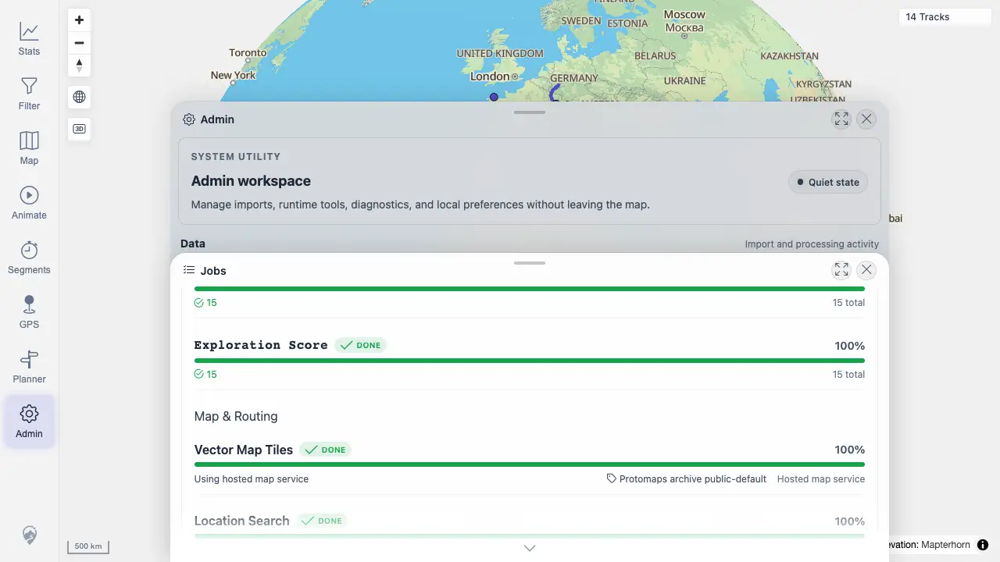

# Packet: ADM_06

## Scope

- Coverage source: `documentation/testing/frontend-regression-test-plan.md`
- Coverage ID or run packet: ADM_06
- In scope: Operational tasks for vector map tiles, location search, and routing segments.
- Out of scope: Running route calculations.

## Prerequisites

- Required previous coverage IDs or run packets: ADM_05
- Required app/data state: Jobs panel open.
- Required browser context: Desktop Chrome.

## Allowed Mutations

- Allowed: Scroll Jobs panel and refresh status.
- Not allowed: Change server configuration.

## Actions And Results

| Coverage ID | Action | Expected result | Actual result | Status | Evidence |
|---|---|---|---|---|---|
| ADM_06 | Scrolled Jobs to Map & Routing and checked operational status APIs. | Vector map tiles, location search, and routing segment status show ready/downloading/unavailable/disabled states with useful detail. | Vector Map Tiles showed done/hosted map service detail, Location Search showed done with GeoNames row metrics, and Routing Segments showed ready with BRouter detail. | PASS | [assets/ADM_06-operational-tasks.webp](../assets/ADM_06-operational-tasks.webp); [assets/ADM-admin-results.txt](../assets/ADM-admin-results.txt) |

## Issues

| ID | Severity | Summary | Reproduction | Expected | Actual | Evidence | Release impact |
|---|---|---|---|---|---|---|---|

## Evidence Files

| File | Purpose |
|---|---|
| [assets/ADM_06-operational-tasks.webp](../assets/ADM_06-operational-tasks.webp) | Map & Routing operational status rows. |
| [assets/ADM-admin-results.txt](../assets/ADM-admin-results.txt) | API status summary for map, location search, and planner routing. |

## Screenshot Evidence

## Timings

| Step | Timing |
|---|---:|
| Inspect operational tasks | 2026-06-20T01:16 CEST |

## Handoff Notes

- Completed: ADM_06 passed.
- Remaining unfinished coverage: ADM_07.
- Blocked or not applicable: None.
- State left for the next packet: Freshness evidence captured.
