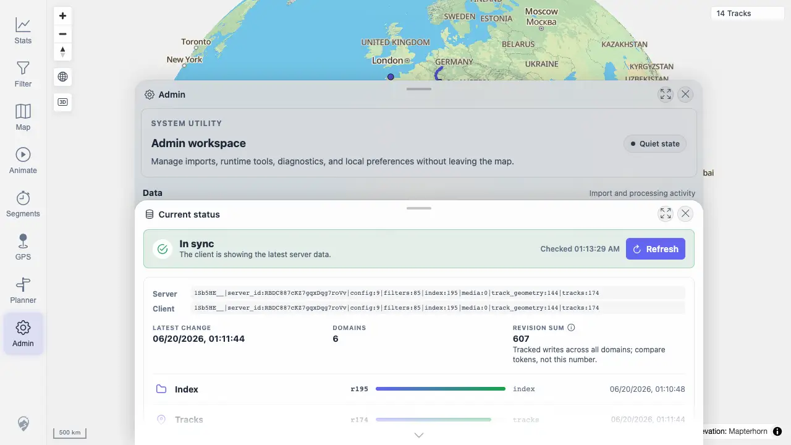

# Packet: ADM_07

## Scope

- Coverage source: `documentation/testing/frontend-regression-test-plan.md`
- Coverage ID or run packet: ADM_07
- In scope: Admin data freshness status, latest-update timestamp, and refresh/reload action.
- Out of scope: Sync banner workflow covered later by SYN IDs.

## Prerequisites

- Required previous coverage IDs or run packets: ADM_06
- Required app/data state: Synthetic upload has been indexed.
- Required browser context: Desktop Chrome.

## Allowed Mutations

- Allowed: Open Freshness panel.
- Not allowed: Apply the map-data refresh from this packet.

## Actions And Results

| Coverage ID | Action | Expected result | Actual result | Status | Evidence |
|---|---|---|---|---|---|
| ADM_07 | Opened Admin > Freshness and inspected server/client tokens, latest change, domains, revision sum, and action button. | Data freshness shows last-update timestamp and offers reload/refresh. | Freshness showed `In sync`, server/client token rows, Latest change timestamp, six domains, revision sum, polling health, and a `Refresh` action. | PASS | [assets/ADM_07-data-freshness.webp](../assets/ADM_07-data-freshness.webp); [assets/ADM-admin-results.txt](../assets/ADM-admin-results.txt) |

## Issues

| ID | Severity | Summary | Reproduction | Expected | Actual | Evidence | Release impact |
|---|---|---|---|---|---|---|---|

## Evidence Files

| File | Purpose |
|---|---|
| [assets/ADM_07-data-freshness.webp](../assets/ADM_07-data-freshness.webp) | Freshness status panel. |
| [assets/ADM-admin-results.txt](../assets/ADM-admin-results.txt) | Freshness token/domain API summary. |

## Screenshot Evidence

## Timings

| Step | Timing |
|---|---:|
| Inspect freshness | 2026-06-20T01:13 CEST |

## Handoff Notes

- Completed: ADM_07 passed.
- Remaining unfinished coverage: ADM_08.
- Blocked or not applicable: None.
- State left for the next packet: Refresh was not applied from this panel.
