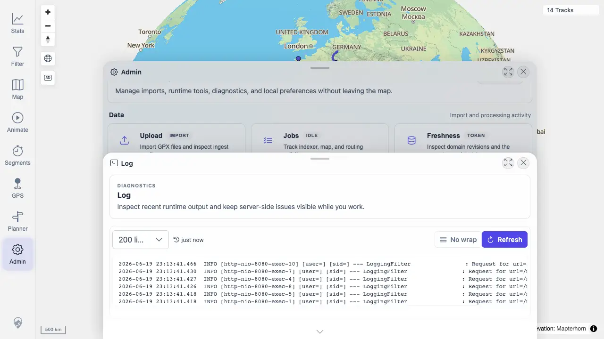

# Packet: ADM_08

## Scope

- Coverage source: `documentation/testing/frontend-regression-test-plan.md`
- Coverage ID or run packet: ADM_08
- In scope: Server log panel load and refresh.
- Out of scope: Exhaustive log review.

## Prerequisites

- Required previous coverage IDs or run packets: ADM_07
- Required app/data state: Admin dialog available.
- Required browser context: Desktop Chrome.

## Allowed Mutations

- Allowed: Open Log and click Refresh.
- Not allowed: Change server logging configuration.

## Actions And Results

| Coverage ID | Action | Expected result | Actual result | Status | Evidence |
|---|---|---|---|---|---|
| ADM_08 | Opened Admin > Log and used the Refresh action. | Server log lines load and refresh. | Log panel loaded with line-count control, wrap/no-wrap control, refresh action, timestamp, and log content; server log API returned HTTP 200 with content. | PASS | [assets/ADM_08-server-log.webp](../assets/ADM_08-server-log.webp); [assets/ADM-admin-results.txt](../assets/ADM-admin-results.txt) |

## Issues

| ID | Severity | Summary | Reproduction | Expected | Actual | Evidence | Release impact |
|---|---|---|---|---|---|---|---|

## Evidence Files

| File | Purpose |
|---|---|
| [assets/ADM_08-server-log.webp](../assets/ADM_08-server-log.webp) | Server log panel after refresh. |
| [assets/ADM-admin-results.txt](../assets/ADM-admin-results.txt) | Server log API summary. |

## Screenshot Evidence

## Timings

| Step | Timing |
|---|---:|
| Open and refresh log | 2026-06-20T01:13 CEST |

## Handoff Notes

- Completed: ADM_08 passed.
- Remaining unfinished coverage: ADM_09.
- Blocked or not applicable: None.
- State left for the next packet: Attribution evidence captured.
