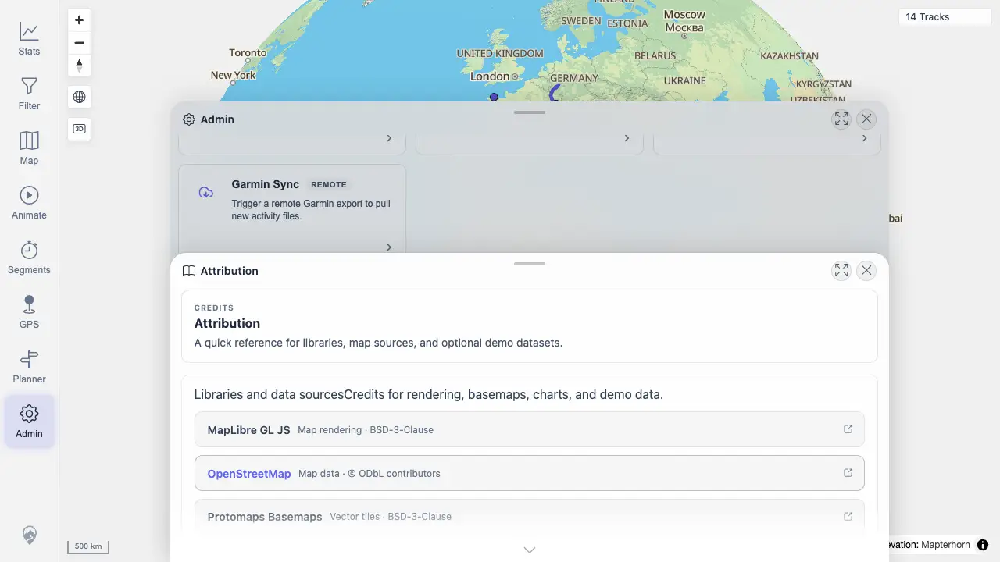

# Packet: ADM_09

## Scope

- Coverage source: `documentation/testing/frontend-regression-test-plan.md`
- Coverage ID or run packet: ADM_09
- In scope: Admin attribution sources.
- Out of scope: External link navigation.

## Prerequisites

- Required previous coverage IDs or run packets: ADM_08
- Required app/data state: Admin dialog available.
- Required browser context: Desktop Chrome.

## Allowed Mutations

- Allowed: Open Attribution.
- Not allowed: Leave the app or open external attribution URLs.

## Actions And Results

| Coverage ID | Action | Expected result | Actual result | Status | Evidence |
|---|---|---|---|---|---|
| ADM_09 | Opened Admin > Attribution and inspected source entries. | Expected map/data sources are shown. | Attribution listed MapLibre GL JS, OpenStreetMap, Protomaps, PMTiles, Terrarium DEM, swisstopo, SchweizMobil, Waymarked Trails, Highcharts, GeoNames, GPSBabel, and BRouter. | PASS | [assets/ADM_09-attribution.webp](../assets/ADM_09-attribution.webp); [assets/ADM-admin-results.txt](../assets/ADM-admin-results.txt) |

## Issues

| ID | Severity | Summary | Reproduction | Expected | Actual | Evidence | Release impact |
|---|---|---|---|---|---|---|---|

## Evidence Files

| File | Purpose |
|---|---|
| [assets/ADM_09-attribution.webp](../assets/ADM_09-attribution.webp) | Attribution entries. |
| [assets/ADM-admin-results.txt](../assets/ADM-admin-results.txt) | Attribution source summary. |

## Screenshot Evidence

## Timings

| Step | Timing |
|---|---:|
| Inspect attribution | 2026-06-20T01:13 CEST |

## Handoff Notes

- Completed: ADM_09 passed.
- Remaining unfinished coverage: ADM_10.
- Blocked or not applicable: None.
- State left for the next packet: Garmin/helper evidence captured.
