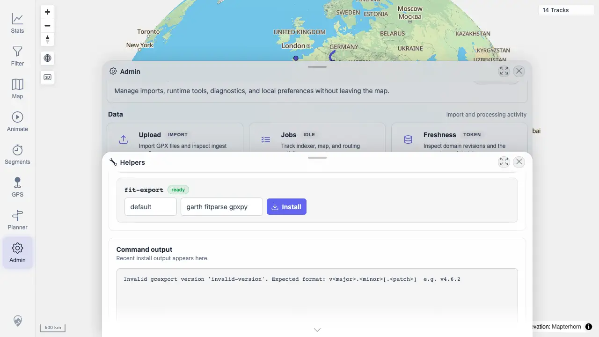

# Packet: ADM_10

## Scope

- Coverage source: `documentation/testing/frontend-regression-test-plan.md`
- Coverage ID or run packet: ADM_10
- In scope: Garmin Sync surface, helper tool status, and install/update error reporting.
- Out of scope: Real Garmin account export.

## Prerequisites

- Required previous coverage IDs or run packets: ADM_09
- Required app/data state: Admin dialog available.
- Required browser context: Desktop Chrome.

## Allowed Mutations

- Allowed: Submit invalid helper install version to exercise validation.
- Not allowed: Run a real Garmin account sync or install a new helper version.

## Actions And Results

| Coverage ID | Action | Expected result | Actual result | Status | Evidence |
|---|---|---|---|---|---|
| ADM_10 | Opened Garmin Sync, opened Helpers, checked tool-status API, and submitted invalid gcexport version `invalid-version`. | Garmin export tools, if present, show installed exporter status; install/update actions report success or error. | Garmin Sync showed Run/output surface; Helpers showed `gcexport` and `fit-export` ready; API reported both venvs present; invalid install reported `Invalid gcexport version 'invalid-version'. Expected format: v<major>.<minor>[.<patch>]`. | PASS | [assets/ADM_10-garmin-sync-panel.webp](../assets/ADM_10-garmin-sync-panel.webp); [assets/ADM_10-helper-tools-ready.webp](../assets/ADM_10-helper-tools-ready.webp); [assets/ADM_10-install-error-ui.webp](../assets/ADM_10-install-error-ui.webp); [assets/ADM-admin-results.txt](../assets/ADM-admin-results.txt) |

## Issues

| ID | Severity | Summary | Reproduction | Expected | Actual | Evidence | Release impact |
|---|---|---|---|---|---|---|---|

## Evidence Files

| File | Purpose |
|---|---|
| [assets/ADM_10-garmin-sync-panel.webp](../assets/ADM_10-garmin-sync-panel.webp) | Garmin Sync Run/output panel. |
| [assets/ADM_10-helper-tools-ready.webp](../assets/ADM_10-helper-tools-ready.webp) | Helper tool status rows. |
| [assets/ADM_10-install-error-ui.webp](../assets/ADM_10-install-error-ui.webp) | Invalid install validation output. |
| [assets/ADM-admin-results.txt](../assets/ADM-admin-results.txt) | Garmin tool API and action summary. |

## Screenshot Evidence

## Timings

| Step | Timing |
|---|---:|
| Verify Garmin/helper tools | 2026-06-20T01:14-01:17 CEST |

## Handoff Notes

- Completed: ADM_10 passed.
- Remaining unfinished coverage: ADM_11.
- Blocked or not applicable: None.
- State left for the next packet: Helpers output contains invalid-version validation.
