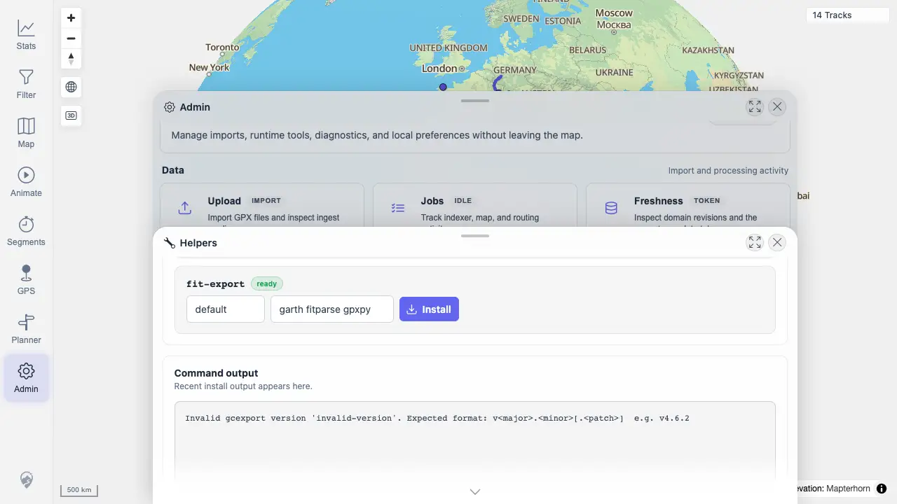

# Packet: ADM_11

## Scope

- Coverage source: `documentation/testing/frontend-regression-test-plan.md`
- Coverage ID or run packet: ADM_11
- In scope: Closing and reopening Admin/detail panels without losing mid-action state.
- Out of scope: Browser reload persistence.

## Prerequisites

- Required previous coverage IDs or run packets: ADM_10
- Required app/data state: Helpers panel contains invalid install validation output.
- Required browser context: Desktop Chrome.

## Allowed Mutations

- Allowed: Close/reopen Helpers and Admin.
- Not allowed: Clear local state or reload the page.

## Actions And Results

| Coverage ID | Action | Expected result | Actual result | Status | Evidence |
|---|---|---|---|---|---|
| ADM_11 | Closed the Helpers detail panel and reopened it, then closed/reopened the full Admin dialog and reopened Helpers. | Closing/reopening the dialog does not lose state mid-action. | The invalid `gcexport` validation output remained visible after both detail-panel reopen and full Admin reopen. | PASS | [assets/ADM_11-detail-reopen.webp](../assets/ADM_11-detail-reopen.webp); [assets/ADM_11-full-reopen.webp](../assets/ADM_11-full-reopen.webp); [assets/ADM-admin-results.txt](../assets/ADM-admin-results.txt) |

## Issues

| ID | Severity | Summary | Reproduction | Expected | Actual | Evidence | Release impact |
|---|---|---|---|---|---|---|---|

## Evidence Files

| File | Purpose |
|---|---|
| [assets/ADM_11-detail-reopen.webp](../assets/ADM_11-detail-reopen.webp) | Helpers detail reopened with output preserved. |
| [assets/ADM_11-full-reopen.webp](../assets/ADM_11-full-reopen.webp) | Full Admin reopened with Helpers output preserved. |
| [assets/ADM-admin-results.txt](../assets/ADM-admin-results.txt) | Reopen-state summary. |

## Screenshot Evidence

## Timings

| Step | Timing |
|---|---:|
| Close/reopen Helpers and Admin | 2026-06-20T01:15-01:17 CEST |

## Handoff Notes

- Completed: ADM_11 passed; Admin Tools section complete.
- Remaining unfinished coverage: SYN_01.
- Blocked or not applicable: None.
- State left for the next packet: Queue advances to Data Updates And Sync.
