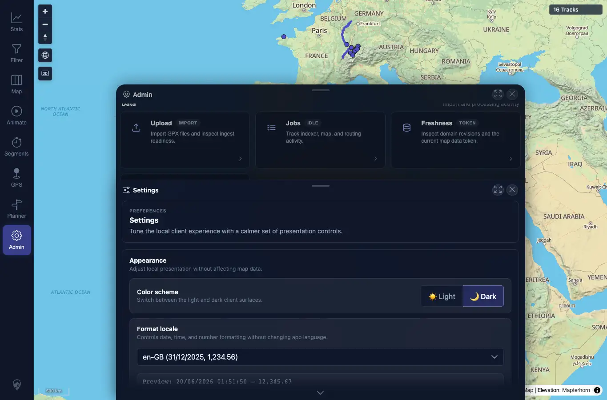

# Packet: APP_01

## Scope

- Coverage source: `documentation/testing/frontend-regression-test-plan.md`
- Coverage ID or run packet: APP_01
- In scope: Switch between light and dark UI themes and verify primary UI surfaces re-theme immediately.
- Out of scope: Map style independence and persistence.

## Prerequisites

- Required previous coverage IDs or run packets: SYN_07.
- Required app/data state: Authenticated map and Stats view available.
- Required browser context: Desktop Chrome context against the remote target.

## Allowed Mutations

- Allowed: Change local color-scheme preference.
- Not allowed: Change server data.

## Actions And Results

| Coverage ID | Action | Expected result | Actual result | Status | Evidence |
|---|---|---|---|---|---|
| APP_01 | Used Admin > Settings color-scheme controls to select Light, opened Stats, then selected Dark and opened Settings/Stats again. | The whole UI re-themes immediately across text, panels, sheets, controls, and charts. | Light state had `data-theme=light`; dark state had `data-theme=dark` and stored `mtl.color-scheme=dark`. Nav, Settings sheet, Stats cards, chart panel, controls, and track-count badge changed colors without reload. | PASS | [assets/APP_01-light-stats.webp](../assets/APP_01-light-stats.webp); [assets/APP_01-dark-settings.webp](../assets/APP_01-dark-settings.webp); [assets/APP_01-dark-stats.webp](../assets/APP_01-dark-stats.webp); [assets/APP_01_APP_05-theme-results.txt](../assets/APP_01_APP_05-theme-results.txt) |

## Issues

| ID | Severity | Summary | Reproduction | Expected | Actual | Evidence | Release impact |
|---|---|---|---|---|---|---|---|

## Evidence Files

| File | Purpose |
|---|---|
| [assets/APP_01-light-stats.webp](../assets/APP_01-light-stats.webp) | Light Stats overview. |
| [assets/APP_01-dark-settings.webp](../assets/APP_01-dark-settings.webp) | Dark Settings sheet. |
| [assets/APP_01-dark-stats.webp](../assets/APP_01-dark-stats.webp) | Dark Stats overview. |
| [assets/APP_01_APP_05-theme-results.txt](../assets/APP_01_APP_05-theme-results.txt) | Theme state summary. |

## Screenshot Evidence

## Timings

| Step | Timing |
|---|---:|
| Theme switch and capture | ~3 min |

## Handoff Notes

- Completed: APP_01 passed.
- Remaining unfinished coverage: APP_02 onward.
- Blocked or not applicable: None.
- State left for the next packet: Dark theme selected in local browser state.
