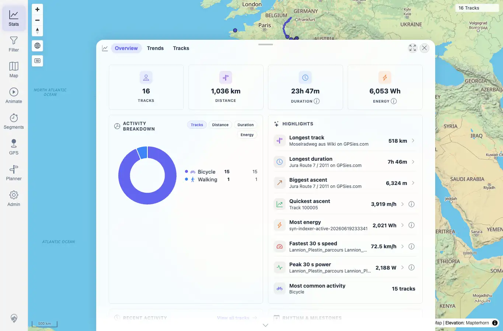
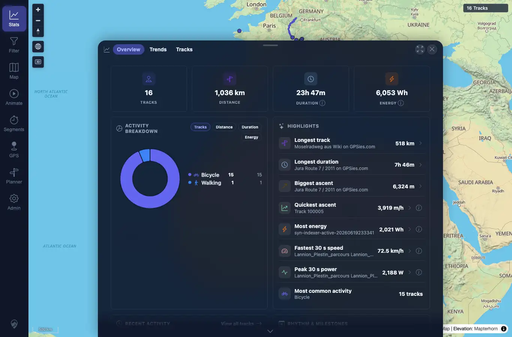

# Packet: APP_02

## Scope

- Coverage source: `documentation/testing/frontend-regression-test-plan.md`
- Coverage ID or run packet: APP_02
- In scope: Check text readability in light and dark themes.
- Out of scope: Full WCAG audit of every possible route.

## Prerequisites

- Required previous coverage IDs or run packets: APP_01.
- Required app/data state: Light and dark UI states captured.
- Required browser context: Desktop Chrome context.

## Allowed Mutations

- Allowed: Switch local color scheme.
- Not allowed: Change server data.

## Actions And Results

| Coverage ID | Action | Expected result | Actual result | Status | Evidence |
|---|---|---|---|---|---|
| APP_02 | Sampled visible text colors/backgrounds in Settings, nav, and Stats surfaces in both themes, and visually reviewed screenshots. | No text is unreadable as white-on-white or black-on-black in either theme. | No white-on-white or black-on-black text was observed. Automated samples covered 110 visible text elements in each theme; the lowest sampled light contrast was 4.47:1 and the lowest dark sample was muted inactive nav text at 3.75:1, still readable in the screenshot. | PASS | [assets/APP_01-light-stats.webp](../assets/APP_01-light-stats.webp); [assets/APP_01-dark-settings.webp](../assets/APP_01-dark-settings.webp); [assets/APP_01-dark-stats.webp](../assets/APP_01-dark-stats.webp); [assets/APP_01_APP_05-theme-results.txt](../assets/APP_01_APP_05-theme-results.txt) |

## Issues

| ID | Severity | Summary | Reproduction | Expected | Actual | Evidence | Release impact |
|---|---|---|---|---|---|---|---|

## Evidence Files

| File | Purpose |
|---|---|
| [assets/APP_01-light-stats.webp](../assets/APP_01-light-stats.webp) | Light text/readability sample. |
| [assets/APP_01-dark-settings.webp](../assets/APP_01-dark-settings.webp) | Dark Settings text/readability sample. |
| [assets/APP_01-dark-stats.webp](../assets/APP_01-dark-stats.webp) | Dark Stats text/readability sample. |
| [assets/APP_01_APP_05-theme-results.txt](../assets/APP_01_APP_05-theme-results.txt) | Contrast sample details. |

## Screenshot Evidence

## Timings

| Step | Timing |
|---|---:|
| Theme readability sampling | ~2 min |

## Handoff Notes

- Completed: APP_02 passed.
- Remaining unfinished coverage: APP_03 onward.
- Blocked or not applicable: None.
- State left for the next packet: Dark theme selected.
